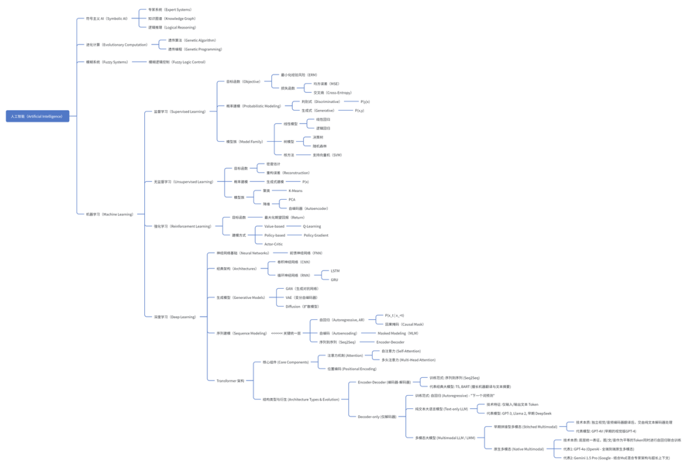
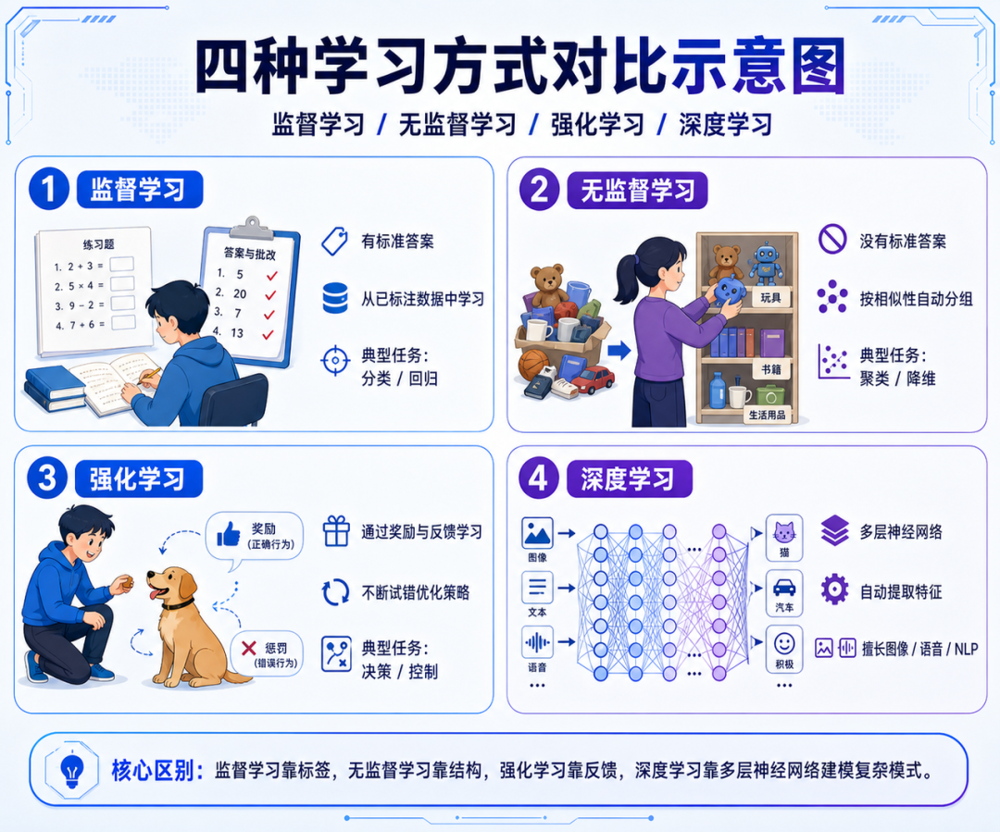
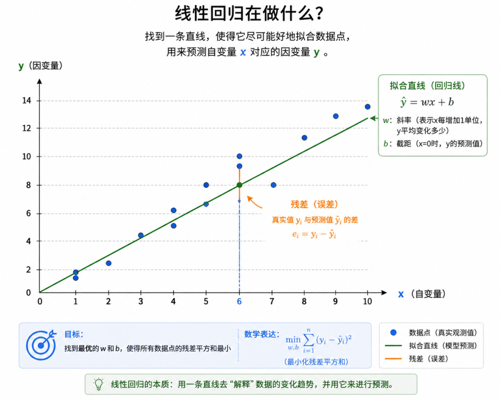
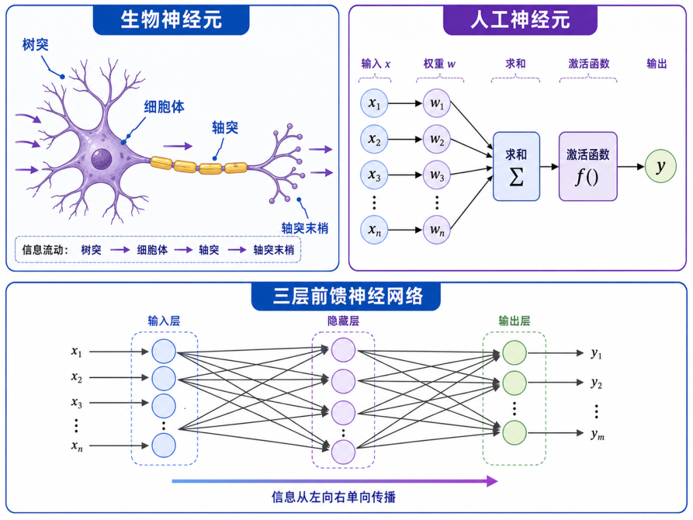
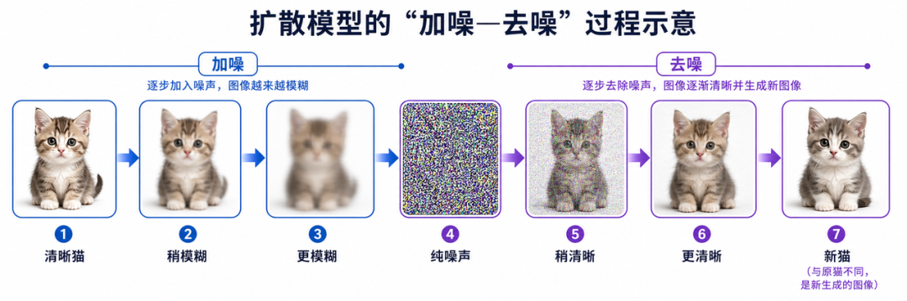
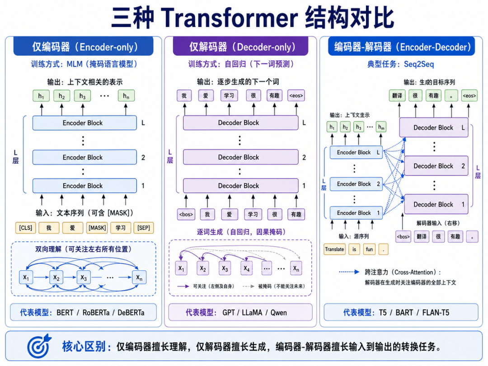

# 挑战一口气说清楚人工智能核心概念

> **作者**：芊羽AIGC
> **来源**：[微信公众号原文](https://mp.weixin.qq.com/s/EQ3dTuCg8xm9o9sb9lr0Ng)
> **发布日期**：2026-05-05

---

## 写在前面

人工智能名词太多、流派太杂、教材一上来就是公式。我花了一些时间把这些概念重新梳理了一遍，才发现其实它们之间有一条非常清晰的脉络。所以想用一篇文章，把我理顺的这条脉络分享出来，如果你正好对AI好奇又不知道从哪入门，希望这篇能帮到你。
（思维导图图片字有点小，用AI生成因为字太多，很多小字会糊，所以可以下载下来放大看）

## 第一章 机器学习之前，人类是怎么造AI的

很多人以为AI是这两年才有的东西，其实"造一个会思考的机器"这个想法，从上世纪五十年代就开始了。在"机器学习"成为主流之前，科学家尝试过三条完全不同的路。理解这三条路，能帮你明白为什么"机器学习"好。
1.1 符号主义：把人类的知识写成规则塞给机器
符号主义的想法非常朴素：既然人是靠"知识"和"逻辑"思考的，那我把所有知识都写成规则，让机器照着推理，不就有AI了吗？
最典型的产物是 专家系统。比如八十年代医院用的诊断系统，是把几百位老医生的经验整理成几千条"如果……那么……"的规则——"如果体温高于38.5度，并且有咳嗽，并且白细胞超标，那么大概率是细菌性肺炎"。机器只要顺着规则查，就能给出诊断建议。
后来发展出 知识图谱，把世界上的事物拆成"实体—关系—实体"的小卡片，比如"北京—是首都—中国"、"鲁迅—原名—周树人"。早期的搜索引擎和智能问答都靠它撑着。
这条路最大的问题是：知识全得靠人一条一条写。世界太复杂，规则永远写不完，遇到没写过的情况机器就傻眼了。
1.2 进化计算：让算法像生物一样优胜劣汰
第二条路受了达尔文进化论的启发：既然自然界能进化出这么聪明的生物，那能不能让算法也"进化"？
具体做法是：先随机生成一大堆"候选答案"，让它们互相竞争，好的留下、差的淘汰，留下的还能"杂交"和"变异"产生新的答案。一代一代迭代下去，最后进化出一个最优解。
这种思路叫遗传算法。NASA曾经用它设计过一根卫星天线，进化出来的形状奇形怪状，看起来不像人类工程师能设计出来的，但性能比人设计的还好。
1.3 模糊系统：让机器接受"差不多"
传统计算机的世界非黑即白：要么0，要么1。但人类思维不是这样——我们会说"有点冷""比较热""差不多够了"。模糊逻辑就是让机器也能处理这种"差不多"的概念。
最经典的例子是空调的"模糊温控"：它不会等温度精确到26度才停，而是判断"差不多凉快了"就降低功率。日本的电饭煲、洗衣机里也大量用了这个思路。
这三条路各有用武之地，但都有同一个瓶颈——知识和规则要靠人去写。 当任务变得越来越复杂（比如识别一只猫），人类自己都说不清楚"猫到底是什么"，这条路就走不下去了。于是科学家换了个思路：能不能让机器自己从数据里学？ 机器学习正式登场。

## 第二章 机器学习总览：让机器自学成才的四种姿势

2.1 什么是"学习"？
先用一个最简单的场景：教小孩认猫。你不需要给他讲"猫科动物的生物学定义"，你只要指着一千张猫的照片说"这是猫、这是猫、这是猫"，他自己就能总结出规律——有毛、有胡须、会喵喵叫。下次见到一只新猫，他也能认出来。
机器学习就是这件事：把"小孩"换成算法，把"看照片"换成喂数据，把"总结规律"换成在内部调整一堆数字（叫做"参数"）。 学完之后，给它一张没见过的照片，它也能判断是不是猫。
2.2 四种学习方式，一句话区分
机器学习按"老师怎么教"分成四大类。这张表先放在这里，下面四章会一个一个展开：
| 学习方式
| 通俗解释
| 生活类比

| 监督学习
| 数据有标准答案，让机器照着学
| 做有答案的练习册

| 无监督学习
| 数据没答案，让机器自己找规律
| 把一抽屉杂物自己分类整理

| 强化学习
| 通过奖励和惩罚学

| 训狗：做对给骨头，做错不给

| 深度学习
| 用很深的神经网络去做上面三种事
| 不是新方式，是更强的工具

这里要特别强调一句：深度学习不是和前三种并列的，它更像是一种"超级工具"。监督、无监督、强化学习都可以用深度学习来做，今天我们听到的所有"大模型"，本质上都是深度学习里的一种特殊形态。这一点搞清楚，后面就不会乱。

## 第三章 监督学习：AI最常用、也最像"应试教育"的一种

3.1 核心思路
监督学习的逻辑特别像我们小时候做练习题：给机器看大量"题目+标准答案"的例子，让它学会从题目推出答案的规律。
举个真实例子：你想做一个垃圾邮件识别器。你先人工标注一万封邮件——这封是垃圾、这封不是。把这些"邮件+标签"喂给算法，它学完之后，再给它一封新邮件，它就能判断是不是垃圾。
监督学习要做的事可以分成两类：

- 分类：答案是几个固定的类别。比如"猫还是狗"、"垃圾还是正常"。

- 回归：答案是一个连续的数值。比如"明天气温几度"、"这套房子值多少钱"。

下面我们看几种最经典、也是被用得最多的监督学习方法。
3.2 线性模型：用一条直线把规律画出来
线性模型是所有机器学习方法里最简单、最容易理解的一种。
想象你手头有一组数据：100套房子的"面积"和"价格"。你把它们画在坐标纸上，横轴是面积，纵轴是价格，会发现这些点大致沿着一条斜线排列——面积越大，价格越高。
线性模型做的事，就是从这堆点里找出"最能代表整体趋势的那条直线"。 找到之后，给一个新房子的面积，沿着这条直线就能读出预测的价格。这就是 线性回归。
如果要做的不是"预测数值"而是"分类"（比如判断邮件是不是垃圾），就用 逻辑回归——它本质上还是画一条线，但这条线是把数据"分成两边"的分界线，左边判定为垃圾、右边判定为正常。
线性模型的好处是简单、快、好解释，缺点是只能处理"线性关系"。如果数据点的分布是弯弯曲曲的，一条直线就拟合不了，得用更复杂的方法。

3.3 概率模型：用"可能性"做判断
概率模型的思路是：与其给一个非黑即白的答案，不如算一下"是这个的可能性有多大、是那个的可能性有多大"，选可能性最高的那个。
最经典的是 朴素贝叶斯。我用一个例子讲清楚它怎么工作：
假设你想判断一封邮件是不是垃圾邮件。你之前统计过一万封邮件，发现：

- 包含"中奖"这个词的邮件，90%是垃圾。

- 包含"发票"这个词的邮件，70%是垃圾。

- 包含"会议"这个词的邮件，只有5%是垃圾。

现在来了一封新邮件，里面同时出现了"中奖"和"发票"。朴素贝叶斯会把这些线索的概率综合起来算一下，最后得出"这封邮件是垃圾的概率是95%"，于是判定为垃圾。它的核心就是把每条线索的可能性乘起来，看最后哪种结论的总概率最高。
还有一种叫 最大熵模型，思路稍微反过来：当我对一件事知道得不够多时，应该选最"公平"、最"不偏心"的那个概率分布。比如你只知道一个骰子是六面的，没别的信息，那最合理的猜测就是每面1/6——不要凭空脑补哪面更容易出。最大熵模型在自然语言处理早期被大量用于词性标注、命名实体识别。
3.4 K近邻（KNN）：看你周围几个邻居是谁，你大概率就是谁
这是最直观的一种方法，原理一句话就能讲清楚：判断一个新数据属于哪一类，就看离它最近的K个"邻居"中哪一类最多。
举个例子：你要判断一个新搬来的住户的收入水平。你看看他周围最近的5户邻居——3户是高收入、2户是中等——那你就猜他大概率是高收入。
放到机器学习里：每个数据都可以看成一个"点"，点和点之间能算"距离"。来了一个新点，找它最近的K个老邻居，按多数投票决定它是哪一类。
这个方法特别适合像"电影推荐"这样的场景：你喜欢的5部电影，找到喜欢这5部电影的其他用户，看他们还在追什么——大概率你也会喜欢。
3.5 决策树家族：玩"二十个问题"猜东西
你有没有玩过这个游戏：一个人心里想一样东西，另一个人最多问20个是非题，要猜出来是什么。问的人会先问大类（"是动物吗？"），再一步步缩小范围（"会飞吗？""比鸡大吗？"）。
决策树就是机器学习里的"二十个问题"。 它从一个根问题开始，根据答案分叉，每一层再问一个更细的问题，最后到达"叶子"——也就是最终的判断结果。
比如银行判断"是否给这个人贷款"，决策树可能是这样：

- 先问"月收入超过1万吗？"——是的话往左，否则往右

- 左边再问"工作满3年吗？"——是的话批准，否则再看其他条件

决策树最大的优点是人类能看懂它的判断过程，所以银行、保险这种需要解释的行业很爱用。
但单棵决策树容易"想偏"。所以又发展出了：

- 随机森林：让一千棵决策树独立判断，最后投票。一千个人投票总比一个人靠谱。

- GBDT（梯度提升树）：让决策树一棵接一棵地训练，每一棵都专门修正前一棵犯的错。今天很多搜索排序、风控系统都在用它。

3.6 支持向量机（SVM）：在数据之间画一条"最宽的马路"
要讲SVM，得先回答一个问题：什么是"向量"？
向量你可以简单理解成"一组数字"。 比如描述一个人，你可以用[身高=175, 体重=70, 年龄=30]，这就是一个三维向量。每个数据样本，都能写成这样一组数字，也就是一个向量。把这些向量放进坐标系里，每个样本就是一个点。
SVM的思路是这样的：假设你要把"猫的照片"和"狗的照片"分开，每张照片都是一个点。你可以画无数条线把它们分开，但SVM专门找那条离两边的点都最远的"中间线"。
打个比方：你在两群人中间画一条分界线，这条线的两边各空出尽可能宽的一条"马路"，让两边的人都离马路远远的。这条最宽的马路就是SVM找的"最佳分界面"。
为什么要追求"最宽"？因为留的余地越大，将来来一个新数据时分错的可能性就越小，模型就越稳。SVM在深度学习火起来之前，是文本分类、图像识别的主力选手。

## 第四章 无监督学习：没人教，自己悟

4.1 它解决什么问题？
监督学习有个大麻烦：得先有人标注数据。一万封邮件你得自己一封一封标"垃圾/不是垃圾"，成本极高。
但现实世界里，没标签的数据多得是——全网的网页、用户的浏览记录、商场的购物小票，这些都没有"正确答案"。无监督学习就是要从这片"没答案的汪洋"里，让机器自己挖出规律。
4.2 聚类：把相似的东西放一堆
聚类就是"分组"。给机器一堆数据，不告诉它有几类、每类是什么，让它自己把相似的归到一起。
最常用的是K-means（K均值聚类）。它的思路非常巧妙，我用电商分群的场景说一下：
假设一家电商有10万用户，你想把他们分成3组做精细化运营，但你不知道怎么分。K-means的做法是：

- 先在数据里随便扔3个"中心点"

- 让每个用户去认离自己最近的中心点，认了哪个就归到哪一组

- 每组重新算一下中心位置（取这组所有人的平均值）

- 中心移动了，所有人再重新认一次组

- 反复这样几轮，直到中心不再移动——分组就稳定了

最后你可能会发现，机器把用户自动分成了"高频高价值用户"、"价格敏感型用户"、"沉睡用户"三类。注意，这三类的名字是你后来根据数据特征起的，机器只是把相似的人放在了一起。
除了K-means，还有 层次聚类——它不预先指定要分几组，而是先把每个点都当成一组，再把最相似的两组合并、再合并，最后形成一棵"聚类树"。你想分几组，就在树上对应的高度切一刀。
4.3 降维：把复杂的数据"压扁"
一个数据可能有几百个维度（比如描述一个用户：年龄、性别、收入、爱好、地区、消费记录……几百项）。维度太多有两个麻烦：一是计算慢，二是没法画图给人看。
降维就是把高维数据压缩到低维（通常是二维或三维），同时尽量保留原来的信息。
最经典的方法叫 PCA（主成分分析）。打个比方：你给一群人拍合影，要拍一张2D的照片。从哪个角度拍最能体现"大家的不同"？正面拍能看出脸的差异，但看不出身高顺序；侧面拍能看出身高，但看不清脸。PCA就是帮你找那个"最能区分大家"的拍摄角度，把高维数据从这个最佳角度"拍扁"成低维。
4.4 关联规则：发现"啤酒与尿布"
这是无监督学习里特别有名的应用。沃尔玛分析购物小票时，意外发现：买尿布的男士经常顺手买啤酒。原因是新手爸爸晚上被指派去买尿布，会顺便给自己买几瓶啤酒。沃尔玛把这两样东西摆近了，啤酒销量大涨。
关联规则就是从大量数据里挖"A出现时B大概率也出现"的规律，电商推荐、超市陈列都靠它。

## 第五章 强化学习：AlphaGo和自动驾驶背后的"奖惩教育"

5.1 核心概念：智能体、环境、动作、奖励
强化学习的逻辑特别像训狗：

- 智能体：要学习的对象（狗）

- 环境：它所在的世界（客厅）

- 动作：它能做的事（坐下、握手、转圈）

- 奖励：做对了给骨头，做错了不给

强化学习的本质就是：让智能体通过反复试错，学会一套"什么情况下做什么动作能让长期奖励最大"的策略。
5.2 目标函数：最大化"期望回报"
这里要解释一个特别关键、但又特别容易劝退人的术语——期望回报（Return）。
"回报"指的是从现在开始，未来一连串奖励加在一起的总和。注意是"一连串"，不是"这一步"。下围棋时你这一步吃掉对方一个子（短期奖励高），但可能让你输掉整盘棋（长期回报差）。强化学习要最大化的是整盘棋的回报，不是一步的便宜。
而"期望"两个字，是因为未来是不确定的——同样一步棋，对手可能这么应、也可能那么应，结果不一样。所以我们追求的是所有可能未来下的"平均回报"最大。
整个强化学习的目标，就一句话：找一套策略，让期望回报最大化。 后面所有方法都是在变着花样实现这一目标。
5.3 三类主流方法

- 基于价值（Value-based）：代表算法 Q-learning。它给每个"在某个状态下做某个动作"打一个分数（叫Q值），分数代表"做了这个动作之后预计能拿到的总回报"。每次选分数最高的动作做。试得多了，分数就越来越准。

- 基于策略（Policy-based）：代表算法 Policy Gradient（策略梯度）。它不打分，而是直接学一个"策略函数"——输入当前状态，直接输出"该做哪个动作"。学习的方法是：哪个动作让最后的回报变高，下次遇到类似情况就提高它出现的概率；让回报变低的就降低概率。

- Actor-Critic（演员-评论家）：把上面两种结合——一个"演员"负责做决定（策略），一个"评论家"在旁边打分（价值），评论家的反馈让演员越演越好。今天大多数前沿强化学习算法都是Actor-Critic的变种。

5.4 为什么强化学习现在这么重要？
AlphaGo打败李世石靠的就是它；自动驾驶的决策系统靠它；甚至ChatGPT之所以"听话"，靠的是叫做RLHF（人类反馈强化学习）的技术——让人类对模型的回答打分，模型再根据这些分数调整自己。可以说，强化学习是让AI"听人话、做对事"的关键。

## 第六章 深度学习：让机器学习长出大脑

这一章是全文最重要的部分，因为今天所有"看起来神奇"的AI能力，背后基本都是深度学习。
6.1 神经网络是什么？从一个神经元讲起
人脑里有大约860亿个神经元。每个神经元长这样：很多"树突"接收上游传来的信号，"细胞体"把信号汇总处理，再通过"轴突"发给下游。很多神经元连成网络，人就有了思考能力。
科学家想：能不能模仿这个结构造一个"人工神经元"？做法是这样的：

- 接收几个输入数字（比如3个数字）

- 每个输入乘上一个"权重"（重要性），加起来

- 加完之后通过一个简单的函数处理一下，输出一个新数字

一个人工神经元很笨，但把成千上万个连起来，分好几层，就能完成非常复杂的任务。 层数很多的就叫"深度神经网络"，用它做的机器学习就叫"深度学习"。
最基础的一种神经网络叫 前馈神经网络（FNN）——"前馈"两个字的意思是：信号只朝一个方向走，从输入层→中间层→输出层，不绕回去。它就像一条单行道流水线，原料从一头进去，成品从另一头出来。后面要讲的CNN、RNN、Transformer，都是在这个最基础的结构上做的各种改造。
那"学习"在神经网络里到底是什么？就是不停调整每个连接上的"权重"那个数字，让网络的输出越来越接近正确答案。 一个大模型可能有几千亿个这样的权重要调，所以训练才那么烧钱。

6.2 三大经典网络架构
#### 6.2.1 卷积神经网络（CNN）：图像识别的王者
我们看一张图片识别它是不是猫，大脑是怎么做的？不是一下子看整张图，而是先看局部——这里有个尖耳朵，那里有胡须，那边有毛茸茸的尾巴——再把这些局部线索组合起来，得出"这是只猫"的结论。
CNN就是模仿这个过程。它用一个小窗口（比如3×3的格子）在图片上一寸一寸地扫，每扫一下就提取这个局部的特征——可能是一条边缘、一个色块。第一层提取的是"边缘"这种简单特征，第二层把边缘组合成"耳朵、眼睛"这种部件，再上一层把部件组合成"猫脸"。这个"用小窗口扫描提取局部特征"的操作，就叫卷积。
人脸识别、医学影像分析、自动驾驶视觉，背后基本都是CNN。
#### 6.2.2 循环神经网络（RNN）：处理"有顺序"的数据
有些数据天生有顺序，比如一句话——"我今天没去吃饭"和"今天我没去吃饭"意思一样，但"我吃饭没今天去"就不通了。理解一句话必须从头读到尾，第N个词的意思依赖前面所有词。
普通神经网络处理不了这种顺序依赖。RNN的做法是：它有"记忆"——每次处理一个词时，会把之前处理过的信息一起带上。 就像你读小说，读到第五章的时候大脑里还记着前四章的剧情。
但原始RNN有个毛病：句子一长就"忘事"——读到第500个词时，前50个词的信息基本丢光了。为了解决这个问题，研究者发明了两个改进版：

- LSTM（长短期记忆网络）：在RNN里加了一个"记事本"和几个"开关"——开关控制"什么信息要写进记事本""什么信息要从记事本里删掉""什么信息要拿出来用"。这样模型就能有选择地记长期信息，不再读到后面就忘了前面。

- GRU（门控循环单元）：可以理解成LSTM的简化版，开关少一点、计算快一点，效果差不多。

LSTM和GRU在2014到2017年间几乎主导了机器翻译、语音识别。但它们仍然没法并行训练（必须一个词一个词处理），根本性的解决要等到Transformer。
#### 6.2.3 生成模型：让AI"创作"而不只是"识别"
前面讲的都是让AI"判断"——这是猫还是狗、是不是垃圾邮件。生成模型反过来，让AI"创造"——画一张从来没存在过的图、写一段全新的文字。

- GAN（生成对抗网络）：用一个绝妙的对抗机制——一个网络当"造假币的"（生成器），专门生成假图；另一个网络当"警察"（判别器），专门辨别真假。两个网络互相对抗、互相进步，最后造假币的能造出连警察都分不出真假的图。早期AI换脸、AI画头像基本都靠它。

- VAE（变分自编码器）：先把数据压缩成一段"语义编码"（你可以理解成数据的精华），再从编码里还原出新样本。

- 扩散模型（Diffusion）：现在Midjourney、Stable Diffusion背后的技术。原理特别有意思——先把一张清晰图片一步步加噪声，直到变成纯雪花点；然后训练模型学会"反向去噪"，从雪花点一步步恢复出清晰图片。 训练完之后，给它一张随机雪花点，它就能"显影"出一张全新的图。

6.3 序列建模：理解大模型怎么"学说话"的关键一层
在讲Transformer之前，必须先把"序列建模"这一层讲清楚——因为今天所有大语言模型的训练方式，本质上都是这三种序列建模套路里的一种。后面再看BERT、GPT、T5的区别就特别清楚。
什么是"序列"？一段有顺序的东西就是序列：一句话是词的序列、一段语音是声音片段的序列、一段视频是画面的序列。序列建模就是让模型学会"序列里的元素之间是怎么互相关联的"。 而模型怎么学，主要有三种套路：
#### 6.3.1 自回归（Autoregressive，AR）：根据"已经写过的"预测"下一个"
自回归的思路最简单：给模型看一段话的前半截，让它猜下一个字是什么。猜对了奖励，猜错了纠正。 训练时让模型一字一字地往后猜，几千亿字猜下来，它就学会了语言的规律。
写专业一点的话，自回归在做的事是计算 P(x_t | x_<t) ——也就是"在已经看到前t-1个词的情况下，第t个词是什么的概率"。
为了让模型在猜第t个词时不能偷看后面的答案，要用一个叫因果掩码（Causal Mask） 的东西，把第t个词之后的所有内容挡住。"因果"两个字的意思是"因在前、果在后"——你只能用过去的信息推未来，不能让未来反过来影响过去。
GPT系列就是典型的自回归模型。你跟ChatGPT聊天，它一个字一个字往外蹦的样子，就是自回归在工作——每蹦一个字，都是基于前面所有字（包括你的提问和它自己已经蹦出来的部分）算出来的。
#### 6.3.2 自编码（Autoencoding）：完形填空式学习
自编码的思路反过来：故意把句子里的几个词挖掉，让模型猜被挖掉的是什么。这就叫 掩码语言建模（MLM，Masked Language Modeling）——和我们做完形填空一模一样。
举例："我今天去[MASK]吃了一碗面"，模型要猜出[MASK]位置可能是"食堂""饭馆""楼下"。
和自回归不同的是，自编码可以同时看左右两边的上下文——既看"我今天去"，也看"吃了一碗面"，两边线索一起用，所以特别擅长"理解"句子。BERT就是典型的自编码模型，也是早年搜索引擎、文本分类的主力。
#### 6.3.3 序列到序列（Seq2Seq）：输入一段，输出另一段
第三种是"输入一个序列、输出另一个序列"，比如机器翻译：输入中文句子，输出英文句子。这个套路叫Seq2Seq，对应的网络结构叫Encoder-Decoder（编码器-解码器）——编码器先把输入"读懂"压缩成一个中间表示，解码器再根据这个中间表示一字一字地生成输出。
记住这三种序列建模的套路：自回归（猜下一个）、自编码（猜被挖掉的）、Seq2Seq（一段换一段）。后面讲Transformer的三种用法时，你会发现它们一一对应。
6.4 Transformer：撑起整个大模型时代的架构
#### 6.4.1 为什么需要Transformer？
RNN、LSTM有两个致命弱点：一是必须按顺序一个词一个词处理，没法并行，训练巨慢；二是再聪明的记事本也搞不定特别长的依赖关系。2017年Google发了一篇论文叫《Attention Is All You Need》（注意力就是你需要的全部），提出了Transformer，一举解决这两个问题。
#### 6.4.2 核心机制：注意力（Attention）
我用一个例子让你瞬间理解什么是"注意力"：
读这句话——"小明把苹果给了小红，因为她饿了"。读到"她"的时候，你大脑会自动把"她"和前面的"小红"关联起来，而不是和"小明"或"苹果"关联。这种"读到一个词时，自动判断它和前面哪些词更相关"的能力，就是注意力。
Transformer做的事就是把这个能力交给机器：处理每一个词时，让模型"瞄一眼"句子里所有其他词，自动判断谁和谁更相关，相关的多关注一点，不相关的少关注。
围绕这个核心，又衍生出几种变体：

- 自注意力（Self-Attention）：句子内部的词互相"打量"对方，判断彼此的关联强度。

- 多头注意力（Multi-Head Attention）：不只用一个角度看相关性，而是同时从多个角度（语法、语义、指代等）一起看，再把结果汇总。就像同一段话让一个语文老师、一个逻辑老师、一个心理学家分别读一遍，最后综合三个人的理解。

#### 6.4.3 Transformer的核心组件
除了注意力机制，Transformer还需要几个配件才能正常工作：

- 位置编码（Positional Encoding）：因为Transformer不像RNN那样按顺序读（它是把所有词同时扔进去并行处理的），所以得给每个词额外加一个"位置标签"，告诉模型"我是这句话的第3个字"。没有位置编码，"我打你"和"你打我"在Transformer眼里就一样了。

- 前馈网络：每个词经过注意力之后，再单独过一个小的前馈神经网络做精加工。

- 残差连接 + 层归一化：保证网络很深的时候，训练不会崩。这个不展开，知道有就行。

#### 6.4.4 三种Transformer结构，对应三类大模型
这是全文最值得记住的知识点。Transformer的核心组件是固定的，但根据怎么把编码器和解码器搭起来，分出三种结构，正好对应上一节讲的三种序列建模套路：

- 只用编码器（Encoder-only）：训练方式是 自编码（MLM完形填空），代表是 BERT。擅长"理解"——读完整段话后做分类、问答、情感分析。像一个只听不说的优秀阅读理解学生。

- 只用解码器（Decoder-only）：训练方式是 自回归（猜下一个词），代表是 GPT系列。擅长"生成"——一个字一个字往外蹦。像一个会接龙的话痨，给个开头就能续写下去。今天我们用的所有"大语言模型"基本都是这条路线——LLaMA、Claude、Qwen、DeepSeek、Gemini，全是Decoder-only。

- 编码器+解码器（Encoder-Decoder）：训练方式是 Seq2Seq，代表是 T5、原始Transformer、BART。擅长"输入一段、输出另一段"，典型如机器翻译、文本摘要。

到这里，你应该能把读到的名词串起来了：ChatGPT = Decoder-only的Transformer + 自回归预训练 + 用RLHF（强化学习）让它"听人话"。是不是瞬间清晰了？

#### 6.4.5 从纯文本到多模态：Transformer怎么"长出眼睛和耳朵"
最早Transformer只处理文字，但研究者很快发现一件神奇的事：只要能把任何东西"翻译"成一串数字向量，Transformer就能处理它。

- 一张图片可以切成一格一格的小块，每块编成一个向量——这就是 ViT（Vision Transformer），让Transformer能看图。

- 一段语音可以切成一小段一小段，每段编成向量——Transformer就能听声音。

- 一段视频是一连串画面，每帧切成块，加上时间顺序——Transformer就能理解视频。

当一个模型同时能处理文字、图像、语音、视频时，它就成了 多模态模型。"模态"就是信息的类型——文字、图像、声音、视频是四种不同的模态。
今天的GPT-4o、Gemini、Claude、豆包都是多模态模型。你给它一张图它能描述、给它一段语音它能回答、给它一段视频它能总结，背后都是同一套Transformer架构在不同模态间统一工作。这也是为什么Transformer被称为"通用架构"——它不挑食，什么数据都能学。
#### 6.4.6 大模型是怎么训练出来的：预训练 + 微调
最后补一个最常被问到的问题：像ChatGPT这种东西，到底是怎么炼成的？基本就两步：

- 预训练：把全网几万亿字的文本喂给一个Decoder-only Transformer，让它做自回归——猜下一个词。猜了几万亿次之后，它就学会了语言、常识、逻辑、甚至一点点"世界知识"。这一步要烧几千万到几亿美元。

- 微调：预训练出来的模型只会"接龙"，不一定听话、不一定符合人类偏好。所以再用一些高质量的"人类示范对话"教它怎么回答问题（监督微调），最后再用RLHF（人类反馈强化学习）让它符合人类喜好。这一步成本相对小，但极其关键。

ChatGPT、Claude、DeepSeek这些模型，都是这两步走出来的。区别只在于数据多少、模型多大、微调技巧不同。

## 第七章 把碎片拼起来

我们从头捋一遍这条主线：
最早的AI走的是 符号主义——把人类知识写成规则塞给机器。它教不会机器"什么是猫"这种说不清的概念。进化计算和模糊系统 另辟蹊径，但也只能解决一部分问题。后来科学家换了思路：与其把规则塞进去，不如让机器自己从数据里学——这就是 机器学习。
机器学习按"老师怎么教"分成 监督、无监督、强化 三类，再加上一个"超级工具" 深度学习。深度学习的本质是用很多层人工神经元，让机器自动从数据里学出复杂的规律。它从最基础的 前馈神经网络 出发，长出 CNN（管图像）、RNN/LSTM（管序列）、生成模型（管创作） 三大经典架构。
但真正点燃这一波AI浪潮的，是2017年出现的 Transformer——它用 注意力机制 解决了"理解长文本"的难题，并且能并行训练。基于Transformer，又分化出三条路线：Encoder-only（BERT，靠自编码做理解）、Decoder-only（GPT，靠自回归做生成）、Encoder-Decoder（T5，靠Seq2Seq做转换）。Decoder-only这条路加上海量数据预训练和RLHF微调，催生了今天的 大模型；Transformer又通过多模态扩展，让一个模型同时能看、能听、能读、能写，于是有了GPT-4o、Gemini这些产品。
我们现在用的ChatGPT、Midjourney、Sora、自动驾驶、智能客服，都是这条主线开出的花。

## 写在最后

读到这里你应该能感觉到：AI不是魔法，每一项看起来神奇的能力，背后都是几种朴素思路的组合——找规律、调参数、试错、注意力。
你不需要会写代码，但理解了这些概念，下次别人聊AI你就能听懂八成。如果某一节当时没看懂，没关系，过两天再翻回来读一遍，会有新感觉。
人工智能这棵树还在长，我会持续分享更多有用的干货，有兴趣的话我们下次接着聊~
