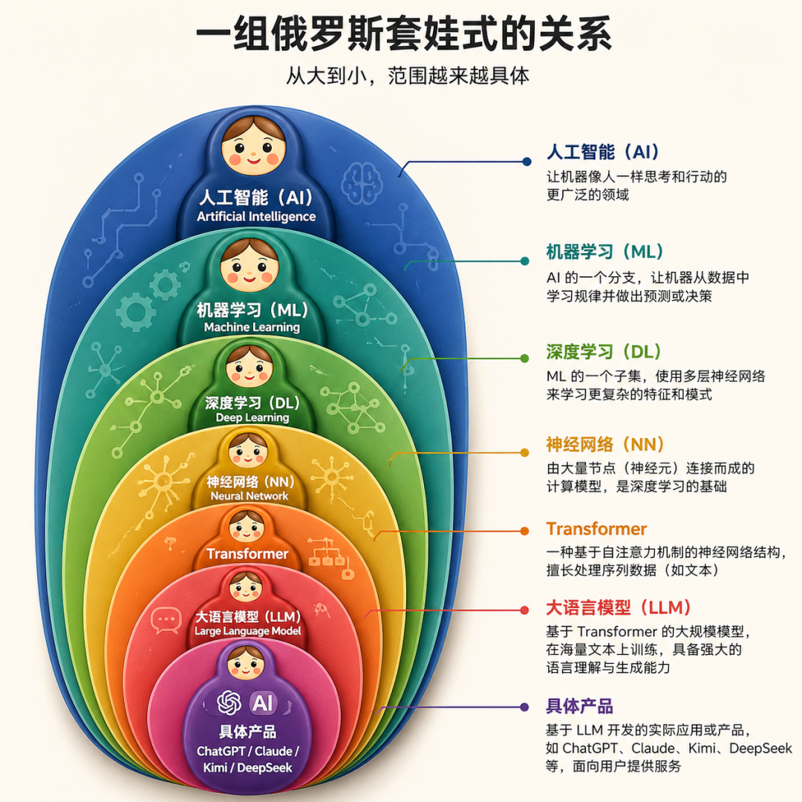

# 看懂Transformer，你才知道为什么AI能听懂人话

> **作者**：芊羽AIGC
> **来源**：[微信公众号原文](https://mp.weixin.qq.com/s/czLSYG_Le8dCLTdSH-sPPQ)
> **发布日期**：2026-05-01

> [!NOTE]
> 一句话总结：这篇文章面向零基础读者，从AI家族谱系讲起，说清楚支撑今天所有主流大模型的 `Transformer` 架构从哪来、在做什么、和你每天用的产品有什么关系，以及它的局限与未来。核心是理解一件事——注意力机制让系统知道在海量信息里该关注什么。

## 目录

- [前言](#前言)
- [一、在认识Transformer之前，先搞清楚AI这个家族](#一在认识transformer之前先搞清楚ai这个家族)
- [二、Transformer为什么会出现](#二transformer为什么会出现)
- [三、Transformer到底在做什么](#三transformer到底在做什么)
- [五、Transformer不是终点](#五transformer不是终点)
- [六、理解了Transformer，你能多看懂什么](#六理解了transformer你能多看懂什么)

---

## 前言
你有没有想过，当你对ChatGPT说“帮我写一段下周去三亚旅游的天气穿搭指南，要考虑到可能会下阵雨，风格要轻松幽默”，它是怎么理解“阵雨”和“穿搭”之间的微妙联系的？又是怎么知道“三亚”和“轻松幽默”之间应该建立什么样的基调？

它甚至还能根据你前面聊过的话题，把你特别怕热、一出汗就心烦这个细节自然地编织进去。这已经脱离了冷冰冰的程序执行范畴，像是一个真正听懂了你的朋友在帮你筹划。

这背后的底层秘密，是一个叫Transformer的东西。

> [!TIP]
> 这个名字听起来像变形金刚或者某款新产品，但实际上，它是支撑今天所有主流大模型——ChatGPT、Claude、Gemini、文心一言、通义千问、Kimi、DeepSeek等模型的同一张“大脑结构图纸”。理解了它，你就拿到了看懂这一轮AI浪潮的钥匙。

所以，这篇文章就是想帮助一个完全没有AI背景的人，从零搭建起对Transformer的完整认知。它从哪儿来，它在做什么，它和你每天用的产品是什么关系，它的局限和未来又是什么。

## 一、在认识Transformer之前，先搞清楚AI这个家族
很多人一上来就问“Transformer是什么”，但这个问题就像问“发动机是什么”一样，你得先知道“汽车是什么”，才能理解发动机在哪儿、起什么作用。

所以我们先花点时间，把整个AI家族的家谱画清楚。

这就是一组俄罗斯套娃。每往里走一层，范围就更具体。

- 人工智能（AI）： 意思是“让机器具备类似人类的智能”。这是一个终极目标，而非一种具体技术。早期人们尝试过用规则、用逻辑推理来实现AI，但都做得不太好。

- 机器学习（ML）： 核心理念是“绕过人工设定规则的环节，直接让机器自己从海量数据里提取规律”。比如不再人工写“下雨天通常伴随乌云、气压低、湿度高”这样的规则，而是给机器看一万组气象数据，让它自己总结出“什么样的指标预示着降雨”。这是AI走向今天的关键转向。

- 深度学习（DL）： 是机器学习的一个具体方法。“深”在哪里？指它用的网络结构有很多层，层层递进地学习。和传统机器学习相比，深度学习不需要人工去挑选“哪些特征是重要的”，机器自己会在层层网络中找出关键特征。

- 神经网络（Neural Network）： 是深度学习的载体。它模仿人类大脑神经元的连接方式，由一层层“虚拟神经元”组成。每个神经元接收输入、做一点计算、输出结果给下一层。听起来玄乎，但本质上就是一堆数学函数的连接。

- Transformer： 是神经网络的一种具体架构（结构图纸）。可以理解为“造大脑”这件事有很多种结构方案，Transformer是2017年被提出、目前最成功的一种。

- 大语言模型（LLM）： 是用Transformer架构造出来的、专门处理语言的超大神经网络。“大”指参数量大——GPT-3有1750亿个参数，可以理解为这个大脑里有1750亿个可调节的旋钮。

- ChatGPT、Kimi、DeepSeek这些： 是基于大语言模型再做一层产品化包装后的应用。

Transformer之前，AI是怎么处理语言的

在Transformer出现前，处理语言的主流架构叫RNN（Recurrent Neural Network，循环神经网络）及其升级版LSTM（Long Short-Term Memory，长短期记忆网络）。

RNN有一个根本特性叫“sequential nature”，翻译过来就是天生顺序结构——它必须一个字一个字地读，第N个字处理完才能处理第N+1个字。就像一个特别认真的学生，必须从课文第一个字开始一字一句往下念，不能跳读。

这种处理方式有两个致命问题：

第一个问题是健忘。 当模型读到“我从小在热带沿海长大，经历过无数次台风、暴雨、闷热的梅雨季，习惯了出门永远带一把长柄伞……所以我现在去西雅图出差，完全能适应那里的阴雨绵绵”这句话时，等读到结尾“适应阴雨绵绵”几个字，前面“热带沿海”和“习惯带伞”这些最关键的信息已经在它的记忆里被冲淡了。

> [!WARNING]
> 这就是著名的长距离依赖问题——句子里相隔很远的两个词之间的关系，RNN很难抓住。

第二个问题是慢。 因为必须排队处理，所以哪怕你有再好的硬件（比如GPU这种擅长并行计算的芯片），RNN也没办法把它的能力发挥出来。每个字都要等前面那个字处理完，硬件大部分时间在空等。

这两个痛点，就是后来Transformer要解决的核心问题。

## 二、Transformer为什么会出现
故事要从2017年的一篇论文说起，因为Transformer这个东西，确实就是被这篇论文凭空创造出来的。

这篇论文叫《Attention Is All You Need》，翻译过来是“你只需要注意力”。它在向当时所有处理语言的主流方法宣战。论文署名八个作者，全部来自Google。

他们在论文署名上特意标了一句“Equal contribution. Listing order is random”（贡献相等，署名顺序随机），这在严肃的学术圈是个挺浪漫的细节。论文的题目据说是致敬披头士的《All You Need is Love》。

后来这八个人大多离开了Google，分别创办或加入了OpenAI、Character.AI、Adept、Cohere——今天你听过的AI明星公司，几乎一半都和这篇论文的作者有关。

但故事的重点不在人物，而在他们做了什么。

一个反直觉的洞察

在Transformer出现之前，处理语言的主流是“RNN + 注意力机制”。当时学术界已经发现，给RNN加上注意力机制（一种让模型自动判断“该看哪里”的机制）效果会变好。但所有人都默认，注意力只是RNN的辅助。

这八个人提出了一个反直觉的洞察：既然注意力本身就能跨越长距离建立联系，彻底抛弃RNN难道不行吗？

他们在论文摘要里写了一句话：

"We propose a new simple network architecture, the Transformer, based solely on attention mechanisms, dispensing with recurrence and convolutions entirely."

翻译过来就是：“我们提出了一种全新的简洁架构Transformer，它仅基于注意力机制，彻底摒弃了循环（RNN）和卷积（CNN）。”

> [!IMPORTANT]
> 这句话在AI历史上的分量，相当于物理学里说“我们彻底不要牛顿力学了”。它的革命性在于——RNN必须排队处理的那个根本约束，被一刀砍掉了。

数据上的降维打击

光有想法不够，论文给出了硬数据。在机器翻译这个当时AI最难啃的任务上：

- WMT 2014英德翻译任务上拿到28.4 BLEU分（BLEU是机器翻译的核心评分指标，分数越高翻译越好），比之前最好的模型——包括把多个模型集成在一起的版本——还高出2分以上。

- 英法翻译拿到41.8 BLEU，刷新了当时的最好成绩。

- 最关键的是，它只用了8块P100 GPU训练了3.5天。当时同类最好模型的训练成本，是这个数字的几十倍。

> [!TIP]
> 便宜、快、效果还好。这种降维打击，让整个AI圈在那一年集体转向了Transformer。

一句话总结Transformer为什么出现

Transformer的诞生，本质上是为了解决两个问题：

### 1.让机器能一眼看完整句话（解决RNN的健忘和慢）

### 2.并且能自动判断哪个词跟哪个词关系最近（解决长距离依赖）
它做到这两件事的核心武器，就是注意力机制（Attention）。

## 三、Transformer到底在做什么
我用气象翻译官小T的故事来讲清Transformer的工作原理

小T的工作是把英文的天象记录翻译成中文。今天他接到一个句子：

"The storm ruined the picnic, because it was too fierce."

这句话的难点在于最后那个“it”——它到底指的是风暴，还是野餐？人类一秒就能判断是风暴（因为只有风暴猛烈才合逻辑），但机器要怎么搞清楚？

让我们跟着小T，一步步看他是怎么完成这个任务的。

第一步：让机器看懂文字——分词与词嵌入

机器不认识文字，只认识数字。所以小T要做的第一件事，是把这句英文变成数字。

分词（Tokenization）：把句子切成一个个最小的处理单元，叫做Token（词元）。"The storm ruined the picnic"会被切成 The / storm / ruined / the / picnic 这样几个token。中文也是一样，“这阵暴雨毁了野餐”可能被切成“这阵 / 暴雨 / 毁了 / 野餐”。一个汉字大致对应1到2个token。

词嵌入（Embedding）： 把每个token映射成一串数字。这串数字的排列有严密的逻辑，它能让意思相近的词在数字空间里距离更近——“暴雨”和“台风”距离很近，“暴雨”和“晴天”距离很远。

原版Transformer里，每个词被映射成一个512维的向量。可以这样理解：机器用512个不同的角度来定义每一个词的含义。

到这一步，小T把“The storm ruined the picnic, because it was too fierce”变成了一堆512维的数字向量。

第二步：给每个词发一张座位号——位置编码

这里有个问题：因为Transformer是“一眼全看”，它不知道哪个词在前、哪个词在后。

举个中文例子：“风吹云”和“云吹风”，对人来说一眼就能区分主谓语，但如果机器只看“词袋”（一堆词的集合），这两句话完全一样。

所以Transformer发明了位置编码（Positional Encoding）——给每个词发一张独一无二的“座位号”。这个座位号是用sin和cos函数生成的特殊数字图案（这个细节有点偏数学，记住“用三角函数生成独特图案”就够了）。

为什么不让模型自己学位置编码呢？原论文给的理由很有意思——sin/cos生成的位置编码，有可能让模型推广到比训练时更长的序列。

也就是说，哪怕训练时模型只见过100个字以内的句子，用了这种位置编码，它有机会处理1000字、10000字的输入。

词嵌入向量加上位置编码向量，就是小T真正“看到”的输入。

第三步（核心）：注意力机制，让词与词互相打量

现在小T要回答那个核心问题：“it”到底指风暴还是野餐？

他的办法是——让“it”和句子里所有词一一比较，看谁跟它关系最近。这就是注意力机制（Attention）。

具体怎么做呢？小T给每个词发了三张卡片：

- Q卡（Query，查询卡）： 相当于“我在找谁”。比如“it”的Q卡上写着“我在找我指代的对象”。

- K卡（Key，钥匙卡）： 相当于“我能回答什么问题”。每个词都有一张K卡，描述自己的特征。

- V卡（Value，价值卡）： 相当于“我能提供什么信息”。被选中的词，会把自己V卡上的内容贡献出来。

匹配过程是这样的：

- “it”拿出Q卡问全场：“谁是我指代的对象？”

- 句子里每个词的K卡和“it”的Q卡做一次“亲密度计算”（数学上叫点积——两组数字按位置相乘再相加）。

- 计算结果：“it”和“storm”亲密值0.7，“it”和“picnic”亲密值0.2，其他词接近0。

- 用这个亲密值作为权重，把每个词的V卡内容加权汇总。

- 最终“it”的新含义里，70%是“storm”的信息，20%是“picnic”的信息。

> [!NOTE]
> 这就是注意力机制的全部秘密。

第四步：多头注意力，让多个分身从不同角度看问题

光看一遍句子还不够。同一句话里有指代关系、因果关系、程度关系、时态关系——一个分身只能盯一种。

所以Transformer搞了多头注意力（Multi-Head Attention）——让8个分身（论文原版是h=8个头）同时观察同一句话，每个分身负责一个64维子空间（$d_k=d_v=512/8=64$）。

继续用例子说明：处理“气象局预测明天的暴雨会引发山洪”这句话时，多头注意力会让：

- 第一个头去关注“气象局”和“预测”的主谓关系

- 第二个头去关注“暴雨”和“山洪”的因果关系

- 第三个头去关注“明天”的时态指向

- 其他几个头去关注语法、特定名词等其他维度

> [!TIP]
> 8个头并行工作，最后把各自的发现拼接起来，变成对整句话的完整理解。这就是为什么Transformer能从多个维度同时理解一句话。

这里还要解释一个新名词：多头（Multi-Head）。“头”指的是一个独立的注意力计算单元，每个头有自己的一套Q/K/V变换矩阵，相当于每个头有自己独特的“看世界的角度”。

第五步：堆叠——为什么大模型要那么多层

到这里，一层Transformer就讲完了。但真实的Transformer往往包含几十甚至上百层的堆叠。

层（Layer）： 一层Transformer包括“多头注意力 + 前馈网络”两个子模块，每个子模块外面还要包一层残差连接（Residual Connection）和层归一化（Layer Normalization）。

- 前馈网络（Feed-Forward Network，FFN）： 在注意力计算之后做一次非线性变换，让模型能学到更复杂的模式。

- 残差连接： 让原始输入直接“跳过”当前层加到输出上，防止信息在深层网络中丢失。

- 层归一化： 把每一层的输出数值范围标准化，让训练更稳定。

原版Transformer的Encoder和Decoder各堆叠6层。GPT-2小号版有12层，GPT-3有96层，GPT-4估计在百层以上。

> [!NOTE]
> 为什么要堆这么多层？因为浅层只能学到基础的字词关系，中层能理解短语和句法，深层才能把握逻辑、因果、上下文。每多一层，理解就深一分。

四、从Transformer到ChatGPT—你每天用的AI产品，背后到底发生了什么

讲到这里，原理已经全部清楚了。现在让我们把视角拉回到日常——当你打开ChatGPT输入一句话，背后到底在发生什么。

一次完整的对话拆解

假设你对ChatGPT说：“帮我写一段下周去三亚旅游的天气穿搭指南，要考虑到可能会下阵雨，风格要轻松幽默”。

- 第一步，分词： 你的输入被切成几十个token。

- 第二步，词嵌入： 每个token被映射成一个向量。

- 第三步，位置编码： 每个token加上自己的位置信息。

- 第四步，多头注意力： 模型计算每个词和其他词的关系——比如“阵雨”和“穿搭”的对应关系，“三亚”和“下周”的时空联系，“轻松幽默”和“指南”的语调匹配。

- 第五步，多层堆叠： 上面的过程在几十层网络里反复深化，逐层加深理解。

- 第六步，自回归生成： 模型一个字一个字地生成答案。这个过程叫自回归（Auto-regressive）——每生成一个字，都要把前面所有内容（包括它自己刚生成的字）重新算一遍，再决定下一个字是什么。就像一个边写边想的网文作者，写下一句之前必须回头看一眼前面写了什么。

常见概念解析

如果你是非技术读者，下面这三个概念能让你彻底看懂AI产品的游戏规则。

Token计费： 为什么OpenAI、Anthropic的API都按Token数收钱？因为模型每处理一个Token都是真金白银的算力消耗。一个英文单词大概1个Token，一个汉字大致对应1到2个Token。GPT-4每输入1000个Token大约几分钱，这听起来不多，但ToB场景一天几百万次调用，成本会飙升。

上下文窗口（Context Window）： 为什么和ChatGPT聊久了它会“失忆”？因为每个模型都有上下文长度上限，超出部分会被截断。GPT-4 Turbo是128K Token，Claude 3.5是200K Token，DeepSeek是128K Token。“K”是1000的意思，128K大约是10万汉字的容量。

温度参数（Temperature）： 为什么有时候AI回答得很死板，有时候又很有创意？因为生成下一个词时，模型会从概率分布里采样。Temperature=0时只选概率最高的词（最稳定），Temperature=1时允许更冷门的词出现（更有创意）。写代码时一般用低温度，写诗时用高温度。

Transformer家族的三个分支

原版Transformer是Encoder（编码器）+ Decoder（解码器）的完整架构，专门用来做翻译。后来这个架构分化出三条路：

- Encoder-only（如BERT）： 只保留编码器，专门做“理解”任务，比如搜索引擎里的语义匹配、文本分类。

- Decoder-only（如GPT、Claude、Kimi、DeepSeek）： 只保留解码器，专门做“生成”任务。这是今天大模型的绝对主流。

- Encoder-Decoder（如T5、原版Transformer）： 保留完整架构，做“序列到序列”任务，比如机器翻译、文本摘要。

今天大模型版图里所有玩家，本质上都是从那篇2017年论文里长出来的不同分支。

## 五、Transformer不是终点
Transformer的真实困境，以及正在发生的进化。

三个真实的痛点

第一个痛点：算力贵到离谱

Transformer的自注意力机制，计算复杂度是 $O(n^2)$——这个符号读作“大O n平方”，意思是计算量随着输入长度的平方增长。

什么是计算复杂度？就是衡量一个算法处理数据量增加时，所需计算量的增长速度。$O(n)$ 是线性增长，n翻倍计算量翻倍；$O(n^2)$ 是平方增长，n翻倍计算量变四倍。处理一篇1万字的文档比处理1千字的，计算量是100倍。

这就是为什么GPT-4处理长文档时又慢又贵。

第二个痛点：数据饥渴

GPT-3的训练用了几乎整个互联网的高质量文本。但高质量人类语料正在快速枯竭——业界有研究估计，到2026-2028年，互联网上能用的高质量文本数据可能用完。模型再大，没有新数据喂，也学不到新东西。

第三个痛点：黑箱难调试

Transformer是个黑箱。当它输出一个错误答案时，工程师很难知道是哪一层、哪个注意力头出了问题。

> [!CAUTION]
> 这给商业化部署带来巨大风险——你永远不知道它下一次会不会“一本正经地胡说八道”（这种现象有个专门的名字叫幻觉（Hallucination）——模型生成了看起来合理但事实错误的内容）。

正在涌现的挑战者

业内已经有团队尝试绕开Transformer的痛点：

- RetNet（Retentive Network，留存网络）： 微软和清华联合提出，把推理复杂度从 $O(n^2)$ 降到 $O(1)$。

- Mamba（曼巴）： 基于状态空间模型，专门处理超长序列。

- MoE（Mixture of Experts，混合专家）： DeepSeek V3、Mixtral都在用。它的思想是——模型里有很多个“专家子网络”，每次只激活几个相关的专家来处理输入，其他的休眠，从而在保持能力的同时降低成本。

> [!IMPORTANT]
> 作为AI从业者，我的态度是：不需要赌哪种架构会赢，但需要理解每一种架构的能力边界，因为这直接决定了我们能做出什么样的产品。

## 六、理解了Transformer，你能多看懂什么
最后这一部分，我想把技术认知转化成你日常能用的思考工具。每一条都给出具体的判断方法——你怎么从一个产品、一篇新闻里看出门道。

视角一：怎么看产品——从交互细节判断它的Transformer用在哪一步

当你拿到一个AI产品（比如某个新冒出来的天气播报助手、AI客服、AI搜索引擎），你怎么判断它的Transformer用在了哪一步？

方法一：看输出是不是逐字蹦出来的。 如果是一个字一个字流式生成（像ChatGPT那样），说明它用的是Decoder-only架构（GPT这种）。如果是“等几秒，唰一下整段返回”，说明它可能用的是Encoder-only或者Encoder-Decoder架构，更偏向理解或翻译类任务。

方法二：看它对长输入的态度。 输入一段3000字的内容，看看它：

- 是直接拒绝（提示“超出长度限制”）？说明它的上下文窗口很小，可能用的是早期模型。

- 还是处理得很慢？说明它在硬扛Transformer的 $O(n^2)$ 复杂度，没有做长文本优化。

- 还是处理得又快又好？说明它做了RAG（检索增强）、滑动窗口、分块处理这些优化。

方法三：看输入和输出的设计。 一个用心的AI产品，会在输入端做什么？会引导你提供更结构化的信息（比如让你选择“气候类型：干燥/湿润/多变”，“降水概率：高/低”）。

在输出端会做什么？会限制格式（强制返回结构化的Markdown，避免长篇散文）。如果一个产品的输入框只有一个空白文本框，输出又长又散，说明产品经理没有在输入输出约束上下功夫，这往往是“拿大模型直接套壳”的产品。

方法四：试试它的“边界行为”。 问它一个明显超出能力范围的问题（比如问AI天气助手“今天股市怎么样”），看它怎么回答：

- 一本正经胡说？说明没做“护栏”，是个有风险的产品。

- 礼貌拒绝并引导回正题？说明产品经理认真定义了能力边界。

视角二：怎么看新闻——破除“参数越大越强”的迷思

再看到“某某模型参数量突破万亿”这种标题，你能从这几个维度判断它的真实价值：

第一，看参数量和激活参数量的差异。 现在很多模型用MoE架构，“总参数量”和“实际激活参数量”完全是两码事。

比如DeepSeek V3总参数671B（B就是十亿），但每次推理只激活37B。如果一篇报道只强调总参数，不提激活参数，它可能在做数据美化。

第二，看上下文窗口是真长还是假长。 很多模型号称支持百万Token上下文，但实测在20万Token之后准确率就严重下降。靠谱的报道会附带长文本召回测试（也叫“大海捞针测试”——在长文本里埋一个特定信息，看模型能不能找到）。

第三，看Benchmark（基准测试）选了什么。 Benchmark是评测模型能力的标准化测试，比如MMLU（综合知识）、HumanEval（代码能力）、GSM8K（数学推理）。

但厂商有“Benchmark过拟合”的嫌疑——专门刷测试分数，实际使用却很差。看一个模型靠不靠谱，不要只看Benchmark分，更要看用户口碑和实际应用反馈。

第四，看训练数据来源。 一个模型在特定场景的表现，很大程度取决于训练数据里相关语料的比例和质量。如果一个模型在某个任务上表现奇差，往往不是架构问题，而是数据问题。

视角三：怎么看趋势——从“注意力”这个底层逻辑出发

理解了“注意力是核心”这个底层逻辑，你就能看懂为什么这些热词都是Transformer思想的延伸：

多模态（Multimodal）： 让Transformer同时处理文字、图片、音频、视频。怎么做到的？把雷达云图切成一个个小块，每块当成一个“视觉Token”，用注意力机制处理。

本质上还是“让模型知道在海量气象信息里该关注什么”。代表模型是GPT-4V、Gemini、文心一言的多模态版。

Agent（智能体）： 让大模型不光会聊天，还能自主调用工具、规划多步任务。怎么做到的？把“该调用哪个气象API”、“该执行哪一步预测”这些决策点，也让注意力机制来判断。代表产品是AutoGPT、Manus、各种“AI数字员工”。

具身智能（Embodied Intelligence）： 让AI操控机器人。怎么做到的？把传感器感知到的风速、温度信号以及动作指令也Token化，用Transformer架构处理。代表项目是特斯拉Optimus、Figure 01。

判断方法： 当你看到任何一个新的AI概念，问自己一个问题——它是在让模型关注新的信息类型，还是在让模型用新的方式处理注意力？如果是，那它本质上还是Transformer的延伸。如果不是（比如世界模型、具身智能里的强化学习路径），那它可能是真正在挑战Transformer的下一代架构。

写在最后：注意力，不只是AI的事

讲了这么多，回头看Transformer的核心思想其实只有一句话：

> [!TIP]
> 让一个系统知道，在海量信息里，该关注什么。

这件事AI做了，靠的是注意力机制。但仔细想想，你做产品、做内容、做项目、甚至每天应对多变的天气，本质上不也是在做同一件事吗？

资源永远有限，信息永远过剩，看到所有东西不是那么重要，知道哪些东西值得加权、哪些可以忽略、哪些虽然冷门但关键时刻能救命（比如突发的一场冰雹）比较重要。

AI的每一次跃迁，背后的核心逻辑在于人类找到了让它“该关注什么”的更好方法。从这个角度看，做产品和训练AI，本质上是同一件事——都是在帮一个强大的系统，把注意力放在对的地方。
