# AIGC | Stable diffusion基础篇

> **作者**：芊羽AIGC
> **来源**：[微信公众号原文](https://mp.weixin.qq.com/s/59NwhH9Maq1QSfP2a8yKsA)
> **发布日期**：2024-05-19

---

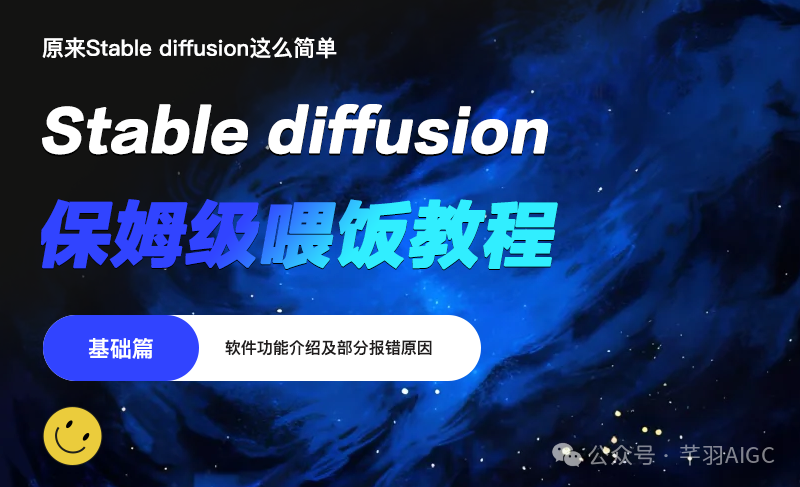

## 前言
随着人工智能技术的飞速发展，AI绘画已经悄然走进了我们的日常工作中，对于设计师来说，AI绘画已经不是加分项了，而成为了必须项。加上目前如此严峻的就业形势，学习AI绘画不仅仅是技术趋势，更有助于提高我们在就业市场上的竞争力。

目前市面上主流的绘画工具有Stable Diffusion、midjourney、Dall.E 3，本文将对这三款绘画工具进行对比，并详细介绍三款绘画工具中可控性最高的 Stable Diffusion 的具体使用方法。由于篇幅过长，就分为基础篇和进阶篇两部分了，此篇为基础入门篇，下篇是进阶应用篇。如有描述错误的地方，欢迎指正！

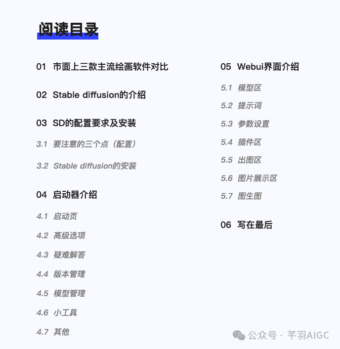

## 一、市面上三款主流绘画软件对比

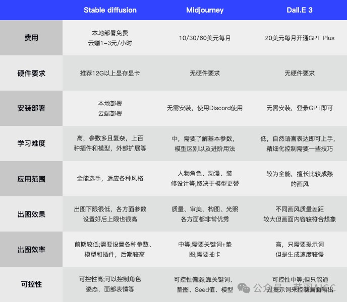

总结：

Midjourney：是目前出图最精美的AI绘画工具

Stable Diffusion：是目前出图最可控的AI绘画工具

DALL·E 3：是目前最能理解人类语言的AI绘画工具

## 二、Stable diffusion的介绍
Stable Diffusion是一种基于扩散过程的图像生成模型，可以生成高质量、高分辨率的图像。它通过模拟扩散过程，将噪声图像逐渐转化为目标图像。这种模型具有较强的稳定性和可控性，可以生成具有多样化效果和良好视觉效果的图像。

相比较其他两款绘画工具来说，SD可控性较高，较适合应用到商业场景。虽然学起来稍微有那么点费劲，但是我们先来看看SD的强大之处，给你学习SD注入亿点点动力吧！

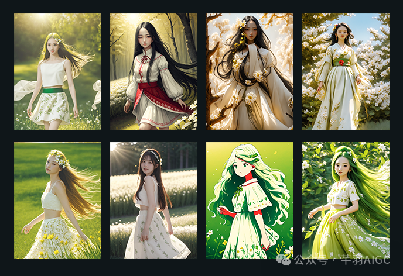

## 三、SD的配置要求及安装

### 3.1、在安装之前需要注意这几个关键点：

#### 3.1.1、查看电脑的配置，主要关注GPU (显卡和显存)
查看方法：在底部任务栏单击右键——选择任务管理器——性能——查看GPU（显卡）的品牌和型号

显存4G勉强可以打开，但是出图速度很慢，而且容易报错；显存6G或8G可以使用SD的基础功能，简单出图，但是进阶功能，比如模型训练等就无能为力了；显存12G可以较为顺畅使用SD ；显存16G以上所有功能都可以畅玩。

推荐使用英伟达的N卡，如果是A卡或者目前使用SD比较困难，可以使用云端配置，新手小白推荐使用青椒云。

附上各显卡对比图：

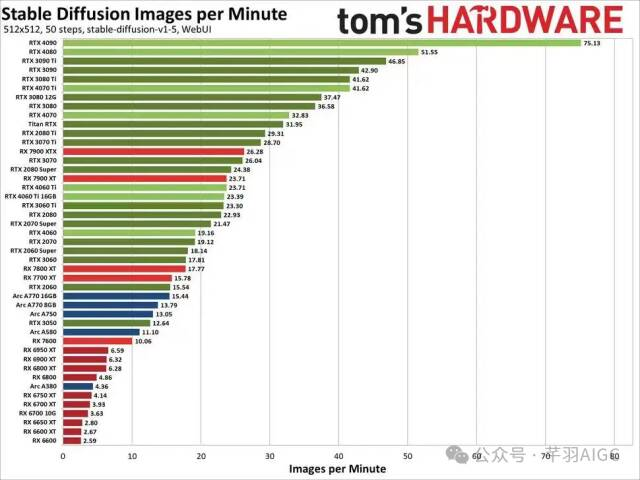

此图片来源于网络（可保存下来对比）

#### 3.1.2、确定好要把SD安装在哪个盘哪个文件夹
SD的安装路径最好不要带中文和空格，因为这可能导致报错

不建议安装在C盘，因为后续需要用到非常多模型，模型很占空间，需要找一个空间大的盘

#### 3.1.3、由于SD是一款开源软件，如果在使用过程中打开了杀毒软件可能会产生误杀的情况。

### 3.2 SD的安装

由于自己部署到本地费时费力，所以我用的是秋叶大佬的整合包，一键安装方便快捷。

安装步骤：

#### 3.2.1、下载整合包，下载地址可以在B站搜秋叶

#### 3.2.2、下载完后，双击安装启动器依赖

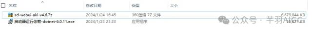

#### 3.2.3、然后解压SD安装包，打开之后就可以看到整个根目录，找到启动器双击就可以启动该软件了。
‍

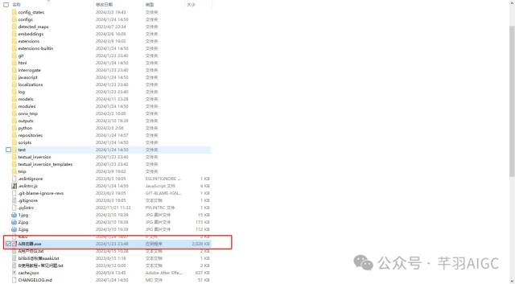

## 四、启动器介绍
### 4.1 启动页

这个页面存放了各种文件夹，点击可以打开对应的文件夹查看相应内容。如点击根目录：打开SD安装所在的文件夹；其他按钮同理，扩展可以理解为SD的各种插件，我们在使用过程中下载的插件基本都存放在此文件夹。临时文件夹可以定期清理，避免占用过多内存。其他几个文件夹就是字面意思，通过不同方式生成的图片的存放位置。

用得最多的当然就是这个【一键启动】按钮了，打开启动器点击【一键启动】之后系统开始加载，加载完后会在默认浏览器显示操作界面。

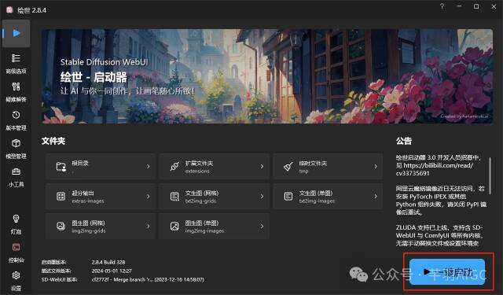

### 4.2 高级选项

这个界面参数通常维持默认就好，一般很少变动

### 4.3 疑难解答

当出现报错，报错信息会出现在此界面，里面配备【开始扫描】按钮，点击可以检查有无报错。

### 4.4 版本管理

所有更新迭代的版本都会出现在这里，不止sd的本体版本，还包括了扩展（也就是插件）的版本信息。

这里需注意：版本不是越新越好，如果本体的版本和插件的版本有冲突，将可能会出现报错。

一般情况下，保持在稳定的版本就好啦！

### 4.5 模型管理

如图所示，SD的模型主要可以分为Stable diffusion 模型、嵌入式(Embedding)模型、Lora模型、超网络(Hypernetwork)模型、变分自编码器(VAE)模型这几类。

其中，Stable diffusion 模型通常被我们称为大模型，是出图必不可少的模型，占用空间较大，大小为2-8G不等；其他模型被我们称为小模型，是在大模型的基础上微调得到的，在出图过程中起到锦上添花的作用，如果想要更好的效果或者出图更加便捷时可以用到，占用空间几十k到几百mb不等。

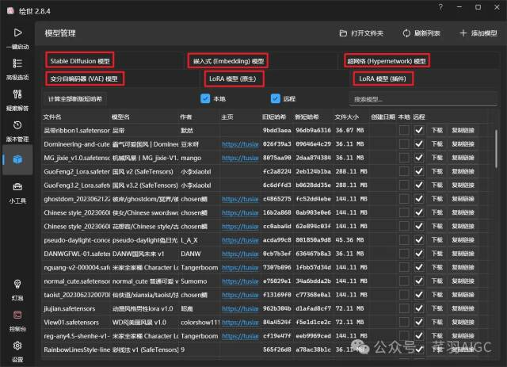

此界面可以查看已经安装的模型和下载新模型，不过通常较少在这里下载，因为看不到效果预览图。

### 4.6 小工具

介绍了一些好用的网站，有模型下载网站、图片素材网站等。

### 4.7 其他

设置里面的内容通常保持默认就好了，软件还可以调到深色模式，设置默认打开Webui的浏览器等。

需要注意的是：点击启动后，操作界面在浏览器打开，启动器窗口也不能关，可以在控制台看到软件运行情况，报错信息等。

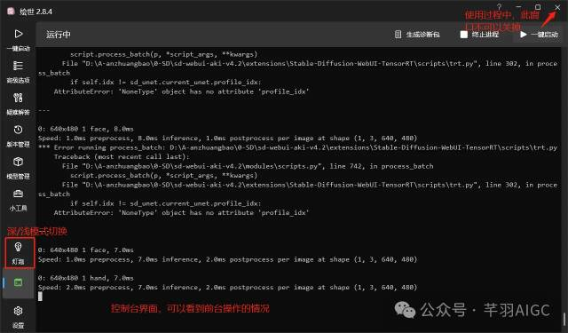

## 五、Webui界面介绍
接下来介绍webui界面，点击一键启动后启动器会呈现加载状态，加载完之后在浏览器会出现操作界面

我们先对SD的操作界面有一个全局的认识。SD的操作界面大致可以分为模型区、提示词区、参数设置、出图区、插件区，如图所示

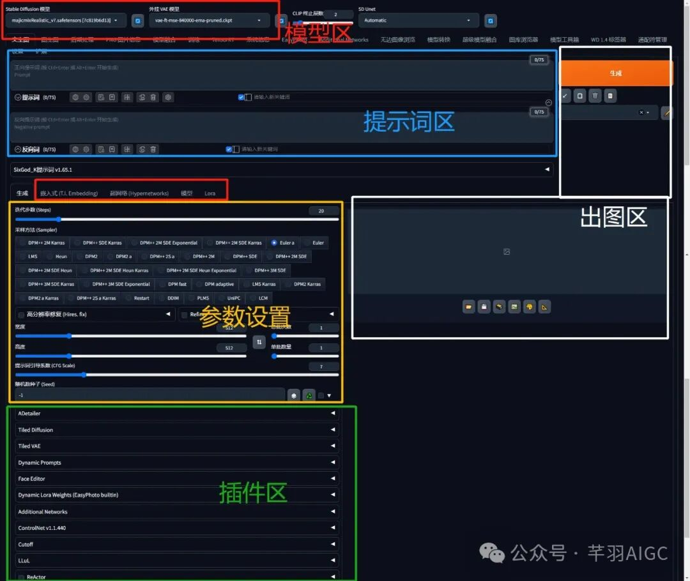

SD主要有两种出图方式：文生图和图生图

文生图出图步骤：选择大模型——输入提示词——设置参数——加入插件——出图

图生图出图步骤：选择大模型——输入提示词——上传参考图片——设置参数——加入插件——出图

文生图和图生图基础设置都差不多，只是图生图多了一个参考图片的功能，可以在参考图片的基础上生成自己想要的效果。这里的插件不是必须项，想要达到特定效果才需要特定插件去实现。

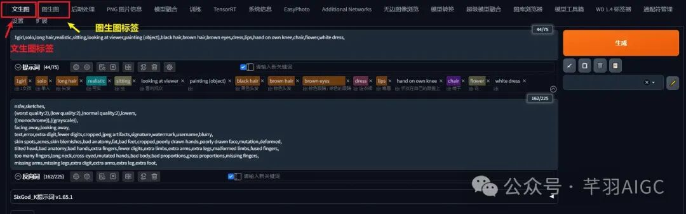

下面是逐个功能、按钮的详细介绍：

### 5.1 模型区

前面提到SD的模型分为五类：

5.1.1 Stable diffusion模型：大小在2G以上，后缀为ckpt或者safetensors

也就是我们所说的大模型（底模），如果把SD比喻成一个美术机构或者设计机构，那么大模型就是具体的某个画师，这位画师学习了一类美术作品的合集，于是形成了特定的画风。

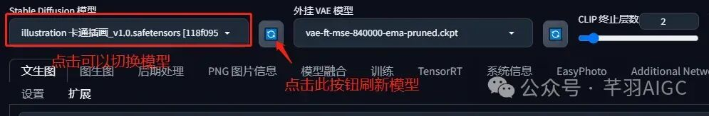

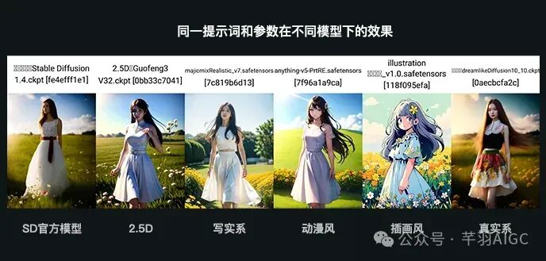

模型下载

### 1.可以通过启动器下载
优点：下载完之后直接存放在模型文件夹，无需科学上网

缺点：无法看到模型效果预览图，就像开盲盒

### 2.通过网站下载
https://civitai.com/

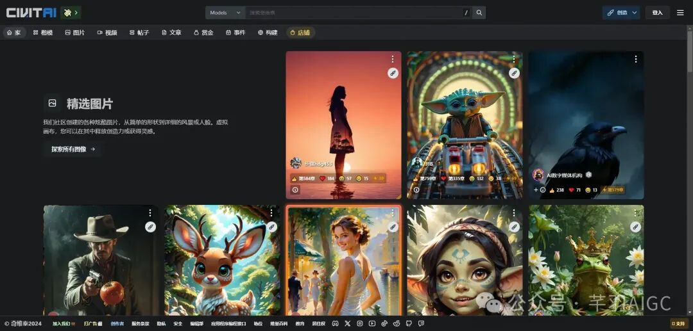

https://www.liblib.art/

大模型安装：以秋叶整合包为例

模型下载后放到 sd-webui-aki-v4.2\models\Stable-diffusion 文件夹里

模型安装好后回到webui界面点击模型后面的刷新按钮，即可把刚刚安装的模型加载出来

#### 5.1.2 lora模型：大小在几十到一百多m，后缀为safetensors
利用非常广泛，用于训练一种概念，这个概念可以是一种画风，一种衣服，一个人的长相，一个人的动作等

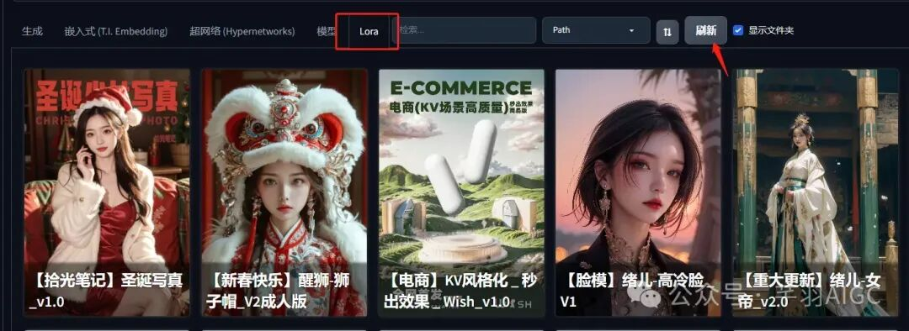

lora模型的下载与安装

下载和大模型一样，都可以在启动器和上面提到的两个网站下载

安装路径：sd-webui-aki-v4.2\models\Lora

lora模型的使用

选中正向提示词框，点击要使用的lora模型，这时lora名称会出现在正向提示词框内，调整lora权重，权重范围0-1，数值越接近1效果越明显，超过1可能导致图片崩坏，数值过小会导致不起效果。然后用英文输入法状态下的逗号隔开，输入触发词，通常在下载lora模型的时候模型发布者会写清楚触发词。

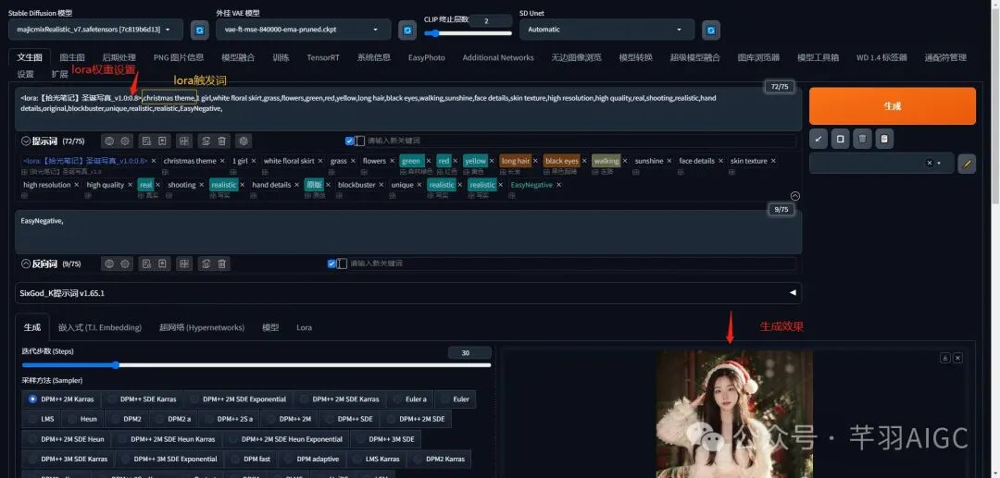

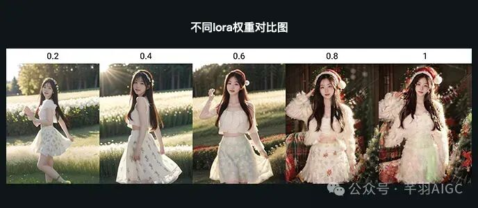

5.1.3 嵌入式模型-embedding（词包）：几k到十几K，后缀为pt或者safetensors

通常用来整合提示词，如用于描述一个东西，提示词很长，就可以打包成embedding一键调用即可，通常把一些反向提示词打包为embedding。

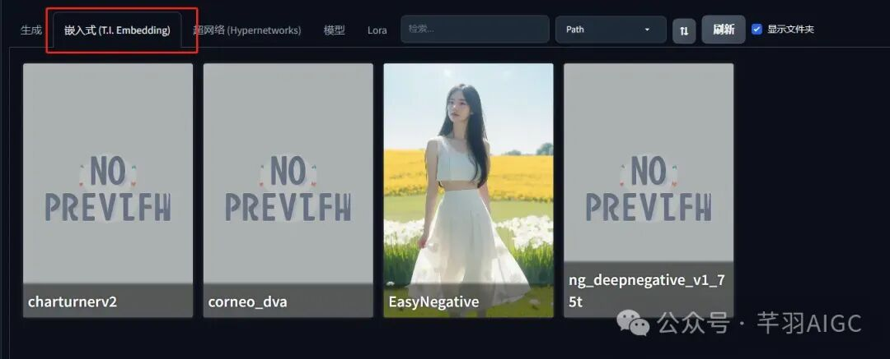

embedding的安装和使用

同样可以在启动器和上面提到的网站下载，安装路径：sd-webui-aki-v4.2\embeddings

选中正向提示词框或者反向提示词框点击就可，可根据需要改成中文名称，设置效果预览图方便查看等

#### 5.1.4 变分自编码器模型-vae (滤镜)：几百m，后缀为pt或者ckpt
英文名Variational Auto-Encoder，缩写成VAE。可以理解为滤镜，用于调整画面的颜色和细节，把浅空间的图片翻译成像素空间的图片。许多大模型在训练的时候会包含VAE，默认推荐使用vae-ft-mse-840000-ema-pruned.ckpt模型

#### 5.1.5 超网络模型-hypernetwork (画风模型)：几十到几百m，现在已经很少用到
功能和lora模型差不多，lora模型出来后差不多被替代了

5.1.6 CLIP 终止层数（对比语言图像训练模型：Contrastive Language-lmage Pre-Training）

作用：理解文字，弄懂我们输入的单词，调整的是SD软件对于文字的理解能力。数值越小，SD对提示词的理解能力越强，把控越精准。推荐参数：2，如果设置为1会使SD缺少想象力，都按照提示词进行生成。

这一排是不同功能的标签栏，有整合包自带的基础功能，如文生图、图生图、后期处理、PNG图片信息、扩展、设置等等，我们下载的插件也有一部分会在这里展现。

### 5.2 提示词（Prompt）

提示词也叫触发词，就是告诉SD你想让它达成的目的是什么，给它下达指令。在输入框中，每一个输入的单词/词组/短句，称之为tag (标签)，全部tag合并起来则称之为Prompt。

提示词分为正向提示词和反向提示词。正向提示词输入想要在画面出现的内容，反向提示词输入不想要在画面出现的内容，还可以提高画面的整体画质。

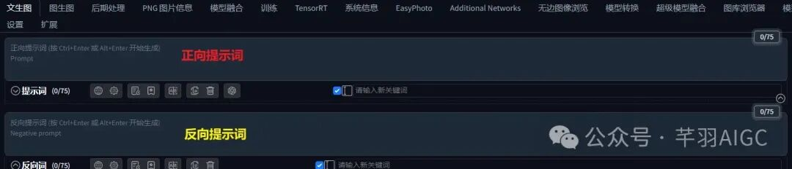

#### 5.2.1 提示词书写注意事项

### 1.提示词只能输入英文，中文效果不太好。

### 2.提示词写得越丰富生成的画面就会越丰富，因此应该尽量充分地写清楚目标效果。
3.提示词的权重按从前往后的顺序依次递减，越在前面的提示词越有效，当提示词到达一定长度时，最后面的提示词可能会不起作用。

#### 5.2.2 提示词分类书写思路
提示词书写格式通常为：质量词+主体+细节词+环境氛围词+艺术风格

注意：出现提示词对出图不起效果的的时候，可能跟大模型的选择有关，可以切换几个模型进行尝试

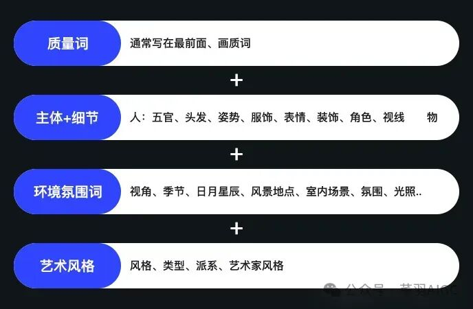

举个栗子：

best quality,masterpiece,heighres,8k,beautiful and aesthetic,official art,1girl,long blonde hair,closed mouth,make up,smile,standing,hand in pocket,white shirt,jeans.on the roof,background is city,sunset,in autumn,cinematic light,wide shot,

最好的质量，杰作，高，8k，美丽和美学，官方艺术，1女孩，金色长发，闭着嘴，化妆，微笑，站着，手放在口袋里，白衬衫，牛仔裤。在屋顶上，背景是城市，日落，秋天，电影光，广角，

#### 5.2.3 提示词的六大基本语法

### 1.内容形式
(1)  单词：1girl,,beautiful,sitting,table

优势：方便在不同的主体之间增加权重

局限：不便于体现多个主体之间的关系

(2)  词组：1 beautiful girl,sitting near the table

优势：更好地体现主体与主体之间的关系

局限：不方面在不同的主体之间增加权重

(3)  短句：1 beautiful girl sitting near the table

### 2.分割
用于分割不同关键词tag之间，用英文输入法的逗号进行分割，中间不用打空格，如1girl,stanting

### 3.权重语法
样式1：(提示词：权重数值)，举个栗子：（blue eye:1.5)

括号把提示词括起来，再加权重数值，数值从0.1~100，默认状态是1，低于1为减弱，大于1则是增强，一般不大于2，快捷键: ctrl + 方向键上下

样式2：（提示词) 或 [提示词]

每一层  {}  增强1.05倍，每一层（）括号增强1.1倍，每套一层  []  减弱1.1倍；复用括号一一可以多层套，最多可套三层，如：(((blue eye)))

### 4.混合语法
用 AND 把多种要素强制融合画进去，如：1cat AND 1dog ，画出来的动物就会又猫又狗的。

还可以添加权重，如：1horse:2 AND 1cow AND 1tiger

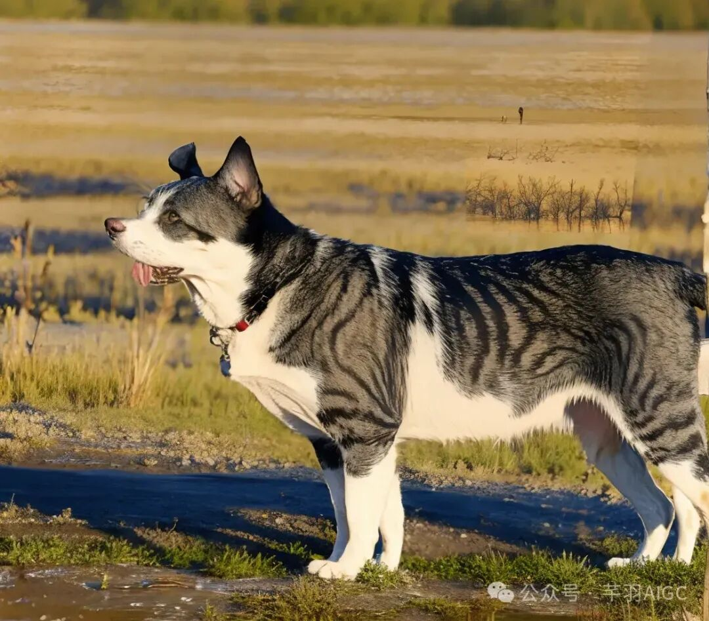

### 5.交替演算
轮流使用关键词来进行生成，某物与某物的交替演算，不仅仅是两个物体之间交替演算，还可以多个物体进行交替演算，使生成的画面具有多种特征

格式：[关键词1|关键词2|关键词3]，[cat|dog|bigj] in a field,

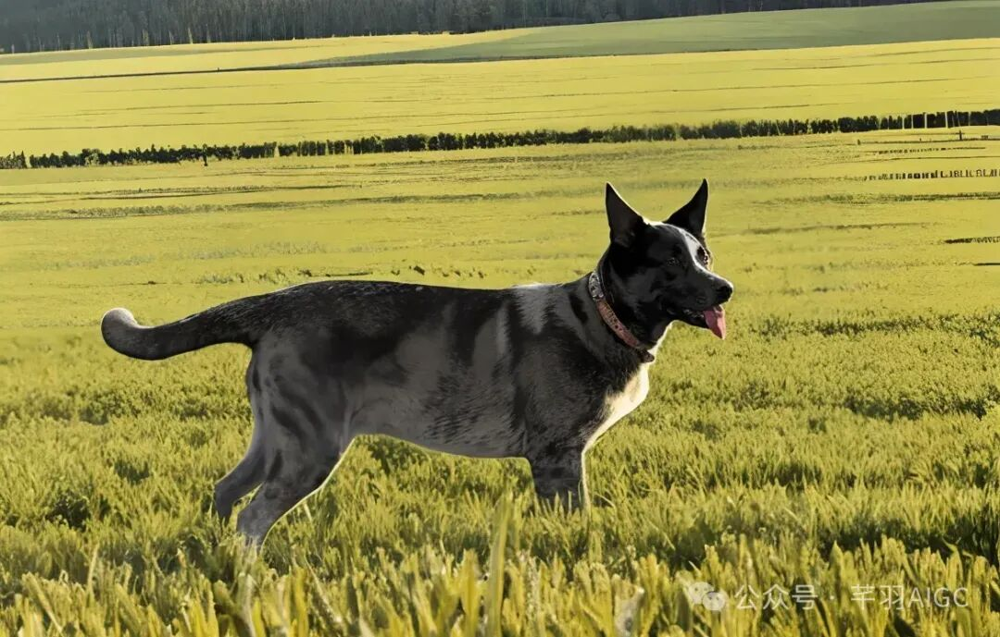

### 6.分段生成
有三种写法

(1)   [关键词1:关键词2:数字]，[from:to:when]

数字大于1的作用：第X步前为关键词1，第X步后变成关键词2，例如: [1man:flower:20]

数字小于1的作用：总步数的百分之X前为关键词1，例如: [1man:flower:0.5]

(2)  [关键词:数字]，[to:when]

数字大于1的作用：从XX步开始画，例如: [flower:20]

数字小于1的作用：从XX比例开始画，例如: [flower:0.5]

(3)  [关键词::数字]，[from::when]

数字大于1的作用：到XX步截止画，例如: [flower::20]

数字小于1的作用：到XX比例截止画，例如: [flower::0.5]

### 5.3 参数设置

#### 5.3.1 【采样方法】
可以理解为某个画家的作画方式，不同的采样方式搭配不同的模型、参数等都会产生不同的效果。

推荐采样方式：二次元使用：Euler a    真实系采用：DPM++ 2M Karras

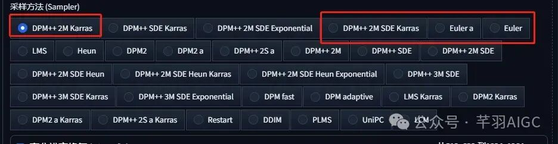

#### 5.3.2 【迭代步数】
可以理解为从布满噪声图的画布，到最终的结果呈现的过程中，中间一共去噪了多少次

在生成真实系图片时，迭代步数越高，对画的描绘就越精细，但太高就对画质的提升用处不大了。在生成二次元图片时，迭代步数太高有时候可能适得其反。因此，迭代步数推荐设置为20-40步（也可根据具体情况做适当调整）。

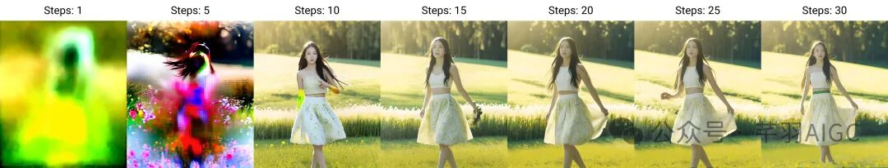

#### 5.3.3【高分辨率修复】
作用：扩大图片大小，增加像素

使用场景：通常情况下都可以使用，特别是在画人物全身图时脸崩的情况下，可以开启它对脸部进行修复

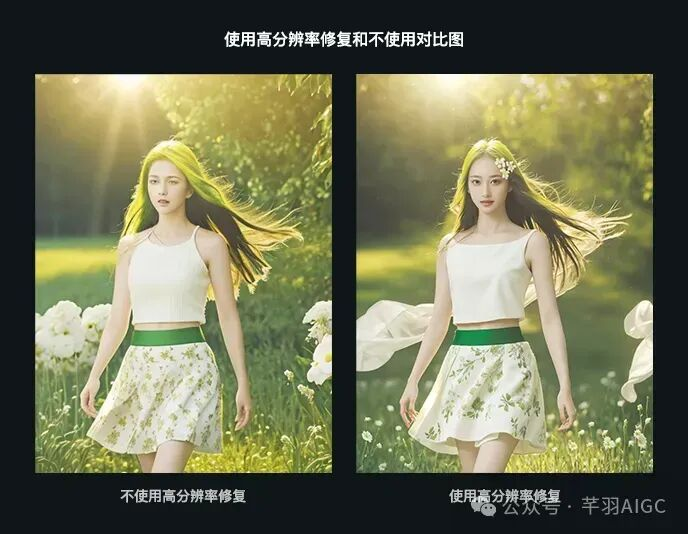

我们都知道，把一张尺寸小的图片放大会使它变得模糊，高分辨率修复就是在原来设置的图片尺寸上，采用相应的放大算法，对图片进行放大相应的倍数，使SD对图片有更大的细化空间，达到使图片依旧清晰的效果。

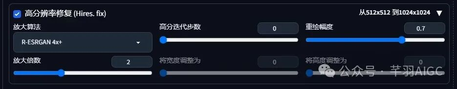

放大算法的逻辑和采用方法类似，在学习初期，推荐使用 “R-ESRGAN 4x+” 放大算法

放大倍数指在原来设置的尺寸上放大相应的倍数，如原来的尺寸是512*512，放大2倍就是1024*1024，放大3倍就是1536*1536，以此类推。

注意：放大倍数太高会出现爆显存的情况。

高分迭代步数：类似前面的迭代步数，默认为0，就是根据原本的迭代步数进行修复。如果是10，那就是在原来的迭代步数上加10进行修复。

重绘幅度：在原来尺寸的那张图上，修复得和原图多像的程度，参数范围是0-1，数字越小越像原图，数字越大越不像原图。这个参数也是图生图中非常重要的一个参数。

#### 5.3.4 【宽度】和【高度】
设置图片的宽高，默认是512*512，此时为正方形图片，把宽加大，设置为680*512，此时为长方形，点击转换按钮可以切换长宽参数。宽高越大，生成图片速度越慢。

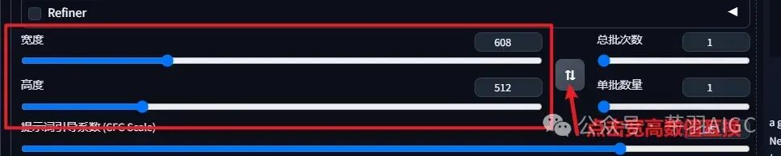

#### 5.3.5 【总批次数】、【单批数量】
总批次数：每次生成(单批数量）的图片张数，依次进行生成

（1）优点：对显卡的需求降低

（2）缺点：生成图片的时间变长

单批数量：同时生成多张图片，优点：将图片拼凑在一起同时生成，对显存的利用率可以有效提高

5.3.6 【提示词引导系数】Classifier-Free Guidance(CFG) scale (CFG指数)

用于调节文本提示对扩散过程的引导程度。参数范围为1-30，提示词引导系数数值越高，图片越受到提示词的影响。数值越小，除了提示词描述的内容外，SD会根据提示词生成一些其他的内容，如提示词是一个女孩，图片还可能会出现街道等，数值越大，生成的图片和提示词越接近。

保持在5-9之间最佳。如果生成画面有“太用力”的情况，调低CFG值。不要超过12，画面很容易崩。

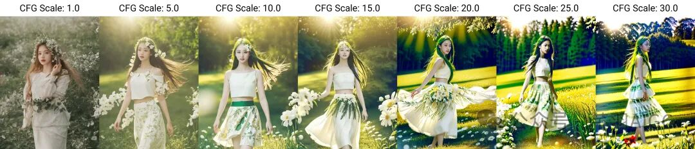

#### 5.3.7 【随机数种子 seed】：限定像素点的分布（附图）
使用场景：控制画面整体格局时，需要对图细微调整时

每张图片都由像素点组成，不同图片像素点分布位置不同。在种子值固定的情况下，生成的图片大致差不多，只是会在细节上有细微差别。

注意：种子值并不是限定画面的内容，而是固定像素点的位置

骰子按钮：点击后数值显示-1，这时SD随机出图，在跑出满意的图之前，通常为-1，可以跑出各种各样可能性的图，直到跑出满意的图后点击骰子旁边的按钮，这时该图的种子值自动被获取，可以对此图进行细调

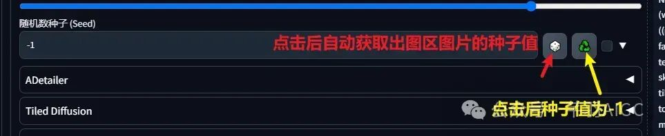

### 5.4 插件区

存放插件的地方，安装的插件除了有一部分会显示在上面的标签栏之外，许多插件也会在这里显示。（此部分进阶篇详细说明）

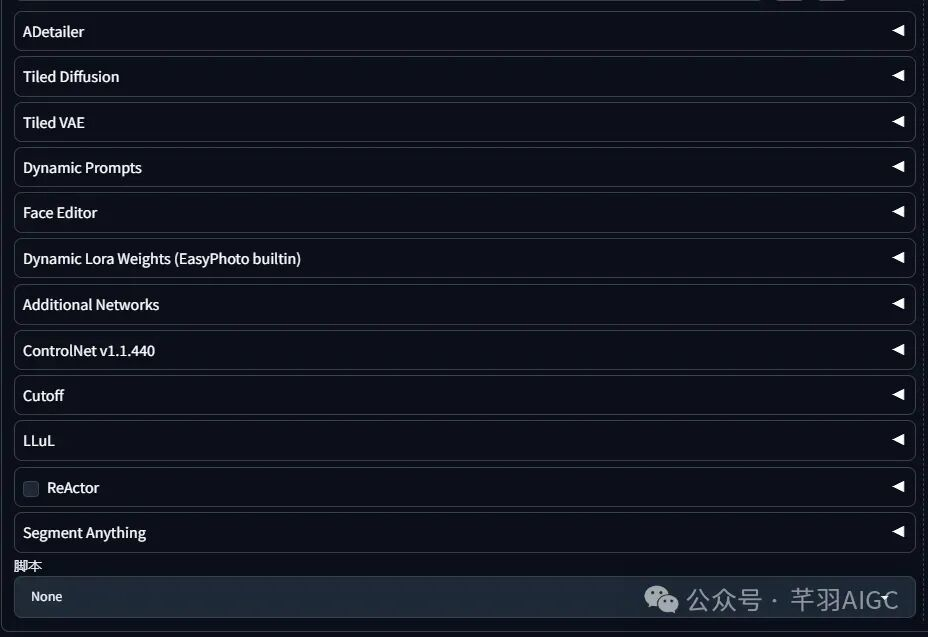

### 5.5 出图区

#### 5.5.1 【生成】按钮
在选择完模型，填入提示词，设置完参数之后单击【生成】，就可以生成图片。右键单击此按钮可以选择【无限生成】和【停止无限生成】

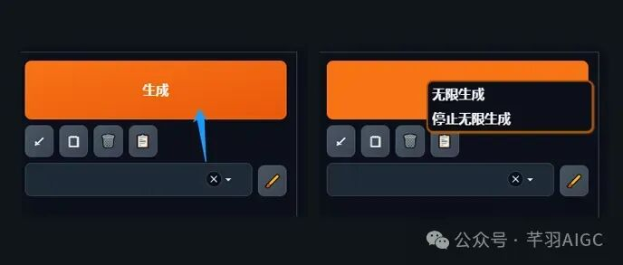

各按钮含义及用法

【1】：单击可以自动获取在生成区的图片的提示词和采样方法

【2】：单击出现输入框，输入提示词后自动填入正向提示词

【3】：单击清空正向提示词和负向提示词

【4】选择预设提示词里的任意一项后点击此按钮，原来预设好的提示词将自动填入正向提示词和反向提示词。

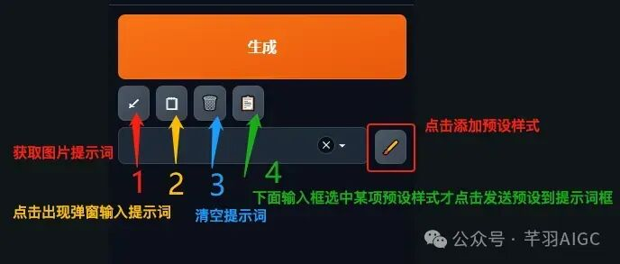

【添加预设】：单击出现弹窗，填写预设样式、正向提示词和反向提示词，然后保存，下次就可以直接调用了，可以把通用的质量词和负面提示词添加到预设里。

预设的删除：已经添加的预设没有办法在Webui里进行删除，需要在SD的根目录里找到 “styles.csv” 的文件，打开进行删除。

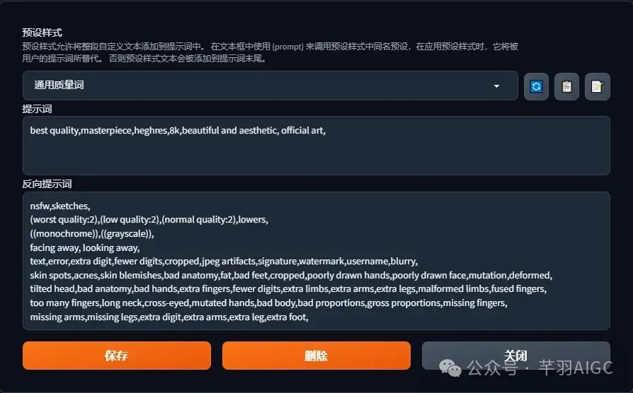

### 5.6 图片展示区

点击生成的图片可以放大，右上角分别是下载和关闭按钮，

【文件夹】：单击打开储存该图片的文件夹

【保存】、【打包下载】：单击后按钮下方会出现该图的名称和下载按钮（如果总批次数和单批数量大于1就会自动打包成压缩包），点击下载即可下载图片或者压缩包

【发送到图生图】、【发送到局部重绘】：单击后跳转到图生图页面，生成该图的提示词也自动获取，我们就可以对图片进行二次创作。

【发送到后期处理】：单击后跳转到后期处理界面，可以对图片进行再处理

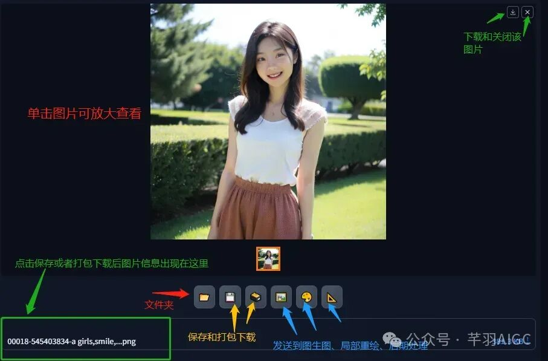

生成信息区域：在生成的图片下方会显示该图片所有的参数，如正向提示词、负向提示词、种子数、迭代步数、采样方法、尺寸、大模型、VAE模型、版本、生成图片所用时间等。

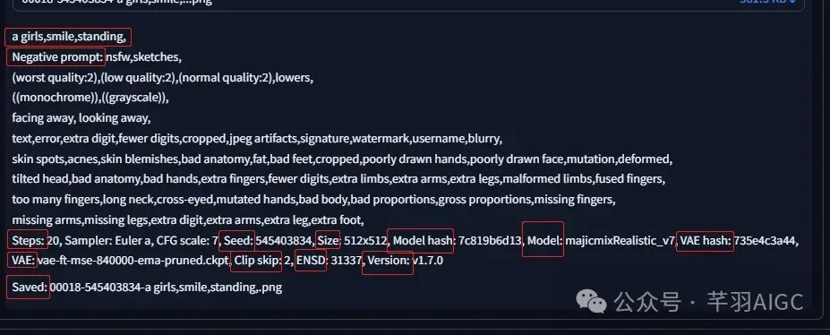

### 5.7 图生图

上面提到的都是文生图的逻辑，接下来是图生图，图生图的出图逻辑与板块和文生图都差不多，只不过是在文生图的基础上加了上传参考图片这一选项

#### 5.7.1 图生图出图步骤：
第一步：选择大模型

第二步：输入正向提示词和反向提示词，这里可以使用 “WD 1.4标签器” 上传图片反推提示词再发送到图生图，系统会自动获取正向提示词

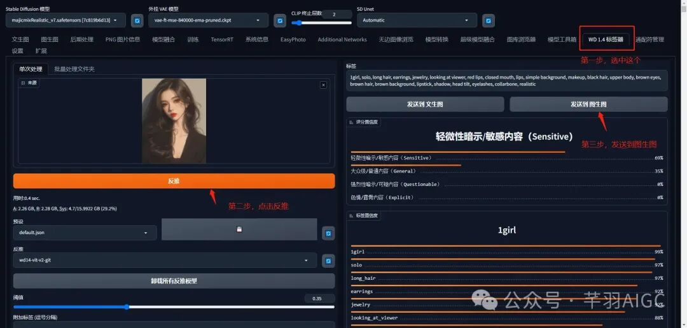

第三步：参数设置

### 1.缩放模式：当参考图片与设置的分辨率不同的时候，采用何种策略。
【仅调整大小】：图片拉伸压缩，导致图片变形

【裁剪后缩放】：裁剪参考图片，只显示相应尺寸内的内容

【缩放后填充空白】：参考图整张图片都缩小后进行囊括，再自动填充空白部分

【调整大小(潜空间放大)】：图片拉伸压缩，导致图片变形

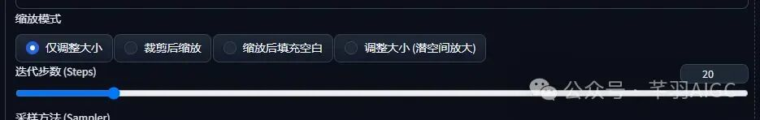

2.重绘尺寸：可以随意设置自己想要的宽高，如果想要和原图片宽高一致，可点击此按钮一键获取

### 3.重绘尺寸倍数：在参考图的尺寸基础上，放大图片到指定倍数
4.重绘幅度：这个参数在图生图中特别重要，它是指你想要生成的图片和参考图相似的程度，

原理：给参考图片铺上噪点，然后重新进行去噪步骤。

参数范围为0-1，越接近0生成的图和原图越像，越接近1和原图越不像。

0.1-0.4：整体不变；

0.4-0.7：画面进行大修

0.8-1：基本重新创作

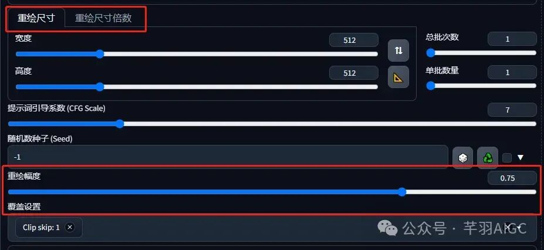

第四步：点击【生成】

以上步骤完成后点击【生成】

#### 5.7.2 涂鸦、局部重绘、涂鸦重绘：
这三者都可以理解为是在图生图的基础上的一个修改局部的功能

1.涂鸦：在上传的图片上用画笔随意涂抹，涂抹的东西会生成相应的内容。在上传图片的右上角，可以选择画笔大小、画笔颜色，清空涂鸦，撤回上一步，删除上传的图片这几个功能

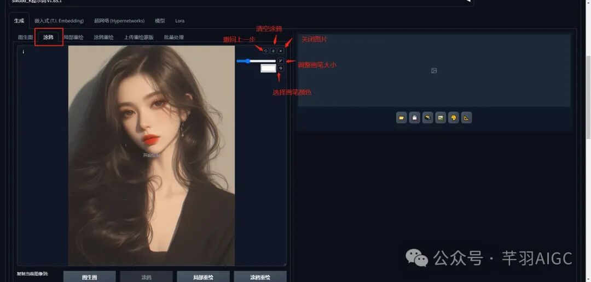

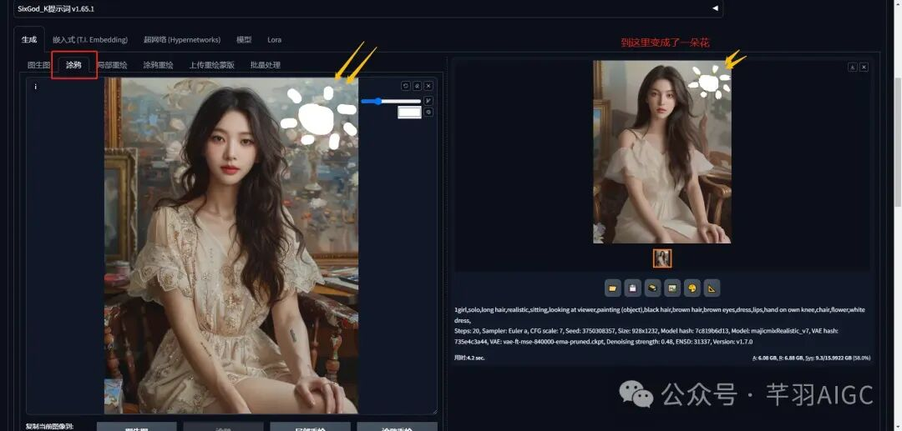

### 2.局部重绘
只重绘图片中限定范围的内容。用画笔涂抹想要变化的区域，在提示词框输入想要在涂抹区出现的词，点击生成即可。可用于模特换衣、模特换脸、修改瑕疵等。

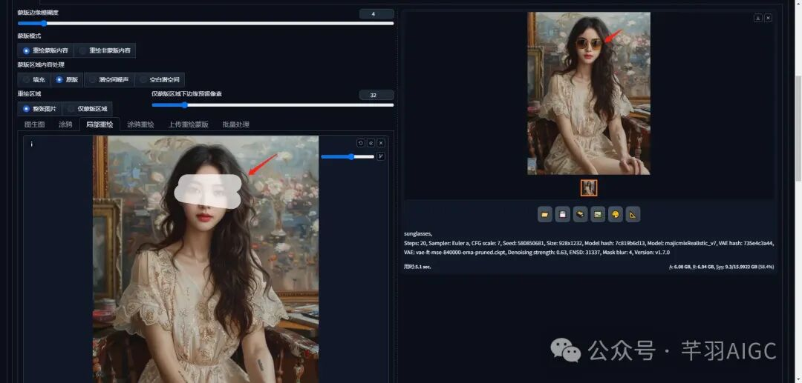

（1）【蒙版边缘模糊度】

类似Photoshop里面的羽化，参数范围为0-64，参数越接近0涂抹的边缘越生硬，越接近64涂抹的边缘越柔和

（2）蒙版模式：

【重绘蒙版内容】：就是重绘你涂抹了的地方，其他地方还是和原图一样保持不变、

【重绘非蒙版内容】：就是重绘你没涂抹的地方，你涂抹了的地方还是和原图一样

（3）蒙版区域内容处理：

【填充】：填充原图模糊化后的像素，略微参考原图色调进行重绘，重绘幅度应大于0.8

【原图】：参考原图进行重绘，重绘幅度0~1

【潜空间噪声】：噪点以像素方式填充，彻底重绘，抹去原图信息，重绘幅度应大于0.8

【空白潜空间】：全部以棕色进行填充，彻底重绘，抹去原图信息，重绘幅度应大于0.8

（4）重绘区域：通常来说，选择【整张图片】选项会使蒙版区域的内容和其他内容融合得更自然。有些情况下，如一张像素不高但是全身的照片，由于分辨率不足，这时脸肯定是崩坏的，这时使用局部重绘功能修复脸，在重绘尺寸为512*512的情况下，重绘区域选择【仅蒙版区域】效果比选择【整张图片】效果好。

因为如果选择【整张图片】等于是512*512这些像素重新画了整张图，而脸部所占像素仍然很少，分辨率太低还是会导致脸崩的情况出现，但是选择【仅蒙版区域】就相当于512*512这些像素只需要填充整张脸就行，分辨率的提高能有效修复脸部。

【整张图片】：SD会把整张图片重新画一遍，但是会对蒙版区域的内容进行变化（如果选择的是重绘蒙版内容的话）

【仅蒙版区域】：SD不会变动没有蒙版区域的内容，只是改变蒙版区域的内容

### 3.涂鸦重绘：和涂鸦差不多

4.上传重绘蒙版：在前面几种重绘功能中做不到特别精细化的处理，而上传重绘蒙版可以在SD以外的软件里先把蒙版做好再上传，提高蒙版的精细化和可控性。

上传的蒙版黑色为非蒙版区，白色为蒙版区，

在此功能下，上图为原图，下图为蒙版图。原图和蒙版图大小需一样。

注意：蒙版这里需要上传jpg格式的图片，png可能会无效

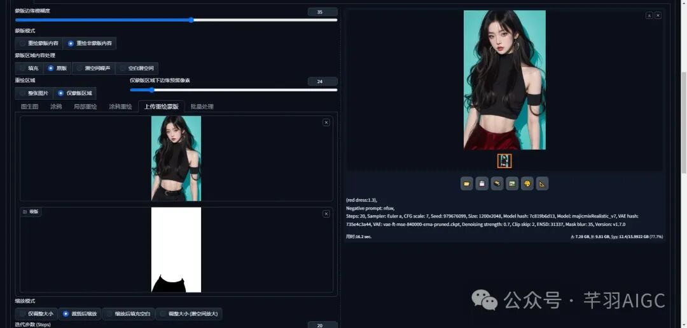

### 5.批量处理
使用场景：有多张图片需要图生图或者重绘的时候使用

使用步骤：

点击输入目录和输出目录的文件夹路径，复制填入，如需要批量重绘蒙版也需要新建一个文件夹存放蒙版，然后把文件夹路径复制到指定区域。

注意：蒙版图和需要处理的原图名称应当是一样的！

其他参数和原来的设置一样，按步骤设置好即可点击生成，生成的图片会出现在【输出目录】里

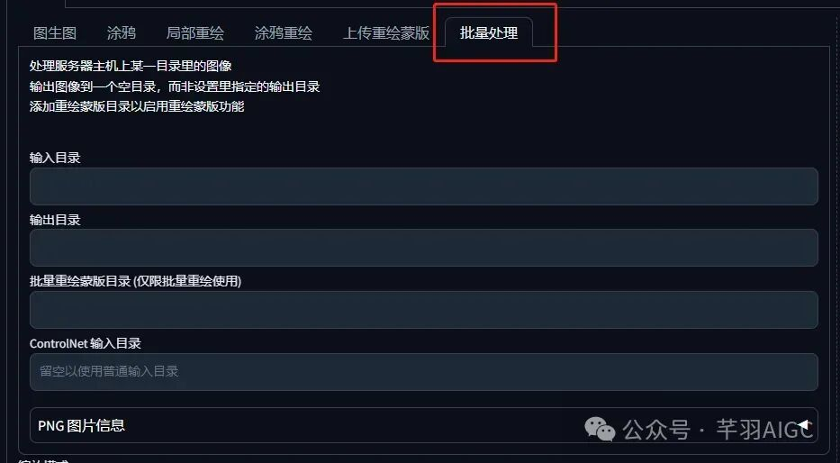

## 六、写在最后
在学习Stable diffusion的过程中会出现各种各样的问题，比如说很多报错问题；明明自己的提示词和别人的提示词一模一样，但是生成的效果却跟那什么一样；命令无效的问题；插件找不到的问题；很难生成自己想要的效果等等。但是Stable diffusion也没有想象中那么难学，重要的是克服畏难的心理，迈出第一步，遇到问题一步一步耐心按照步骤去解决。如果本文有描述错误的地方，欢迎指正！
