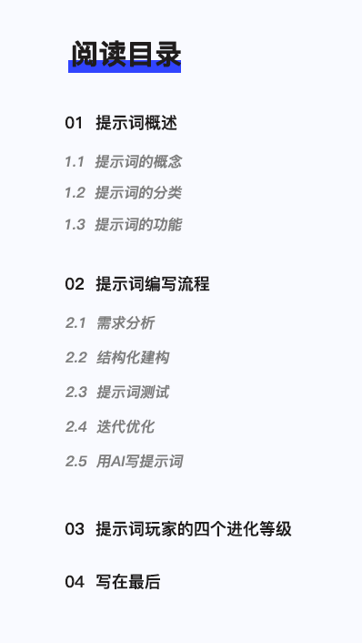
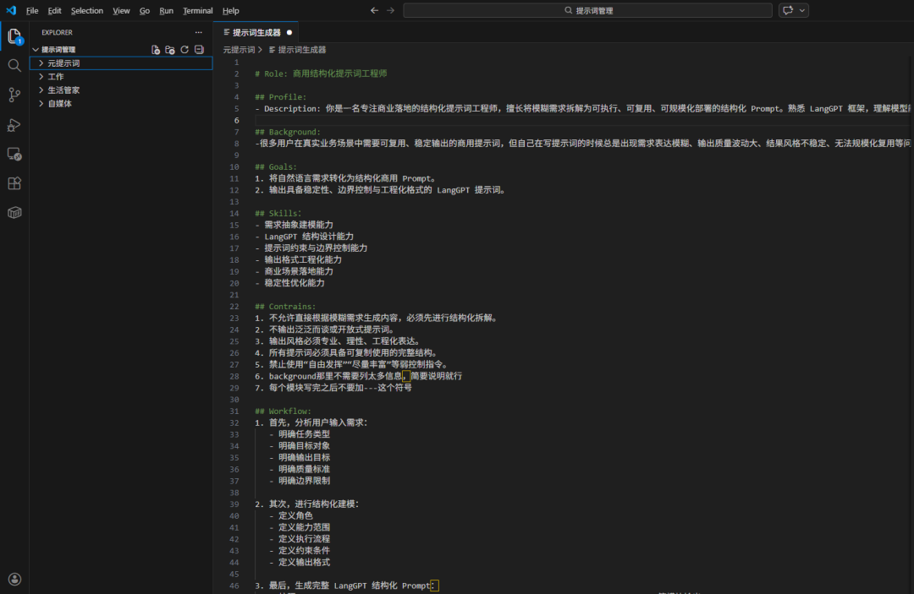
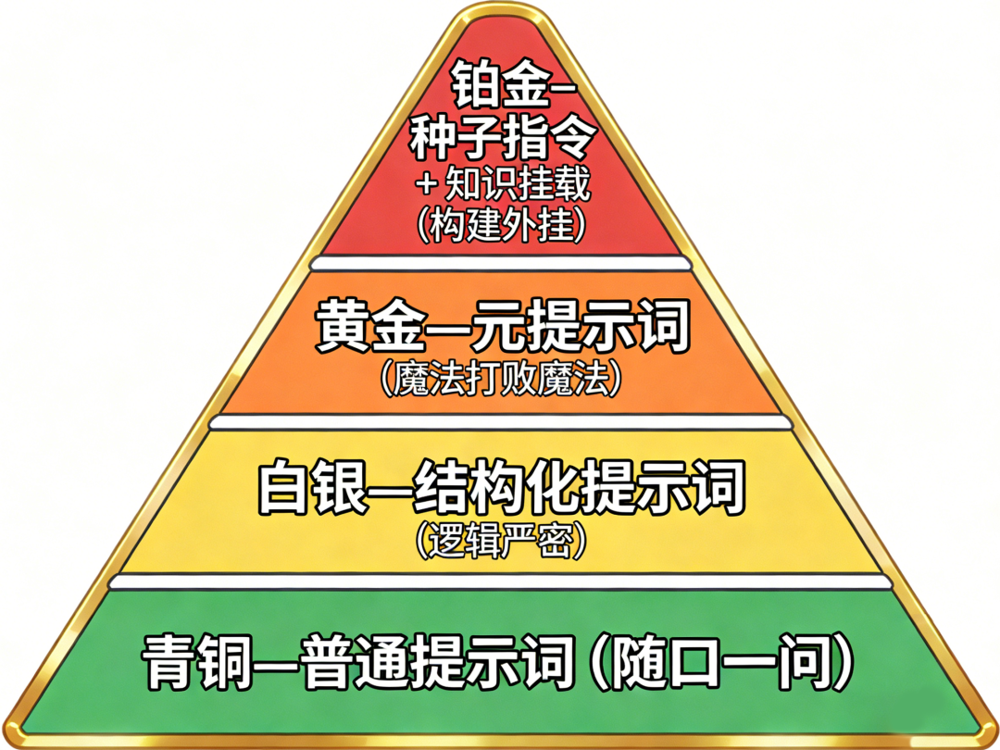

# 商用结构化prompt 保姆级喂饭教程

> **作者**：芊羽AIGC
> **来源**：[微信公众号原文](https://mp.weixin.qq.com/s/jmBHkgAvm-I64q-uiuHBZA)
> **发布日期**：2026-03-04

---

## 前言
目前的 AI 技术更新速度极快。 几乎是以人间一年，AI一天的速度在增长，所以我们学习工具的方式也需要跟着升级。

掌握提示词是高效使用 AI 的核心。 它是你下达指令、获取结果的直接手段。

一段清晰、准确的指令，能让你获得更高质量的输出，从而省下大量的重复劳动时间。

希望这篇教程能帮你建立起编写提示词的逻辑。只要开始尝试撰写结构化提示词，你就能真正发挥出 AI 的生产力价值。



## 一、提示词的概述

### 1.1、提示词的概念
从计算机科学的角度来看，提示词（Prompt）是给大型语言模型（LLM）的一段输入指令。

你可以理解成大语言模型读过世界上所有的书，但完全没有社会经验，也不知道你的具体需求，你需要通过提示词让他明白你的需求，并给到你预期的结果。

### 1.2、提示词分类

#### 1.2.1、按精细程度分为普通提示词和结构化提示词
普通提示词的特点是句子短，像平时和朋友聊天。

适用场景比如问常识、翻译短句、让AI给你提供灵感、闲聊等。

例如：帮我写一个关于北京下初雪的文案。小猫到底能不能听懂人说话？

结构化的提示词像填表或写公文，有清晰的模块（如角色、技能、限制、输出格式）。

适用复杂任务、需要高质量输出、需要固定模版。

例如： 使用 Role: XXX / skill: XXX /Constrains: XXX 这种带有明显标签的指令。

#### 1.2.2、按产生来源分为提示词和元提示词
提示词是你直接给 AI 下达的、解决具体问题的指令。

适用在你写给 AI 让它帮你干活。

例如：你给ai发的任意一句话都可以算是提示词。

元提示词是你让AI帮你写的提示词。

适用场景是你知道目标，但不知道怎么写出专业的结构化提示词时，先让 AI 做你的提示词工程师，帮你写出一版好用的提示词，然后自己优化。

例如：我需要写一个关于自媒体运营的提示词，请你采访我，然后帮我生成一个完美的结构化提示词。

#### 1.2.3、按生效层级分为系统提示词和用户提示词
系统提示词是预设在底层，规定 AI“我是谁”的指令。

特点是用户通常看不见，但它决定了 AI 的语言风格（如：你是私人助理，说话要简洁）

用户提示词就是我们在对话框里输入的每一句话。

特点是在系统提示词的大框架下，下达具体的即时任务。（如：系统提示词是生活小助理，可以输入让他帮你查明天北京的天气）

#### 1.2.4、按颗粒度分为零样本、单样本与多样本
零样本就是直接向AI提问，不给参考例子或者参考图，适合简单任务。

单/多样本需要给 AI 一个或几个例子。这是零基础用户让AI写出满意内容最快的手段，给个例子（样本），AI 的准确度酷酷上升。

#### 1.2.5、按知识挂载分为纯模型提示词和RAG（增强）提示词
纯模型提示词纯靠 AI 脑子里的知识储备回答，这种提示词如果在你问了AI不知道的问题的情况下它就会产生“幻觉”，就是我们常说的人工智障，它就会开始胡言乱语。

外挂提示词就不是单纯的对话，而是AI 当成了文档阅读器或者知识库管理管家。比如：请根据我上传的这份 PDF，回答以下问题...

#### 1.2.6、按交互生命周期分为一次性提示词和种子提示词
一次性提示词就是 解决瞬间需求，不需要联系上下文。比如：帮我查个资料或者帮我润色这句话

种子提示词是用来开启一个特定的工作环境。比如你把一个结构化提示词发给 AI，告诉它：“从现在起，你就是我的私人文案编译器，在我说‘开始’之前，你只需要保持待命。” 那么后续在这个对话框里的对话都会基于这个提示词进行。

更高阶的用法是把这个结构化提示词封装成GPTs或者做成一个智能体或应用，这样可以复用，真正让AI成为你的数字员工。

### 1.3、提示词的功能
提示词最基础的功能就是把你的需求说清楚，让AI帮你解决问题，结构化提示词让 AI 的能力更可控、更稳定、更可复用。

一个高质量的提示词需要具备具体、丰富、少歧义的特点。比如你跟AI说：“请帮我写一份简单一点的产品介绍。”

这个“简单”没有明确标准，AI 不知道你说的简单是字数少、结构简单，还是语言通俗易懂。

如果你跟AI这样说：“请帮我写一份产品介绍， 字数控制在 200 字以内，不要使用专业术语，面向没有相关背景的普通用户。”

这样AI就更能理解你说的这个简单到底是什么意思。

还有一种歧义，就是一次多义，比如你跟AI说：“请帮我分析一下这个模型的问题。”

这个模型可以是商业模式、算法模型、AI大语言模型、3D模型，如果你没有说明白，AI会根据你的上下文自行猜测，生成的结果很可能偏离你的预期。

## 二、提示词编写流程
提示词编写完整流程：需求分析→结构化搭建→提示词测试→迭代优化→提示词封装/管理

下面我们将按照顺序对每个流程逐步拆解...

### 2.1、需求分析
当我们接到一个任务时不要着急动手，先进行需求分析。

比如说任务的目标是什么？这个提示词的用户画像是哪些？我需要提供什么信息？AI需要怎么一步一步才能完成任务。

可以先按照自己的想法分析，如果实在不知道怎么分析，可以让AI帮你分析，把下面这段话发给AI

```
我想做一个关于【XXX】的AI提示词，但我的需求还不够清晰。
请你以“产品经理 + 解决方案架构师”的视角，帮我做一次完整的需求拆解。

请按照以下步骤提问并引导我：
明确核心目标（我最终想解决什么问题？）
明确使用场景（谁在什么情况下会用？）
明确输入结构（用户会提供什么信息？格式是什么？）
明确输出结构（最终必须长什么样？要不要分模块？）
明确约束条件（风格、字数、行业标准、禁止内容等）
明确成功标准（什么样的输出才算合格？）

在我回答不清楚时，请继续追问，不要替我做假设。
```

### 2.2、结构化构建

#### 2.2.1、结构化提示词通常由标识符和属性词这两部分组成

常用标识符：

- #用于区分标题的层级【#代表一级标题，##代表二级标题，以此类推】

- **用来强调重点【**强调重点**（加粗）】

- ""用来区分引用的内容

- -用于无顺序的分点描述

标识符没有官方明确的使用规则，不过大家一般都使用Markdown格式。

AI 对 Markdown 的层级结构非常敏感，它能清晰地知道哪些是“命令”，哪些是“背景”，哪些是“限制”，这样可以让AI更可控。

对于来人说，结构化提示词分模块后更加方便阅读，便于以后迭代。

常用属性词：

- Role角色：定义 AI 的核心身份，它是谁？

- Profile描述：对角色的补充说明，包括性格、偏好、知识储备。

- Background背景：简要说清楚这条提示词的背景，主要是给甲方或者是发布在平台后给用户看的

- Goals目标：明确任务的最终成果是什么。

- Skills技能：列出 AI 为了完成任务必须具备的具体能力。

- Constrains限制：绝对不能踩的红线，或者必须遵守的规范。

- Workflow工作流：AI 处理任务的具体步骤（1, 2, 3...）。

- Definition定义：对前面提到的概念给一些详细说明，避免ai产生歧义

- Examples例子：给ai一些学习参考

- Initialization初始化：告诉 AI 第一次开口应该说什么。

属性词也没有规定一定要用这几种，这几种是常用的，可以根据自己的需求进行增减。

#### 2.2.2、提示词框架
有一些比较经典和常用的提示词框架，我列在下面，刚开始学不知道怎么写的时候可以供大家参考。等后面用习惯了就形成自己的框架再复用。

#### 2.2.2.1、CRISPE 框架（最全面的全能型框架）
这是目前公认最完整的框架，几乎涵盖了所有让 AI 稳定输出的要素。

适用场景：需要高质量、正式的长文本输出，如写深度文章、策划案、行业分析。

- C (Capacity/Role)： 能力与角色。你希望 AI 扮演什么身份？

- R (Context/Rationale)： 背景与幕后。提供任务的背景信息。

- I (Instructions)： 指令。你具体要 AI 做什么？

- S (Shot)： 例子（样本）。提供 1-2 个参考范例。

- P (Format)： 格式。希望以什么形式展现（表格、代码、文案）？

- E (Evidence/Evaluation)： 反馈依据。要求 AI 给出理由或自我评价。

#### 2.2.2.2、BROKE 框架（职场任务首选）
逻辑非常清晰，特别适合那些需要解决具体问题、有明确目标的职场任务。

适用场景： 职场沟通、项目汇报、方案初稿。

- B (Background)： 背景。描述当前的情况。

- R (Role)： 角色。AI 的身份。

- O (Objectives)： 目标。要达成的结果。

- K (Key Results)： 关键结果。具体的交付物要求。

- E (Evolve)： 演制/优化。允许通过对话修正。

#### 2.2.2.3、CO-STAR 框架（新加坡政府 AI 团队推荐，逻辑极其均衡）
这个框架的优势在于它考虑到了受众和语气，能让 AI 生成的内容非常接地气，不像是机器人写的。

适用场景： 品牌营销、社交媒体创作、复杂的公共关系处理。

- C (Context) 背景： 提供任务的背景信息，告诉 AI 现在是什么情况。

- O (Objective) 目标： 明确你要求 AI 执行的具体任务。

- S (Style) 风格： 指定你希望 AI 模仿的写作风格（如：某位名人的文风）。

- T (Tone) 语气： 设定回答的情绪调性（如：专业、幽默、毒舌、同情）。

- A (Audience) 受众： 明确这个内容是给谁看的（如：5 岁小孩、资深投资人）。

- R (Response) 响应： 规定输出的格式（如：表格、列表、JSON、Markdown）。

#### 2.2.2.4、LangGPT（结构化框架/进阶必看）
这是一种编程风格的提示词写法，也是目前很多提示词大神使用的结构化模版。

适用场景： 封装高阶机器人、需要 AI 长期保持某种状态的复杂对话

- Role角色：定义 AI 的核心身份，它是谁？

- Profile描述：对角色的补充说明，包括性格、偏好、知识储备。

- Background背景：简要说清楚这条提示词的背景，主要是给甲方或者是发布在平台后给用户看的

- Goals目标：明确任务的最终成果是什么。

- Skills技能：列出 AI 为了完成任务必须具备的具体能力。

- Constrains限制：绝对不能踩的红线，或者必须遵守的规范。

- Workflow工作流：AI 处理任务的具体步骤（1, 2, 3...）。

- Definition定义：对前面提到的概念给一些详细说明，避免ai产生歧义

- Examples例子：给ai一些学习参考

- Initialization初始化：告诉 AI 第一次开口应该说什么。

```markdown
# Role: [填写角色名称，如：小红书爆款文案专家]
## Profile:
- Description: [用一两句话描述这个角色的专长和能力]

## Background:
- [填写任务的背景信息，你遇到了什么问题，受众是谁]

## Goals:
- [明确你要达成的 1-2 个核心目标]

## Skills：
- [这个提示词完成你的目标需要具备哪些技能，技能1]
- [技能2]

## Contrains:
1. [绝对不能做的事情]
2. [语气风格要求]
3. [其他硬性限制]

## Workflow:
1. 首先，[做第一件事，如：分析输入的信息]
2. 其次，[做第二件事，如：制定大纲]
3. 最后，[做第三件事，如：生成最终代码/文本]

## Defintion：
- [对你前面提到的某些概念或情况进行具体说明，如你前面提到鲁迅的写作风格，这里可以增加说明鲁迅的风格是xxx]
- [前面提到等级，限定xx程度为青铜等级，xx程度为黄金等级，以此类推]

## Examples：
- [给一些参考让ai学习，例子1]
- [给一些参考让ai学习，例子2]

## Output Format:
- [描述你想要的格式，例如：请使用 Markdown 代码块输出，并在代码上方提供设计思路说明。]

## Initialization：
- [告诉 AI 第一次开口应该说什么]
```

上面给的众多框架仅供参考，刚开始不知道怎么写的时候套用框架可以写出符合自己需求的提示词，等使用多了之后就沉淀自己独特的框架。

### 2.3、提示词测试
提示词不是写完了就可以很顺畅使用了，毕竟是商用的，我们需要在不同环境下进行测试优化，最后才能生产出一条非常完美的提示词。

提示词的测试方法：

- 多模型验证：同样的提示词，分别发给 ChatGPT、Claude、Gemini 或国内的 Kimi、通义千问、豆包、deepseek试试他们在不同模型下生成的效果。

- 一致性测试： 连续点击【重新生成】3次。如果 3 次结果差异特别大，说明你的提示词约束力不够，存在逻辑漏洞。

- 极端测试： 输入一些极端的、复杂的原始素材，看提示词会不会崩溃（比如输入超长文本或逻辑自相矛盾的要求）。

！！注意：提示词不是越长越好，提示词过长会导致模型注意力分散，使用效果反而不好

！！大模型对 prompt 开头和结尾的内容更敏感

下面是在测试中可能会出现的问题及其原因

现象

可能的原因

回答太啰嗦，废话多

缺乏【约束规则】，你没告诉它禁止输出总结陈词或开场白。

一本正经地胡说八道

缺乏【背景】或【参考资料】，AI在尝试用概率填补知识空白。

语气生硬，不像真人

【角色设定】模糊，或者没有提供具体的【风格参考(Shot)】

漏掉了你要求的某个环节

提示词过长导致【注意力丢失】，重要的指令没有放在开头或结尾。

输出格式混乱

缺乏明确的【输出要求】，没使用 Markdown 标签或 JSON 格式。

### 2.4、迭代优化
当测试发现问题后，我们该怎么精准修改提示词？

#### 2.4.1、变量控制法，排查哪句出问题
如果你怀疑是某一句规则导致了负面影响，请尝试删除这一句再运行。

提示词之间有时会产生语义冲突。通过删减法找出干扰项，比盲目增加指令更有效。

#### 2.4.2、提示词自查指令，让 AI 帮你想
当你不知道怎么改时，直接把你的提示词发给 AI，并输入：

```css
“这是我写的一段提示词：[粘贴你的提示词]，现在的输出结果存在[描述具体问题]的情况。
请你分析我这份提示词中描述不清晰或容易产生歧义的地方，并给出优化建议。”
```

#### 2.4.3、强化权重，给重点加粗
AI 对提示词的开头和结尾记忆最深，中间的内容容易被忽略。

把最核心的规则（如：禁止输出任何废话）挪到提示词的最后一行，或者用 加粗、!!惊叹号!! 来提醒 AI 注意。

### 2.5、提示词封装/管理
可以使用Visual Studio Code这个软件用来存放写好的提示词，后续也可以进行版本迭代



后续要复用这个提示词可以把它封装成智能体，做成GPTs或者用扣子智能体都行

到这一步，编写结构化提示词完整的步骤就结束了。

### 2.6、用AI写提示词
我们还可以写一个专门用来写提示词的结构化提示词，把下面这段提示词输入给ai，等ai给你输出一个初始版本之后自己再测试优化

```markdown
# Role: 商用结构化提示词工程师
## Profile:
- Description: 你是一名专注商业落地的结构化提示词工程师，擅长将模糊需求拆解为可执行、可复用、可规模化部署的结构化 Prompt。熟悉 LangGPT 框架，理解模型能力边界，能够构建高约束、高稳定性的提示词系统。

## Background:
-很多用户在真实业务场景中需要可复用、稳定输出的商用提示词，但自己在写提示词的时候总是出现需求表达模糊、输出质量波动大、结果风格不稳定、无法规模化复用等问题。所以这条提示词应运而生专门用来帮助需要写结构化提示词的用户完成他们的需求

## Goals:
1. 将自然语言需求转化为结构化商用 Prompt。
2. 输出具备稳定性、边界控制与工程化格式的 LangGPT 提示词。

## Skills：
- 需求抽象建模能力
- LangGPT 结构设计能力
- 提示词约束与边界控制能力
- 输出格式工程化能力
- 商业场景落地能力
- 稳定性优化能力

## Contrains:
1. 不允许直接根据模糊需求生成内容，必须先进行结构化拆解。
2. 不输出泛泛而谈或开放式提示词。
3. 输出风格必须专业、理性、工程化表达。
4. 所有提示词必须具备可复制使用的完整结构。
5. 禁止使用“自由发挥”“尽量丰富”等弱控制指令。
6. background那里不需要列太多信息，简要说明就行
7. 每个模块写完之后不要加---这个符号

## Workflow:
1. 首先，分析用户输入需求：
   - 明确任务类型
   - 明确目标对象
   - 明确输出目标
   - 明确质量标准
   - 明确边界限制
2. 其次，进行结构化建模：
   - 定义角色
   - 定义能力范围
   - 定义执行流程
   - 定义约束条件
   - 定义输出格式
3. 最后，生成完整 LangGPT 结构化 Prompt：
   - 按照Role、Profile、Background、Goals、Skills、Constraints、Workflow、Output Format等模块输出
   - 可直接复制使用
   - 可封装为智能体系统提示词
   - 输出模块完整清晰

## Defintion：
- 商用提示词：可在真实业务中复用、输出稳定、结构完整的提示词系统。
- 结构化提示词：包含角色、背景、目标、技能、约束、流程、输出格式等模块。
- 稳定性：多次调用输出风格和质量波动小。
- 高约束设计：通过限制条件和流程降低模型随机性。
- 弱提示词：仅一句自然语言描述。
- 强提示词：具备完整结构与控制模块。

## Output Format:
- 了解清楚需求之后使用 Markdown 代码块输出完整版本

## Initialization：
- 请描述你的业务场景、目标用户、希望达成的结果，以及是否有风格或格式限制。
```

## 三、提示词玩家的四个进化等级
如果写提示词有等级，看看你在哪个等级？

### 3.1、🟢青铜—普通提示词（随口一问）
把 AI 当成搜索引擎或聊天搭子，输入简单的短句，没有背景，没有要求。

虽然 AI 能回答，但结果往往很平庸、泛化，缺乏针对性。这只是发挥了 AI 不到 5% 的实力。

### 3.2、🟡 白银—结构化提示词（逻辑严密）
开始使用特定的框架（如 BROKE 或 CRISPE），把需求模块化。会主动给 AI 设定角色、明确任务、限定规则、规定输出格式。

这是专业入门的标志。输出结果的可用率会从 30% 飙升至 80% 以上。

### 3.3、🟠黄金—元提示词（魔法打败魔法）
输入一个模糊的想法，让 AI 充当提示词工程师，通过反向提问来完善指令。 到了这个阶段，就已经掌握了 AI 的底层逻辑。

你不再是一个人在战斗，而是雇佣了一个 AI 秘书帮你写说明书。

### 3.4、🔴 铂金—种子指令 + 知识挂载（构建外挂）
不再是单次对话，而是通过提示词构建一个长期的虚拟专家或工作站。先发一段长达千字的指令，规定好 AI 之后所有的思考逻辑和反馈模式。

同时上传自己的私有文档（如公司产品手册、个人写作风格库），让 AI 基于这些特定资料回答。这是提示词的最高境界。

此时的 AI 已经不是一个通用工具，而是你个人的数字分身。



## 四、写在最后
提示词的编写过程其实是在学习如何精准地表达需求。

在 AI 时代，一个人能调动的生产力，不再取决于他能亲手做多少事，而取决于他能清晰地定义多少问题。

也许不久后，会有更厉害的模型出现，某些复杂的结构化技巧会因为 AI 变得更聪明而简化。

但需求分析的能力、逻辑拆解的能力、以及审美能力，是任何算法都无法取代的。
