# 继 OpenClaw 之后，这个会自我进化的 Hermes Agent 开始接管任务了

> **作者**：芊羽AIGC
> **来源**：[微信公众号原文](https://mp.weixin.qq.com/s/J4eTsMrLWss2pcz0g5tfag)
> **发布日期**：2026-04-12

---

## 前言
电脑里那个自动工作的小龙虾（OpenClaw）还没捂热，后脚就又出现了一个会自动进化的Hermes Agent ，还没弄明白怎么给这只赛博海鲜喂饲料，那边已经开始上演达尔文进化论了。真是就像大家吐槽的那句：只要你学得够慢，就可以不用学了。
这篇文章我们就来看一下这个在Git hub 上星标增长速度创下 GitHub AI 项目新纪录的自进化学习闭环、永久记忆、多平台网关兼容的 Hermes Agent 到底是什么，和openclaw有什么区别，怎么安装以及它能做些什么吧！
Hermes Agent 仅用 2 个月就达成 5 万星，增长速度远超OpenClaw，成为 2026 年开源 AI 赛道的现象级项目。

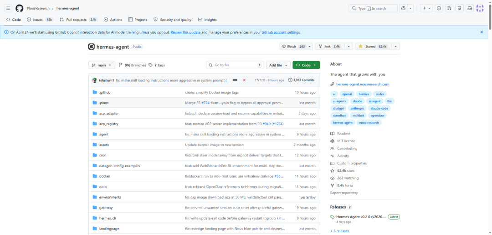

## 一、Hermes Agent 是什么？
Hermes Agent 由 Nous Research 开发的自我进化的 AI 智能体。它是唯一一款内置学习闭环的智能体—，它能从经验中生成专属技能，在使用过程中优化这些技能，主动将知识永久保存，检索自己的过往对话，并跨会话构建出对你越来越深入的个人认知模型。

你不需要让电脑一直开机。把它部署在云端服务器后，你可以随时在手机上（比如用 Telegram 或者飞书等）给它发指令，它会在后台 7×24 小时默默打工。
你想使用什么模型就使用什么模型，Nous Portal、OpenRouter（支持 200 多款模型）、智谱 GLM (z.ai/GLM)、Kimi/月之暗面 (Moonshot)、MiniMax、OpenAI，或是你自己的本地端点。
只需一条 hermes model 命令即可一键切换模型，无需修改任何代码，也没有任何厂商绑定。
他解决了一个非常真实的痛点，就是其他AI每次都失忆，而Hermes 的核心卖点就是 Skill memory 这点非常击中开发者。

## 二、OpenClaw和Hermes agent有什么区别
OpenClaw 遇到代码报错容易卡住，需要人工排查。Hermes Agent 遇到问题会自动寻找替代方案，并把修复经验写进永久记忆（技能文档），同样的错绝不犯第二次。
OpenClaw 主线 API 宕机或限流，工作流直接停摆。Hermes Agent 内置备用链，主模型挂了自动切备用模型（如切到通义千问兜底），业务永不中断。
OpenClaw本质上是一个执行任务的工具。Hermes Agent 带有 MCP 服务器模式，可以充当底层的AI CEO。它甚至能反过来管理和调度底下干活的 OpenClaw 智能体。
目前来说，Hermes Agent 虽然有自动进化的功能，但它还是没有 OpenClaw 成熟，安装的时候还会存在系统不兼容，出现bug等问题，不过现在AI发展这么快，等版本升级了这些问题就会慢慢解决了，毕竟现在1.0版本还不到。

## 三、安装步骤
安装前需注意

- Hermes Agent支持 macOS、Linux、Windows（必须用WSL2子系统），原生 Windows 系统不支持，Windows 用户必须先安装 WSL2，再进行后续操作。

- 除了 git 以外，Python 3.11、Node.js、ffmpeg 等所有其他依赖，官方一键安装脚本会自动处理，不要提前手动安装这些环境，否则会出现版本冲突、权限混乱等问题

- 安装完成后需要配置大模型 API 密钥（Hermes 本身不提供大模型，只是智能体框架），新手推荐提前注册 OpenRouter（支持 200 + 模型）、Kimi、MiniMax 其中一个的账号，提前拿到 API 密钥。

- 硬件要求：建议内存 8GB 以上，磁盘剩余空间 2GB 以上，避免安装过程中空间不足。

- 网络要求：需要一个能打开 Git 的网络环境

### 3.1、第一步：打开终端
#### 3.1.1、macOS 系统（苹果电脑，Intel/M1/M2/M3/M4 芯片通用）
按下键盘上的 Command + 空格 ，调出搜索框，输入终端，点击打开

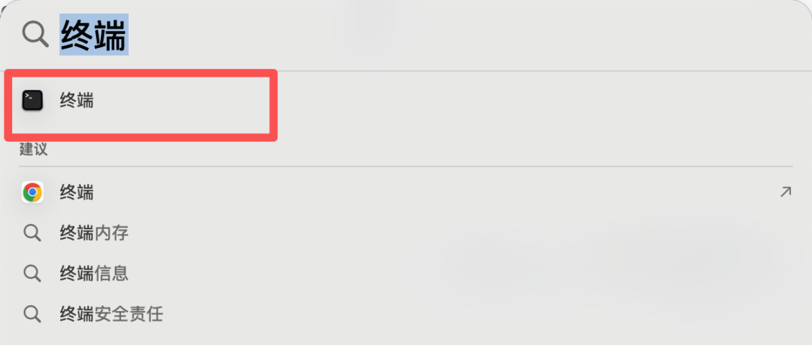

#### 3.1.2、Windows 系统（先装 WSL2，再打开终端）
Windows 用户不能直接用 CMD/PowerShell 安装，必须先安装 WSL2（Linux 子系统），再在 WSL2 的终端里操作，否则会安装失败。

#### 3.1.2.1、先开启 WSL2
#### 3.1.2.1.1、先检查电脑虚拟化是否开启：

- 按下 Ctrl + Shift + Esc 打开任务管理器，切换到「性能」选项卡，点击左侧「CPU」；

- 看右侧详情里的「虚拟化」，如果显示「已启用」，直接跳下一步；如果显示「已禁用」，需要重启电脑进 BIOS 开启虚拟化（Intel 电脑找 Intel VT-x，AMD 电脑找 SVM Mode，设为 Enabled，按 F10 保存重启）。

#### 3.1.2.1.2、开启 WSL2 核心功能：

- 按下 Win + R ，弹出运行窗口，输入 optionalfeatures，按下回车，打开「Windows 功能」窗口；

- 在窗口里，找到并勾选这 2 个选项：适用于 Linux 的 Windows 子系统、虚拟机平台，不要漏选；

- 点击底部「确定」，系统会自动安装组件，等待 1-3 分钟完成后，必须点击「立即重启」电脑，不重启后续步骤全失效。

#### 3.1.2.1.3、安装 Ubuntu Linux 发行版：

- 重启电脑后，打开微软应用商店（Microsoft Store），在搜索框输入 Ubuntu；

- 选择最新的长期支持版（比如 Ubuntu 22.04 LTS），点击「获取 / 安装」，等待安装完成；

- 安装完成后，点击「启动」，会弹出一个黑窗口，提示你「创建默认 UNIX 用户账户」；

- 输入你想要的用户名（全小写，不要有空格），按下回车，再输入密码（输入的时候屏幕不会显示 *，正常输就行），按下回车，确认密码，就完成了 WSL2 的初始化。

#### 3.1.2.1.4、设置 WSL2 为默认版本：

- 按下 Win + X，选择「Windows 终端（管理员）」，输入命令 wsl --set-default-version 2，按下回车，提示「操作成功完成」就可以了。

#### 3.1.2.2、打开 WSL2 终端（后续所有安装命令都在这里执行）

#### 3.1.2.2.1、方法 1：直接打开刚才安装的「Ubuntu」应用，就是终端窗口；
3.1.2.2.2、方法 2：打开 Windows 终端，点击顶部标签栏的下拉箭头，选择「Ubuntu」，就能打开 WSL2 终端。

### 3.2、第二步：安装唯一手动依赖Git
Git 是官方要求唯一需要提前手动安装的工具，安装脚本需要用 Git 拉取代码仓库，按你的系统操作：
#### 3.2.1、macOS 系统
#### 3.2.1.1、在刚才打开的终端里，输入下面的命令，按下回车：
| Plain Text
git --version

3.2.1.2、如果终端输出了类似 git version 2.39.5 的版本号，说明你的电脑已经装了 Git，直接跳第三步；像我的这样就是之前已经安装过了

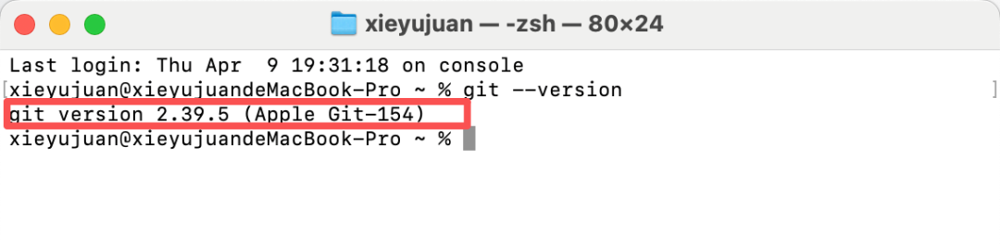

3.2.1.3、如果弹出提示【需要安装命令行开发者工具】，点击弹窗里的【安装】，等待安装完成（约 5-10 分钟，看网速）；
#### 3.2.1.4、安装完成后，再次输入 git --version，输出版本号就说明安装成功了。
3.2.2、Windows WSL2（Ubuntu）/ Linux Ubuntu/Debian 系统
3.2.2.1、在终端里，先执行更新软件源的命令，按下回车，输入你设置的 WSL2 密码（输的时候不显示，正常输），再次回车：
| Plain Text
sudo apt update

#### 3.2.2.2、等待更新完成后，执行 Git 安装命令，按下回车：
| Plain Text
sudo apt install git -y

#### 3.2.2.3、等待安装完成后，输入验证命令，按下回车：
| Plain Text
git --version

#### 3.2.2.4、终端输出版本号，就说明安装成功了。

### 3.3、第三步：执行官方一键安装脚本
这一步是安装的核心，全程只需要复制一条命令，粘贴到终端执行，脚本会自动完成所有剩余操作。
复制下面这条官方最新的一键安装命令到刚刚打开的终端再点击回车（全系统通用，不要修改任何内容）
| Plain Text
curl -fsSL https://raw.githubusercontent.com/NousResearch/hermes-agent/main/scripts/install.sh | bash

#### 3.3.1、安装过程中会发生什么？
按下回车后，终端会滚动输出日志，全程自动，不需要你操作，只有 1 个地方需要你确认：

- 脚本执行到最后，会提示 Add Hermes to your PATH? [Y/n]（是否把 Hermes 命令添加到系统环境变量），一定要输入大写的 Y，然后按下回车，否则后续会出现找不到 hermes 命令的问题。

- 脚本会自动完成这 7 件事：安装 Python 3.11、Node.js、ffmpeg 等依赖 → 克隆官方代码仓库 → 创建独立虚拟环境 → 设置全局 hermes 命令 → 配置基础环境 → 启动初始化向导

- 安装时长根据网速，一般在 3-10 分钟，全程不要关闭终端，不要中断执行

如果你的电脑上原来安装了OpenClaw，它会询问你是否把 OpenClaw 的数据迁移过来（如下图），你如果选择迁移就输入y，暂时不想迁移就输入N，后续想要迁移的时候可以随时进行手动迁移

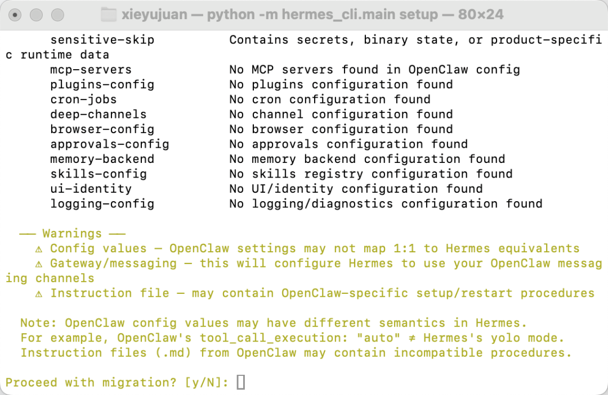

### 3.4、第四步、初始化配置
#### 3.4.1、选择配置方式
当出现下图内容时，则说明前面所有的下载、环境配置、依赖安装都完成了，进入到初始化配置环节，需要配置大模型和基础设置了。

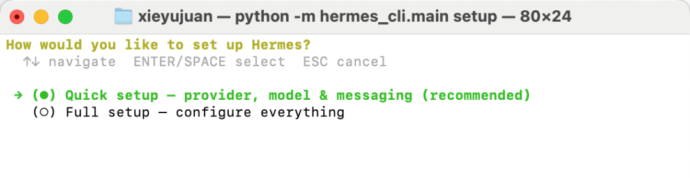

我们看到 Quick setup 前面已经有绿色的圆点了，这是官方默认推荐的选项，新手推荐选这个

- Quick setup：只配置最核心的「大模型提供商 + API 密钥 + 默认模型」，其他所有高级选项用默认值，最快 5 分钟就能用

- Full setup：会一步步配置日志、权限、网关、内存等所有高级选项，新手现在还不需要，等以后熟悉了再改就行

选中 Quick setup 后 直接按键盘上的 回车键（Enter） 确认，就会进入下一步选择大模型的环节

#### 3.4.2、选择大模型
到了这一步我们该选择大模型了，新手推荐先选 OpenRouter，它内置200+款模型可以选择，从最强最贵的claude到很便宜的Qwen系列都有。
是目前所有选项里最省心、中文最好、国内能用的选择，等后面熟悉了再选择如 Anthropic 等更强大的模型。

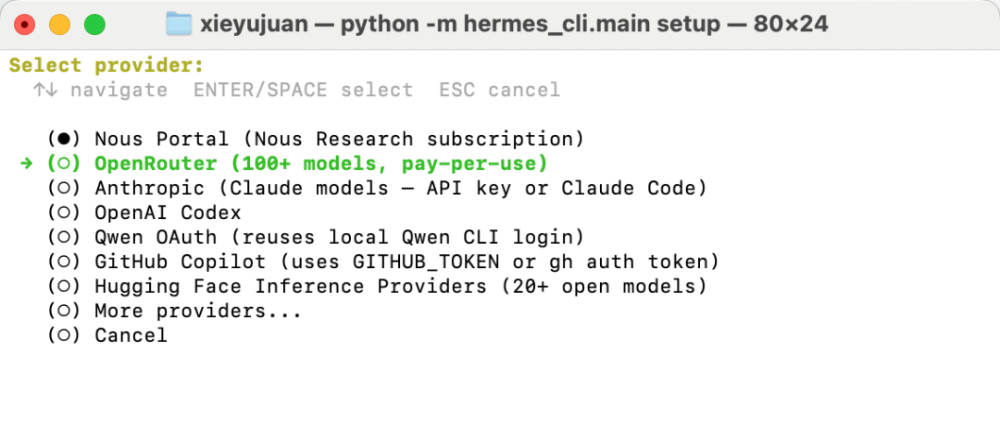

#### 3.4.3、获取密钥
选择了 OpenRouter 模型之后，出现了这个画面就需要获取 API 密钥了

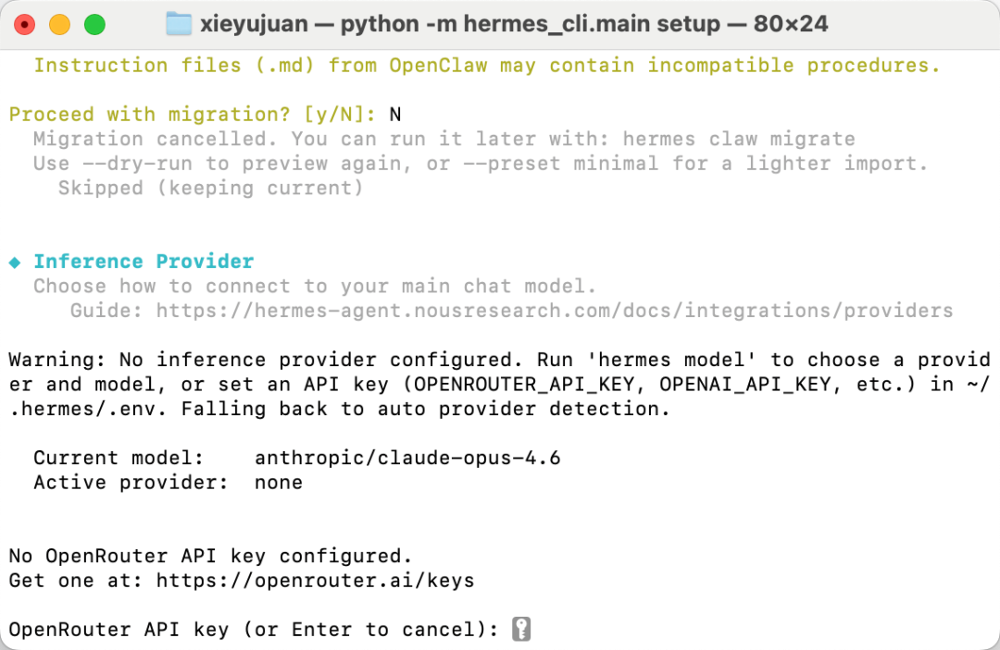

#### 3.4.3.1、获取OpenRouter API 密钥步骤：

- 打开浏览器，访问官网：openrouter.ai

- 右上角点击【Sign Up】，用邮箱 / Google/GitHub 注册（国内 qq 邮箱、163 邮箱都可以）

- 注册成功后，回到首页点击Get API Key 获取密钥

- 点击【Create 】，起个名字（比如 Hermes），再点击【Create】

- 立刻复制生成的 sk_开头的密钥（只显示一次，一定要保存好，丢了只能重新生成）

- 回到终端，按 Command+V（Mac）/Ctrl+V（Windows）粘贴密钥，按回车

OpenRouter 中含有很多模型，所以输入密钥之后我们要选择模型，刚开始安装不熟练可以先选 qwen 系的，后面多测试几轮，熟练了之后换到更好用的模型

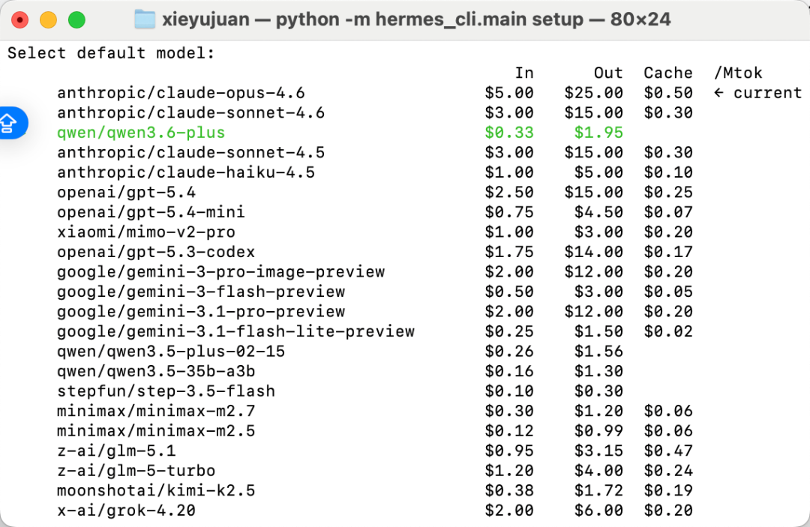

#### 3.4.4、其他设置
到了这一步，我们就可以配置到常用的消息软件，把 Set up messaging now 选中点击回车

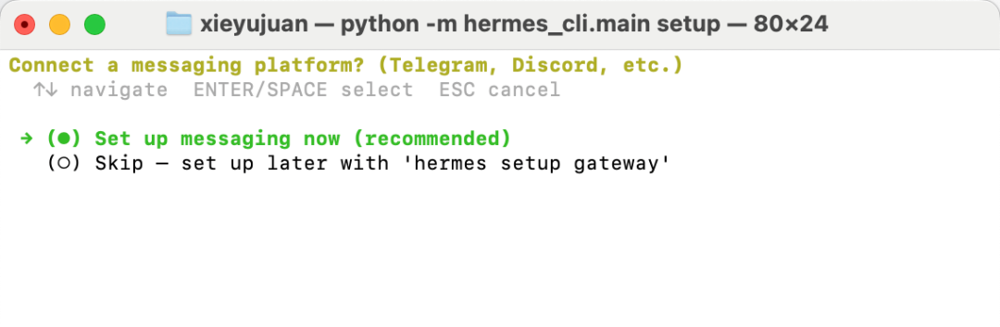

这里有很多可以选择的平台，你可以根据你自己的需求选择想要配置的平台，我这里以飞书为例，选中飞书，点击回车

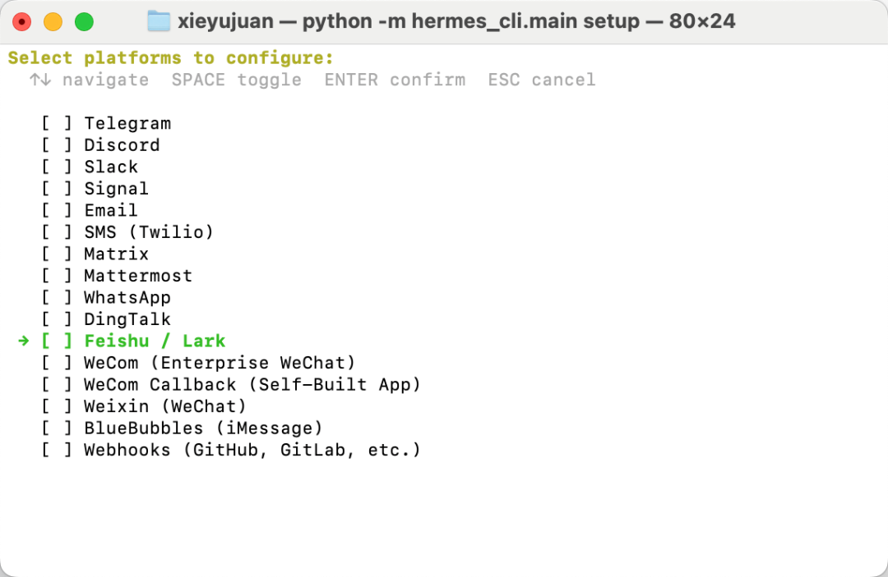

接下来输入Y，就可以进入 hermes 的聊天界面了

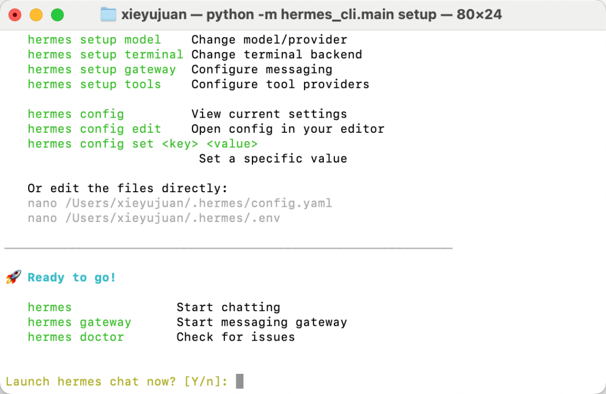

我在输入了Y之后遇到了下面的错误，经过搜索，说这是 macOS Sonoma/Sequoia 系统的已知官方兼容性 bug， 这个 bug 只影响 macOS 14 及以上版本，macOS 13及以下系统、Windows 和 Linux 用户不会遇到这个bug，可以正常启动

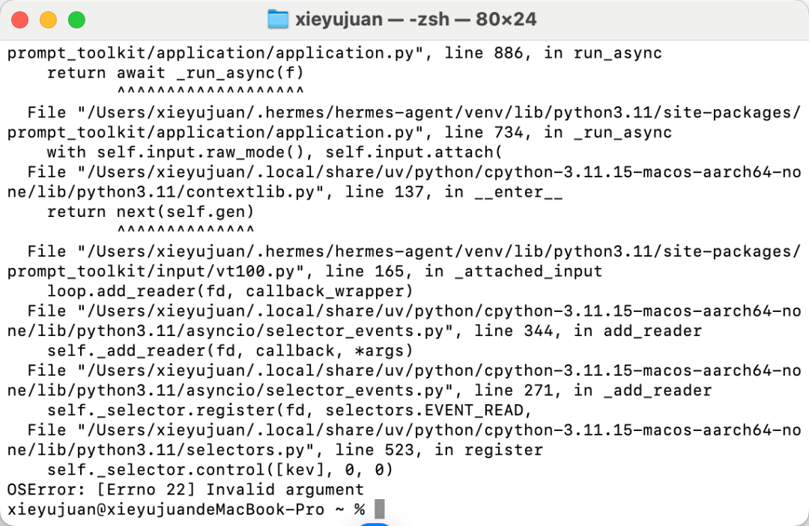

下面解决这个bug
#### 3.4.5、macOS 14 及以上版本兼容启动方法
#### 3.4.5.1、步骤 1：打开终端
在终端里输入下面的命令，按回车：
| Plain Text
nano ~/.zshrc

这会打开 macOS 的 shell 配置文件，你会看到文件里的内容（可能是空的，也可能有其他配置）

#### 3.4.5.2、步骤 2：添加禁用 TUI 的配置
用键盘的方向键，把光标移动到文件的最后一行，输入下面这行内容（复制粘贴就行）：
| Plain Text
export HERMES_NO_TUI=true

这行的意思是：让系统告诉 Hermes，启动时不要用有问题的终端界面模式。

#### 3.4.5.3、步骤 3：保存并退出

- 按键盘上的Ctrl + O（字母 O，不是数字 0），然后按一下回车，保存文件

- 按Ctrl + X，退出编辑器，回到终端

#### 3.4.5.4、步骤 4：让配置生效
在终端里输入下面的命令，按回车：
| Plain Text
source ~/.zshrc

这会让刚才添加的配置立刻生效，不用重启电脑。

#### 3.4.5.5、步骤 5：测试启动
现在直接输入hermes，按回车，就能正常启动了！不会再出现那个报错了,启动后就是这个样子啦！你就可以给它发消息了。

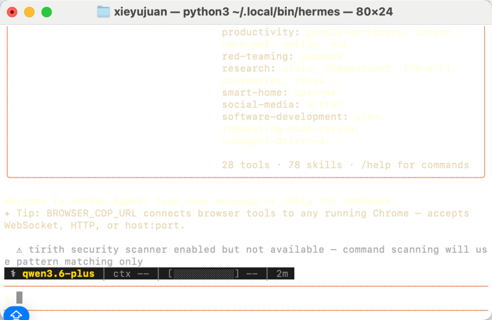

注意：前七天不建议和他闲聊，或者只问你好，给它具体的任务，才能体现 AI 的能力，比如：
运营向：帮我写一份小红书美妆产品的种草文案，主题是“早八人快速上妆技巧”，给3个标题+1个正文模板
工作向：帮我整理本周的工作周报大纲，包含本周完成的3件事、下周计划和遇到的问题
学习向：帮我用通俗的话解释一下什么是“skill”，给3个实用的方法

如果在使用过程中遇到下面的问题，说明需要先给账户充值才能用

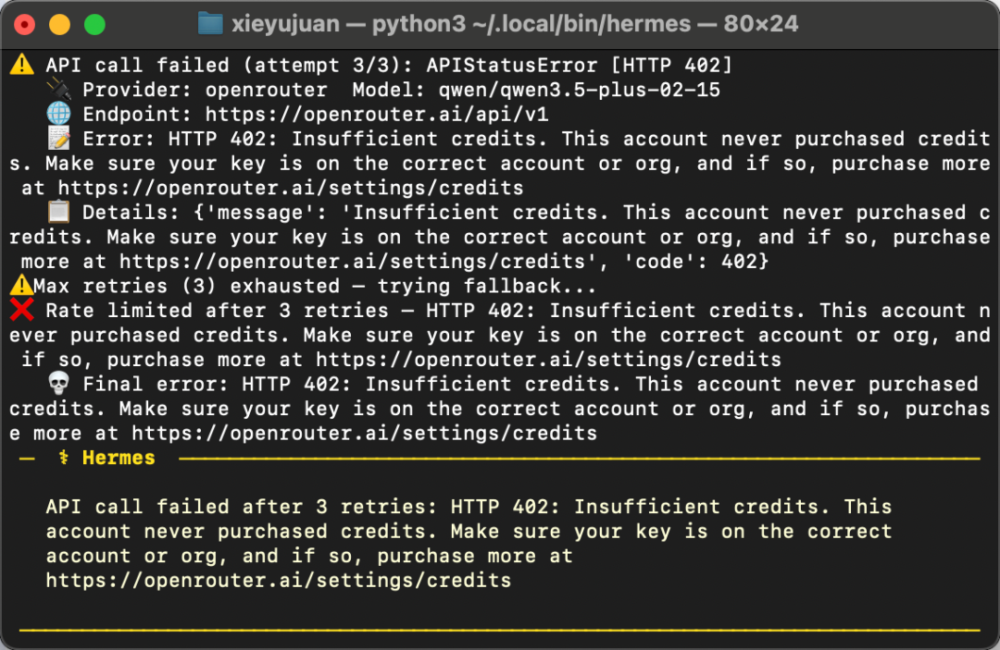

### 3.5、第五步：配置到飞书
#### 3.5.1、登录飞书开放平台，创建应用
#### 3.5.1.1、打开浏览器，访问：open.feishu.cn/，用你的飞书账号登录。
3.5.1.2、点击右上角【开发者后台】→ 选择【企业自建应用】（如果没有企业，先在飞书 APP 里创建一个免费的个人团队）。
#### 3.5.1.3、填写应用信息：

- 应用名称：比如「我的 Hermes AI 助手」

- 应用描述：比如「AI 智能体对话助手」

- 应用图标：上传一张图片（可以用 AI 生成）

#### 3.5.1.4、点击【创建】，进入应用后台。

#### 3.5.2、获取 AppID 和 AppSecret（保存好！）
#### 3.5.2.1、左侧菜单栏找到【凭证与基础信息】，点击进入。
#### 3.5.2.2、找到【应用凭证】部分，复制这两个信息存到记事本里：

- App ID：以cli_开头的一长串字符

- App Secret：点击【显示】，输入飞书验证码后复制完整密钥

#### 3.5.3、开启飞书应用必须的权限（收消息 + 发消息）
#### 3.5.3.1、左侧菜单栏找到【权限管理】→「权限配置」。
3.5.3.2、点击【开通权限】看着勾选，主要勾选接收信息和发送信息、获取信息一类的（大部分个人应用会自动通过，不用审核）：

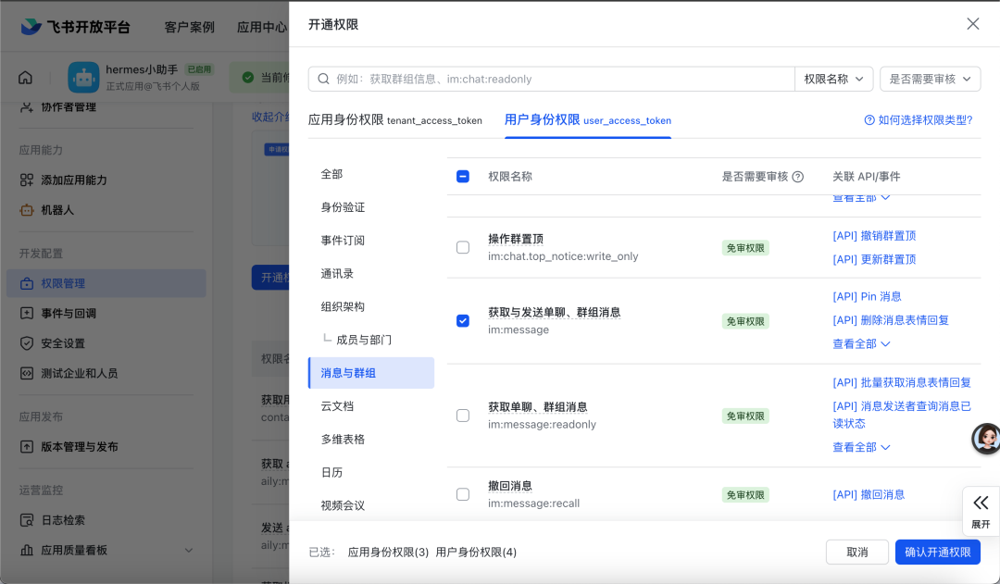

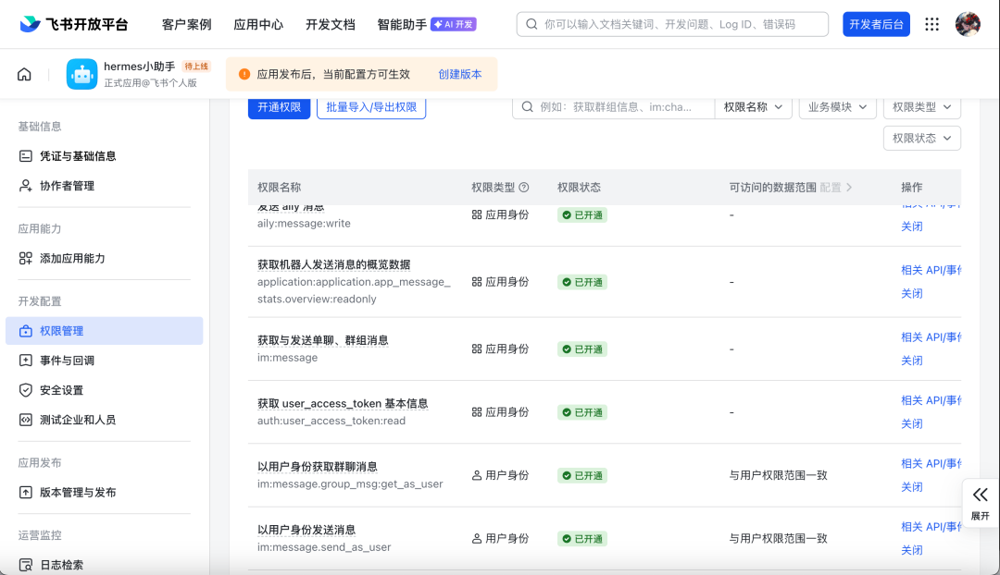

#### 3.5.3.3、开通了权限之后在事件与回顾那里也配置一下

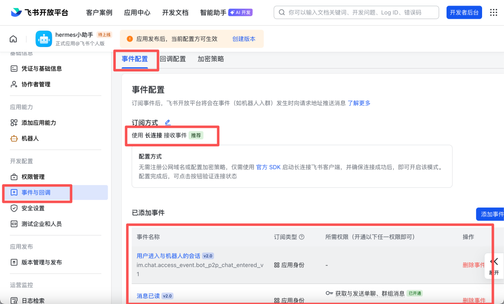

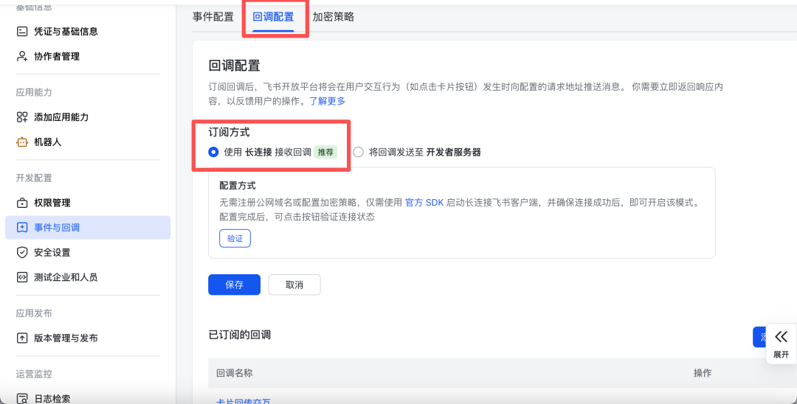

#### 3.5.3.4、在左边添加应用能力那里添加机器人

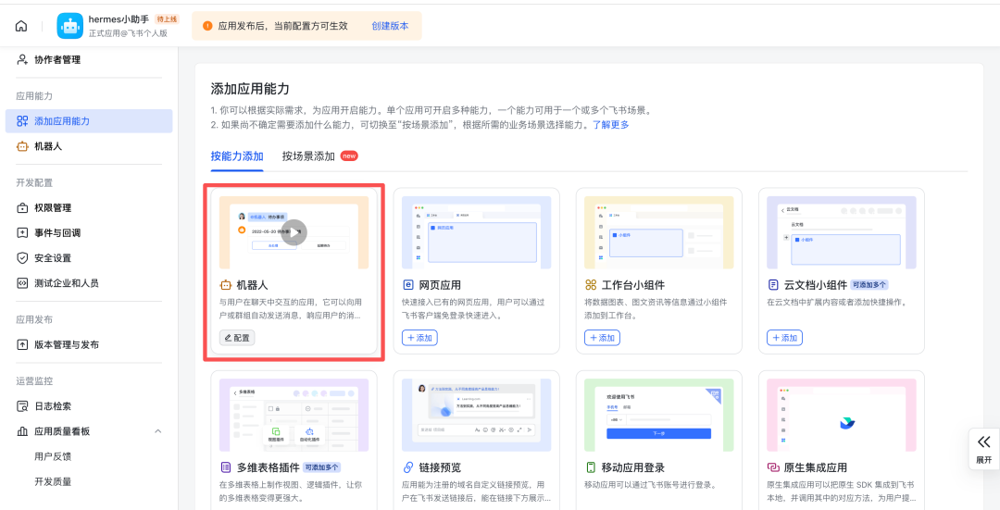

3.5.3.5、飞书这边都调试好了，来到 hermes agent 终端，输入你的需求，再把前面保存的App ID和App Secret 发给它

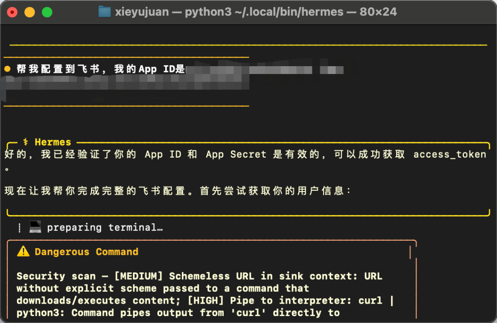

这时候它会让你确定那些权限是不是都开通了，飞书开发者平台的参数是不是设置好了，然后会让你提供user_id或者open_id，需要在api调试台那里找到

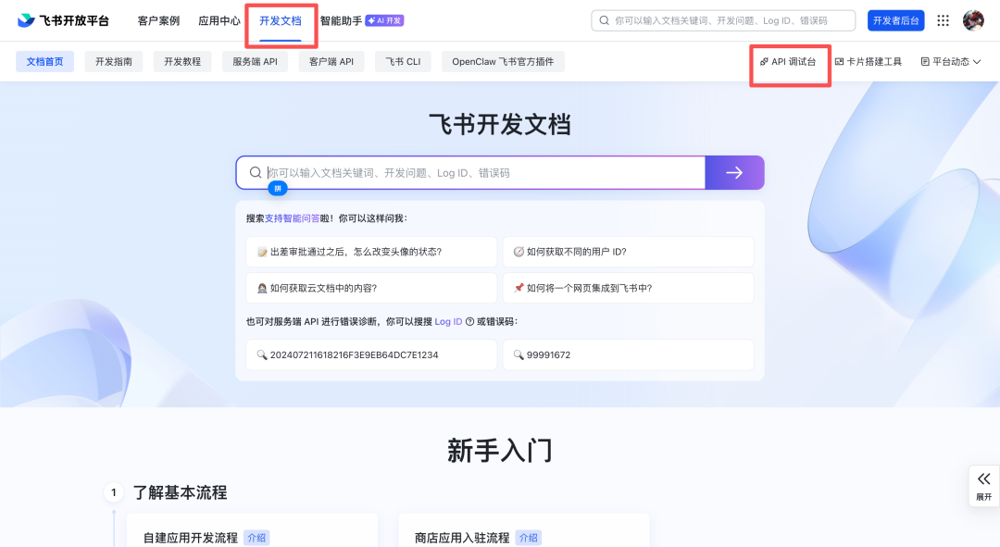

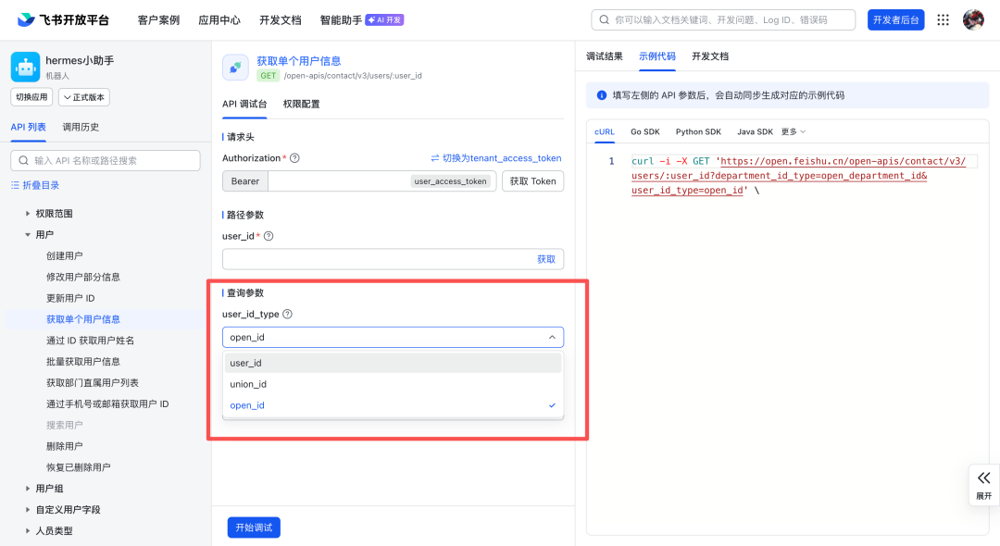

#### 3.5.3.6、在左边找到版本管理与发布，设置一下版本号、更新说明然后点击保存，这样就发布了

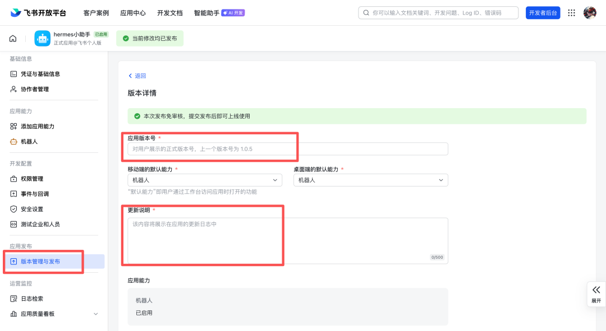

#### 3.5.3.7、来到飞书，点击打开应用，你的飞书信息列表就会出现刚刚你创建的那个机器人对话框

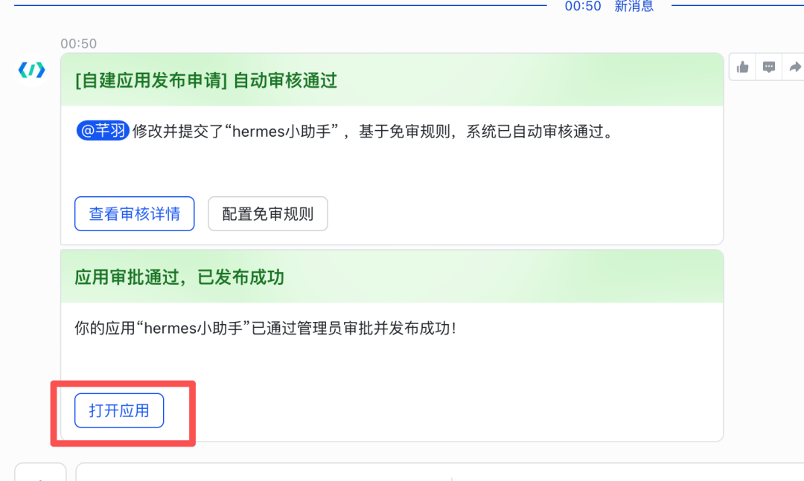

经过很多次测试，直到收到这条消息才算是真正配置成功了

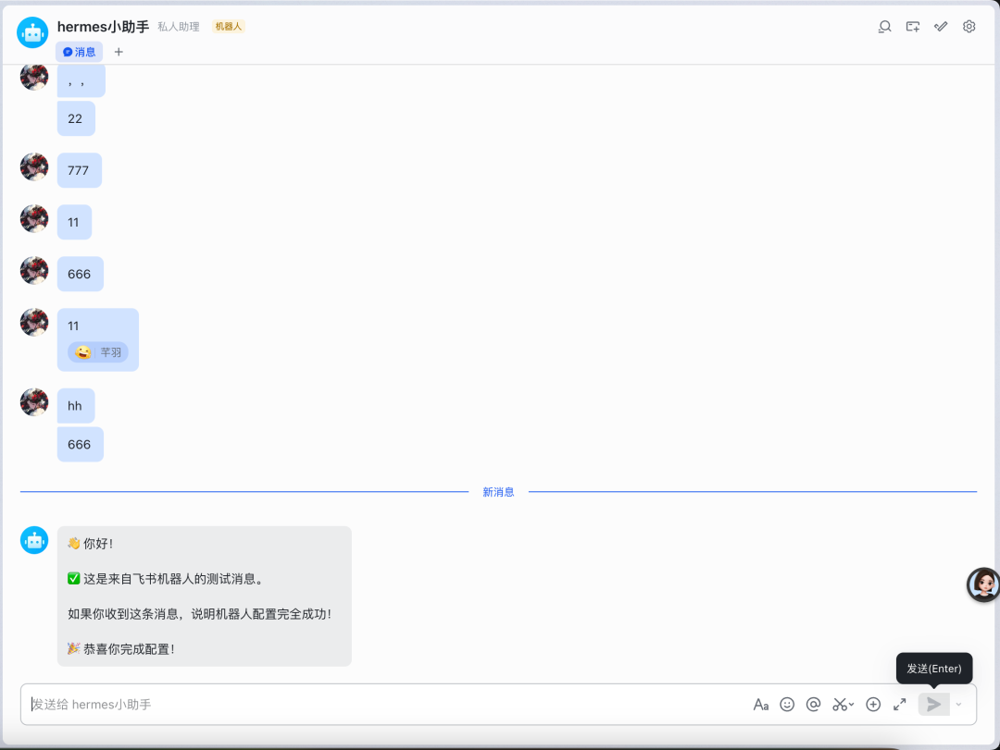

## 四、Hermes Agent 可以做什么？
装都装好了，大家肯定是希望可以用来做点什么，我也刚装上，还没有太多实践可以分享，这里就先分享一下国外AI大神 Julian Goldie 的最佳实践，看看他都把 Hermes Agent 用在了哪些地方。
后续我实践了有了更多的心得体会也会同步分享给大家，点个小关小注不错过后续的分享~
### 4.1、打造全自动的自媒体内容流水线
它可以完全接管账号的内容产出与发布流程。比如，让它自动抓取当下关于认知进化或商业逻辑的热点话题，撰写出极具网感的文案，调用工具（如 Nano Banana 2）生成精美配图，然后全自动发布到各大社交平台（X、TikTok、Instagram），甚至连话题标签都能精准打好。
### 4.2、信息检索和搜集
结合 Firecrawl 或 Browserbase，Hermes 拥有了强大的实时网页浏览能力。
你可以让它绕开那些过时的搜索引擎，直接潜入特定论坛（如 Reddit 细分板块）或前沿网站，把最新的行业新闻、深度研报抓取出来，并提炼成极具洞察的内容摘要。
### 4.3、数据报表与竞品监控
利用它的 Cron Jobs（定时任务） 功能，你可以让它日复一日地自动执行死磕型任务。
#### 4.3.1、账号体检
每天自动给社交媒体后台截图，分析过去 14 天的涨粉数、发帖量，找出互动率最高的爆款内容，生成数据总结。
#### 4.3.2、账号体检竞品追踪：
每 24 小时自动巡查一遍你的同行或竞品，汇总他们最近在发什么、哪些话题最火，直接把灵感喂到你嘴边。
### 4.4、更进阶的玩法
#### 4.4.1、技能复利串联
可以把单个动作拼成流水线。比如：情报抓取技能 + AI 绘图技能 + 自动发帖技能 = 一个完全不需要你插手的自动化营销机器。
#### 4.4.2、给其他 AI 当老板
借助特定工具（如 paperclipip），你可以让 Hermes 充当CEO，由它来监督、管理和指挥底下的 OpenClaw 等其他智能体干活。

## 五、最后
Hermes agent 的永久记忆和自我进化特别惊艳，但它目前还没有那么成熟，系统兼容偶发 Bug、生态不如 OpenClaw 丰富。
但 Hermes 的潜力是无限的，毕竟才发布两个多月，还处在一个非常早期的阶段，难免带着青涩与瑕疵。
以前我们用 AI，是在问问题。后来我们用 AI拼工作流。现在，我们开始把 AI 当成一个不会下线的员工系统，一个会自我纠错拥有超强大脑的CEO。越来越期待AI的进化~
