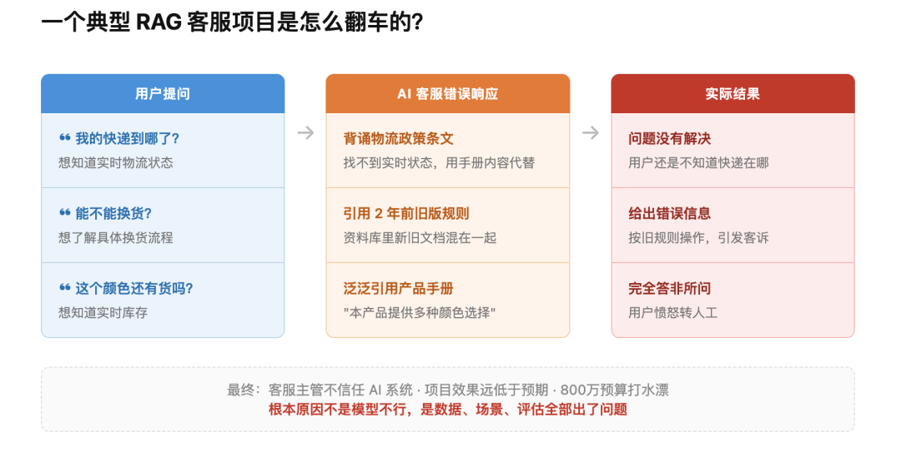
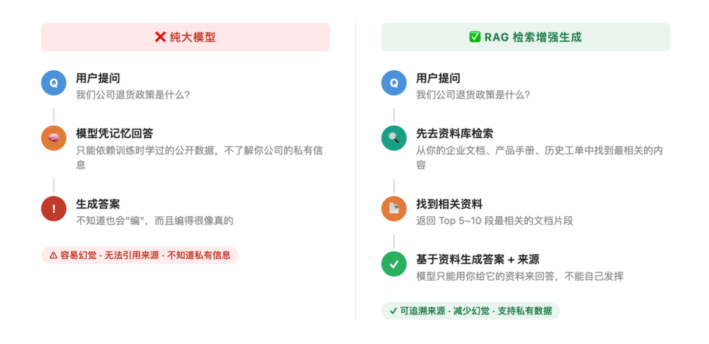
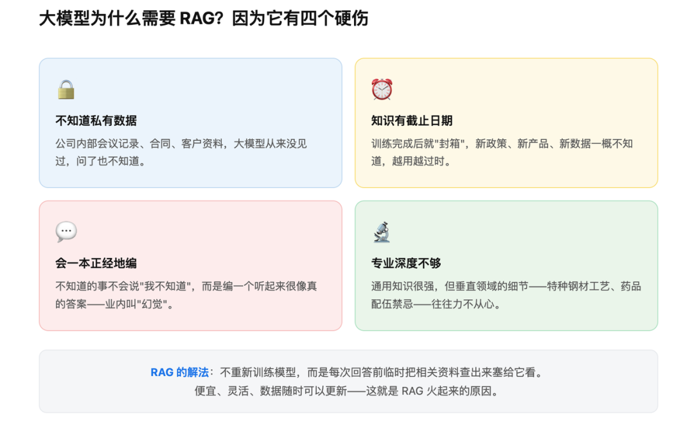
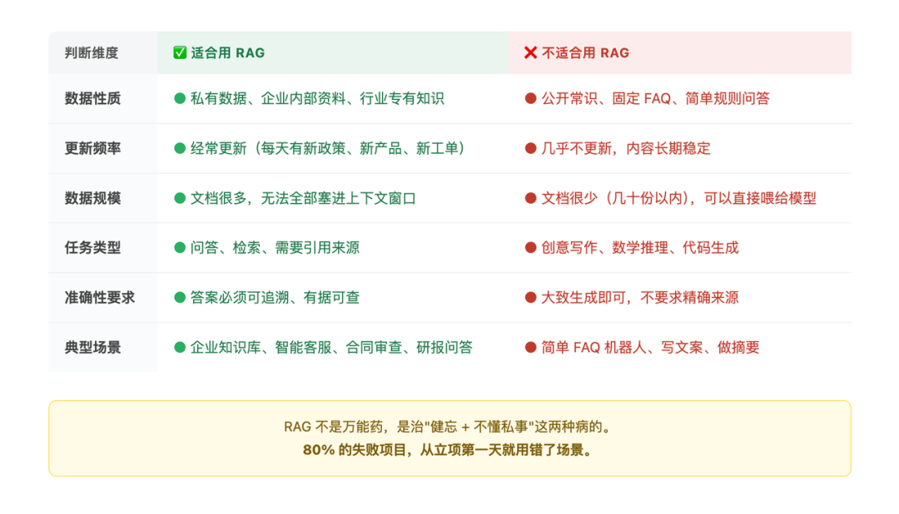
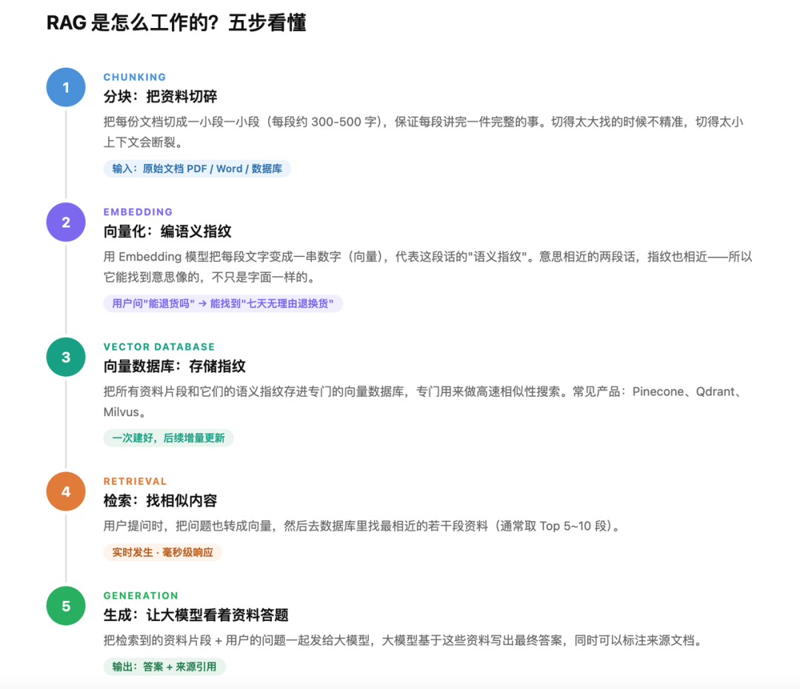
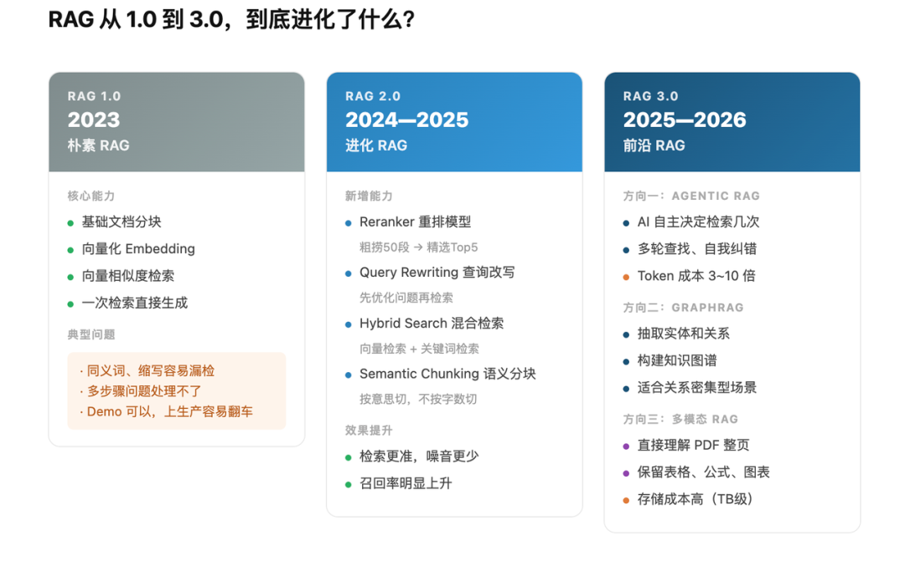
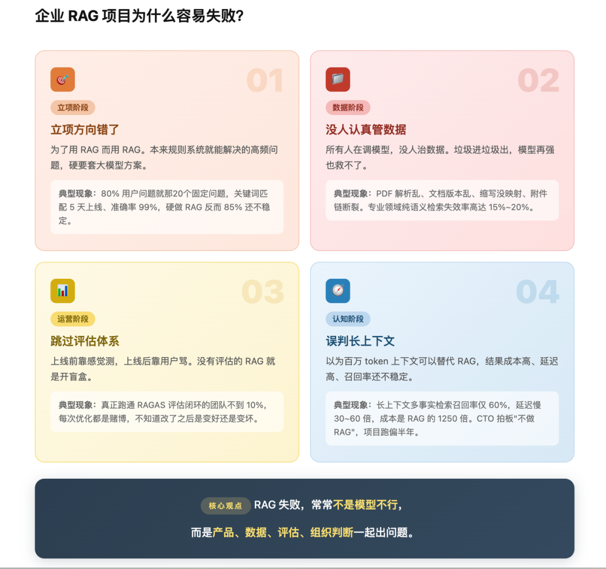

# 你公司花几百万做的 RAG，可能从立项第一天就错了

> **作者**：芊羽AIGC
> **来源**：[微信公众号原文](https://mp.weixin.qq.com/s/VRP-sEZC95_d2zUi-uf_2w)
> **发布日期**：2026-05-12

> [!NOTE]
> **一句话总结**：`RAG` 项目 80% 的翻车，几乎都不是技术问题 —— 而是立项方向错了、只调模型没人管数据、跳过评估、误判长上下文。真正决定成败的，是组织问题。

---

## 目录

- [一、RAG 到底是什么](#一rag-到底是什么)
- [二、RAG 的进化史，从 1.0 到 3.0 到底变了什么](#二rag-的进化史从-10-到-30-到底变了什么)
- [三、80% 失败的真相，四个被忽略的坑](#三80-失败的真相四个被忽略的坑)
- [四、从 0 到 1 搭建企业级 RAG，怎么推进](#四从-0-到-1-搭建企业级-rag怎么推进)
- [五、怎么判断你的 RAG 做得好不好？](#五怎么判断你的-rag-做得好不好)
- [六、写在最后：800 万项目活下来的那 20%，做对了什么](#六写在最后800-万项目活下来的那-20做对了什么)

---

先说一个你可能见过的场景。

某家做电商的公司，2024 年下半年想给客服部门减负，决定上 AI 客服。

立项会上 CTO 说：用大模型加上公司积累的几十万条历史工单、产品手册、售后政策，三个月上线，节省 60% 的人工客服成本。

预算批了，技术团队开始干。

上线后，用户问"我的快递到哪了"，AI 开始背公司物流政策；用户问"能不能换货"，AI 引用的是两年前已经更新过的旧版退换货规则；用户问"这个颜色还有货吗"，AI 回答"根据我们的产品手册，本产品提供多种颜色选择"。

> 客服主管看完测试报告，说了一句：**不如让用户自己去翻帮助中心。**

这个技术叫 `RAG`。这类项目在 2024、2025 年做了一批，有统计说很大一部分公司没达到立项时定的效果。

但做这些项目的团队，技术都不差。问题出在别的地方。要说清楚问题出在哪，得先把 RAG 是什么讲明白。

---

## 一、RAG 到底是什么

### 1.1 RAG 是什么

先说全称：**Retrieval-Augmented Generation，检索增强生成**。

举个🌰说清楚到底是什么意思。你问一个刚入职的应届生："我们公司去年 Q3 的销售额是多少？"

应届生有两种回答方式：

- **方式一**：他凭脑子里学的东西硬答。但他刚来一周，根本不知道公司数据，只能瞎编。这就是**纯大模型** —— 脑子里装的都是训练时学过的公开知识，问私有的、最新的、专业的，它就开始编。这种"编"专业术语叫**幻觉**。
- **方式二**：他先去翻一下公司财务系统，找到 Q3 报表，看完了再回答你。这就是 **RAG**，回答之前，先去外部资料库里检索一下，把找到的资料增强到自己的回答里，再生成最终答案。

Retrieval（检索）+ Augmented（增强）+ Generation（生成）= RAG。

> [!TIP]
> **一句话总结**：RAG 就是让 AI 在回答之前，先查一下你给它的资料。

### 1.2 为什么要有 RAG

你可能会问：现在大模型不是号称无所不知吗？为什么还要让它"查资料"？

因为大模型有四个绕不开的硬伤。

**第一，它不知道你的私事。** ChatGPT 知道全世界的公开信息，但它不知道你公司昨天开会决定了什么、你家上周买了几斤苹果、你的客户合同里写了什么条款。这些私有数据它一概不知。

**第二，它的知识是过期的。** 大模型训练完就定型了。GPT-4 训练完成是 2023 年，它就不知道 2024 年发生了什么。直到下一次重新训练。

**第三，它会一本正经地胡说八道。** 这是大模型最大的毛病。问它不知道的，它不会说"我不知道"，它会编一个听起来很像真的答案。法律条款编、医学诊断编、引用论文编。这种编瞎话叫"幻觉"，是大模型至今没解决的硬伤。

**第四，它专业领域不够深。** 你问它通用知识它很强，但你问"我们公司这种特种钢材的热处理工艺"，它就废了。因为训练数据里这些专业知识太少。

怎么办？两条路：

- **第一条**：重新训练一个懂你的模型。这叫**微调（Fine-tuning）**，贵得离谱，几十万到几百万起步，而且数据一更新又得重训。
- **第二条**：不动模型，每次回答前临时把相关资料塞给它看一眼。这就是 **RAG**。

> [!IMPORTANT]
> 便宜、灵活、数据可以随时换 —— 这就是 RAG 火起来的原因。

### 1.3 谁在用 RAG？

四类玩家：

- **大模型公司**：OpenAI、Anthropic、Google、字节、阿里、智谱，他们自己在产品里就用了 RAG。比如 ChatGPT 的"联网搜索"，本质就是 RAG。
- **企业 IT 部门**：搞内部知识库、客服机器人、合同审查、研报问答的，几乎都在用 RAG。这是 2024-2026 年企业 AI 落地最大的需求。
- **创业公司**：垂直行业的 AI 产品，医疗问诊、法律咨询、教育答疑、电商客服，背后基本都是 RAG。
- **工具链厂商**：卖给前三类人的"铲子"。比如 Pinecone（卖向量数据库）、LangChain（卖框架）、Cohere（卖重排序模型），靠这波吃饱了。

### 1.4 什么时候要用 RAG，什么时候不该用

这部分最关键，因为**用错场景就是 80% 失败的第一个原因**。

**✅ 该用 RAG 的场景：**

- 你的数据是私有的（公司内部文档、客户资料、产品手册）
- 你的数据经常更新（每天有新订单、新政策、新案例）
- 数据量比较大（几千份以上文档，塞不进上下文窗口）
- 你需要引用来源（答案得告诉用户出处，不然没法用）

**❌ 不该用 RAG 的场景：**

- **简单 FAQ**：用关键词匹配的规则系统就够了，RAG 是杀鸡用牛刀
- **需要严密推理的任务**：比如做数学题、写代码，检索帮不上忙
- **数据量很小**：100 份文档以下，直接塞给大模型看完整篇更准
- **需要创造性的任务**：写诗、写小说，让 AI 检索反而限制它发挥

> [!TIP]
> RAG 不是万能药，是治"健忘 + 不懂私事"这两种病的。

### 1.5 RAG 用在哪里，常见落地形态

按场景从浅到深排：

1. **企业内部知识库问答**（最普及）：员工问"差旅报销政策是什么"，AI 从内部文档里找答案。
2. **智能客服**：用户问产品问题，AI 从产品手册、FAQ、历史工单里找答案。
3. **合同/法律审查**：上传合同，AI 对照法规库和过往案例，标出风险点。
4. **医疗辅助诊断**：医生输入症状，AI 从论文库、病例库里找参考诊断。
5. **投研报告生成**：分析师给个主题，AI 从研报库、新闻库、财报库里聚合信息，写初稿。
6. **个人 AI 助理**：读你的邮件、笔记、日程，回答跟你工作生活相关的问题。

### 1.6 RAG 是怎么干活的？

这是技术核心，想象你让助理回答一个问题，整个过程分五步。

**第一步：把所有资料切碎（Chunking 分块）**

你把 50 万份合同扔给助理，他一份一份读完得读到下辈子。所以先把每份合同切成一小段一小段（一段大概几百个字）。这个过程叫**分块**。

切得太大，找的时候不精准；切得太小，每一片都看不出完整意思。怎么切，是个学问。

**第二步：给每段资料编一个"语义指纹"（Embedding 向量化）**

光把资料切碎不行，电脑不会读文字。所以我们用一个叫 `Embedding` 模型的东西，把每一段文字变成一串数字（专业叫"**向量**"）。

这串数字代表这段话的语义指纹。两段意思相近的话，指纹就接近。

比如"狗咬人"和"犬只袭击行人"，字面完全不一样，但语义指纹很像。这就是为什么 RAG 比传统关键词搜索强，它能找到"意思像"的，不仅仅是"字一样"的。

**第三步：把指纹存进专门的库（Vector Database 向量数据库）**

把所有切碎的资料和它们的指纹，存到一个**向量数据库**里。这是个专门用来按指纹找东西的数据库。市面上常见的有 Pinecone、Qdrant、Milvus 这几个，本质都是干这个的。

**第四步：用户提问时，先按指纹找资料（Retrieval 检索）**

用户问"采购合同里违约金条款的常见坑有哪些"。系统先把这个问题也变成一串指纹，然后去向量数据库里找指纹最像的几段资料 —— 比如找出 Top 10 段。这就是 **Retrieval（检索）**。

**第五步：把找到的资料 + 用户问题一起喂给大模型，让它生成答案（Generation 生成）**

最后系统对大模型说："请根据下面这 10 段资料，回答用户的问题。问题是：采购合同里违约金条款的常见坑有哪些。资料是：[贴上 Top 10 段]"

大模型基于这些资料生成答案。这就是 **Generation（生成）**。

> [!NOTE]
> 整个流程就是：**切碎 → 编指纹 → 存库 → 找相似 → 让 AI 看着资料答题。**

---

## 二、RAG 的进化史，从 1.0 到 3.0 到底变了什么

讲完了基础，现在说说 RAG 的进化史。

> [!WARNING]
> 如果你 2026 年还在按上面那五步做 RAG，那你做的就是**朴素 RAG**，业内戏称"作业级 RAG"。生产环境一上就翻车。

过去三年 RAG 已经迭代了两代。

### 2.1 RAG 1.0、朴素 RAG（2023）

就是上面那五步。简单、能跑、Demo 效果不错、上生产就废。

典型翻车场景：

- 用户问"违约金"，系统检索出十段都在讲"违约金"但没一段是用户真正想问的那种合同类型。
- 同义词、缩写检索不到。问"NDA"，资料里写的是"保密协议"，匹配失败。
- 多步推理完全废。问"对比 A 公司和 B 公司去年净利润增长率"，需要先找 A 的数据、再找 B 的数据、再算增长率，朴素 RAG 干不了。

### 2.2 RAG 2.0、进化的 RAG（2024-2025）

业内为了补 1.0 的坑，加了一堆环节：

- **重排（Reranker）**：检索完先粗筛 50 段，再用一个专门的重排模型精挑出 Top 5。准确率上一个台阶。
- **查询改写（Query Rewriting）**：用户问得不清楚，先让 AI 把问题改写得更精确，再去检索。
- **混合检索（Hybrid Search）**：向量检索 + 传统关键词检索一起用。既能找意思像的，也能找字面对的。
- **HyDE**：让 AI 先假装回答一遍问题，再用这个假回答去检索。听起来反直觉，但效果惊人。
- **语义分块（Semantic Chunking）**：不再死板按字数切，按意思切。一段话讲完整一件事再切。

### 2.3 RAG 3.0、Agentic RAG + GraphRAG（2025-2026 当下）

这是现在的最前沿。两条路：

**① Agentic RAG（智能体 RAG）**

让 AI 自己决定怎么检索。朴素 RAG 是"检索一次就回答"，Agentic RAG 是 AI 自己判断：

- "这个问题我没找够资料，再检索一轮。"
- "这段资料和问题不太相关，换个关键词再查。"
- "我需要先查 A，再用 A 的结果去查 B。"

它给 AI 装了一个"自我反思 + 自我纠错"的能力。

- **代价**：`token` 成本是朴素 RAG 的 3-10 倍，延迟 2-5 倍。
- **适合场景**：法律、医疗、金融这种"答错代价巨大"的领域。其他场景算不过账。

**② GraphRAG（图谱 RAG）**

微软主推的方案。向量检索有个根本毛病：它只懂"像不像"，不懂"什么关系"。

比如问"张总和李总是什么关系"，向量检索能找到提到张总的段落、提到李总的段落，但它理解不了两人之间的关系链。

GraphRAG 的办法：先用 AI 把所有资料里的实体（人、公司、事件）+ 关系（投资、合作、竞争）抽出来，建成一张**知识图谱**。检索时既查向量也查图谱。

- **适合场景**：金融关系网络、医疗知识体系、企业组织架构这种"关系密集"的领域。

**③ 多模态 RAG（ColPali）**

这是 2026 年的新东西。传统 RAG 处理 PDF 要先 OCR（光学字符识别）把文字抠出来，但 PDF 里的表格、公式、图表一抠就废。

ColPali 直接把 PDF 当图看，根本不做 OCR，直接用视觉模型理解整页内容。

- **优点**：表格、公式、图文混排全保留。
- **缺点**：1 页 PDF 占 500KB 存储，100 万页就是 TB 级。存储成本爆炸。

那么，为什么这么好的技术，企业落地还是容易翻车？

---

## 三、80% 失败的真相，四个被忽略的坑

我看了一圈业内复盘，企业 RAG 翻车的原因高度集中在四点。**全是非技术问题。**

### 3.1 坑一、从立项第一天，方向就错了

最常见的死法：**为了用 RAG 而用 RAG。**

一家做电商的，要做"智能客服"。立项时拍板用 RAG，从产品手册里查答案。

做完一看，80% 的用户问题就那几个 —— "怎么退货"、"多久发货"、"运费多少"。

这些问题用一个关键词匹配 + 模板回答的传统规则系统，五天就能上线，准确率 99%。但他们花了三个月做 RAG，准确率 85%，还不稳定。

> 业内有句话叫"80% 的场景下，朴素 RAG + 好数据 + 精细产品设计，比复杂技术方案更有效"。但更刺耳的真相是：**剩下那 20% 复杂场景，朴素 RAG 也救不了。**

所以你立项时该问的第一个问题不是"用什么技术"，而是：

> [!IMPORTANT]
> 这个需求，到底要不要用 AI？如果要，是不是非 RAG 不可？

绝大多数失败项目，在这个问题上就拍错了。

### 3.2 坑二、所有人都在调模型，没人管数据

这是技术团队最常犯的错。一个典型的失败 RAG 项目，团队人员配比大概是：

- 算法工程师 3 人，研究 Embedding 模型怎么选、重排怎么调、Prompt 怎么写
- 后端工程师 2 人，搞向量数据库、API 接口
- 产品 1 人
- **数据工程师 0 人**

然后他们花三个月把模型调到极致，效果还是不行。为什么？**因为输入的数据质量不好。**

业内有个调研，专业领域（制药、法律）里纯语义检索的失效率高达 15-20%，主要原因不是模型不行，是数据有这些毛病：

- PDF 解析烂，表格全乱了
- 缩写没建立映射（"NDA"和"保密协议"是一个意思，系统不知道）
- 文档版本混乱（2019 年作废的模板和 2024 年最新的混在一起）
- 交叉引用链断了（合同里说"详见附件 A"，附件 A 找不到）

你模型用 Claude Opus 还是 GPT-5 已经不重要了，因为你检索出来的资料本身就是错的。

> [!IMPORTANT]
> 做 RAG 最该招的不是算法工程师，是**懂业务的数据工程师**。但市面上大部分公司没意识到这点。

### 3.3 坑三、评估比检索更难，但所有人都跳过了评估

做 RAG 最难的不是搭起来，是**知道它到底做得好不好**。

一个 RAG 系统上线后，怎么衡量它的效果？

- 准确率？怎么算？
- 用户问 100 个问题，AI 答了 100 个，多少是对的？谁来标注？标注一次几千块。
- 答错了，是检索错了？还是检索对了模型生成错了？
- 同一个问题问两次，答案不一样，正常吗？

业内有专门的工具，比如 **RAGAS**，能从忠实度、答案相关性、上下文精度等十几个维度评估 RAG。生产可用的基线是 0.8 以上。

但实际情况是：**真正跑通 RAGAS 评估闭环的团队不到 10%。**

大多数团队是这样：

- 上线前找几十个 case 人肉测一下，感觉还行就上
- 上线后看用户反馈，骂得多就调一调
- 半年后老板问"效果到底怎么样"，答不出来

> [!CAUTION]
> 没有评估的 RAG，就是**开盲盒**。你不知道哪改了变好、哪改了变坏，每次优化都是赌博。这是隐性失败成本最大的一块。

### 3.4 坑四、长上下文出来了，但不是用来取代 RAG 的

2024 年 Gemini 出了 100 万 token 上下文，2025 年很多模型都跟进了。

业内立刻开始讨论："RAG 是不是要死了？直接把所有资料塞进上下文不就完了？"很多企业项目就因为这个判断中途下马，结果走了大弯路。

真相是这样的：

- 长上下文模型在多事实检索任务上召回率只有 60%，漏检 40%
- 单次查询延迟比 RAG 慢 30-60 倍
- 单次成本是 RAG 的 1250 倍

更要命的是，长上下文塞太满，模型会"**中间忘记**" —— 开头和结尾记得清，中间的内容直接被它忽略。

2026 年的正确姿势是 **hybrid**：用 RAG 把候选资料范围缩小到几千 token，再用长上下文模型在这个范围内做深度推理。

> [!TIP]
> 长上下文不是 RAG 的替代品，是 **RAG 的下半场**。

但 2025 年很多 CTO 在董事会上拍胸脯说"长上下文出来了 RAG 没必要做"，然后整个项目方向就跑偏了。

---

## 四、从 0 到 1 搭建企业级 RAG，怎么推进

### 4.1 第一步、先想清楚值不值得做

上 RAG 之前，先回答几个问题：

- 用户问的问题高不高度集中在少数几类？如果是，规则系统就够了。
- 数据量有多大，更新有多频繁？量很小且稳定，直接塞进上下文更省事。
- 这个场景答错的代价有多高？代价高就要配更复杂的评估和校验机制，成本上去了，要不要做是另一道算术题。

很多项目在这一步就不该立项，但因为"积极拥抱 AI"的压力，没人敢说。

### 4.2 第二步、先做数据，再选模型

大多数团队的直觉是先选好模型，再想数据的事。**实际上应该反过来。**

先把数据摸清楚：有哪些文档，格式是什么，有没有大量 PDF 或者扫描件，文档有没有版本混乱的问题，有没有缩写或者行业术语需要建同义词表。把数据理清楚了，才知道选什么方案，以及最难的坑在哪。

### 4.3 第三步、做一个最小可用版本，限定在最高频的几个问题上

不要一开始就想着覆盖所有场景。先选五到十个最高频、最有价值的问题类型，做一个能跑通的最小版本，上线给一小批真实用户用，收集真实反馈。

**这一步的目的是验证方向，不是追求完美。**

### 4.4 第四步、建评估集，然后才开始迭代

让业务人员标两三百条标准问答对，覆盖高频场景和典型的容易错的情况。之后每次改动，都先跑评估看分数，再决定要不要上线。

> [!WARNING]
> 没有评估集就开始迭代，等于**开着车走夜路不开灯**，每次优化都是赌博。

### 4.5 第五步、逐步扩大覆盖范围，同时建立持续更新机制

RAG 不是做完就不用管的系统：

- 资料会更新，旧文档要及时替换
- 用户问的问题会出现新类型，评估集要跟着扩充
- 模型本身也在迭代，偶尔需要重新评估用哪个更合适

把这个当成一个**持续运营的产品**来做，不要当成一个一次性的项目。

---

## 五、怎么判断你的 RAG 做得好不好？

很多团队做完 RAG，不知道它到底好不好。凭感觉调、靠用户骂、出了问题再改，这是大多数团队的现状。

RAG 有几个核心指标，搞清楚这些，才知道往哪调。

| 指标 | 含义 | 低了会怎样 | 提升方法 |
| --- | --- | --- | --- |
| **召回率（Recall）** | 检索这一步有多少真正相关的资料被找到了 | 有用的资料没找到，模型拿到的是不完整的信息 | 混合检索（向量+关键词）、建同义词表、检查分块、增加检索候选数再精筛 |
| **精度（Precision）** | 找到的资料里有多少是真正有用的 | 检索了一堆噪音，模型要么答偏要么被干扰 | 加重排模型精筛、给资料打元数据标签、检索时先缩小范围 |
| **忠实度（Faithfulness）** | 回答是否真的基于检索到的资料 | 忠实度低就是幻觉 | Prompt 里明确"只根据以下资料回答"、选指令遵循强的模型 |
| **答案相关性（Answer Relevancy）** | 回答有没有真的答到用户问的问题上 | 说了一堆相关但不直接的内容 | —— |

这四个指标可以用 **RAGAS** 这个开源工具来评估，能自动算分，生产可用的基线大概是 0.8 以上。

> [!TIP]
> 建议在上线之前让业务人员标两三百条标准问答对作为评估集，每次调整后都跑一遍，有没有变好一目了然。

---

## 六、写在最后：800 万项目活下来的那 20%，做对了什么

回到开头那家电商公司。他们后来换了一个思路重做，做了三件事。

**第一、砍需求。** 原本想覆盖所有客服场景，砍到只做最高频的五类问题：退货流程、换货条件、发货时效、优惠券使用、会员积分。其他问题直接告诉用户"请联系人工客服"。

**第二、先治数据。** 招了一个懂电商业务的数据工程师，花六周做了三件事：把历史工单里的无效内容清掉，把产品手册按品类拆开重新分块，把常见缩写和口语表达建了一张同义词表。

**第三、建评估集再迭代。** 让客服主管标了三百条标准问答，之后每次改动都跑一遍评估，有分数说话。

> [!IMPORTANT]
> 三个月后，覆盖的五类问题准确率到了 **91%**，客服工单量下降了 **38%**。

他们做对的不是技术，是想清楚了：**RAG 是工具，能不能用好，取决于你有没有用对地方、用对数据、用对评估方式。**

那 80% 翻车的项目，技术都不差，差的是有没有人在立项时敢说一句"我们这个需求，可能不该用 RAG"。

这句话在大公司很难说出口，因为说了就显得不积极拥抱 AI。

> [!NOTE]
> 所以最终决定 RAG 项目成败的，从来都不只是技术问题，**还是组织问题。**
