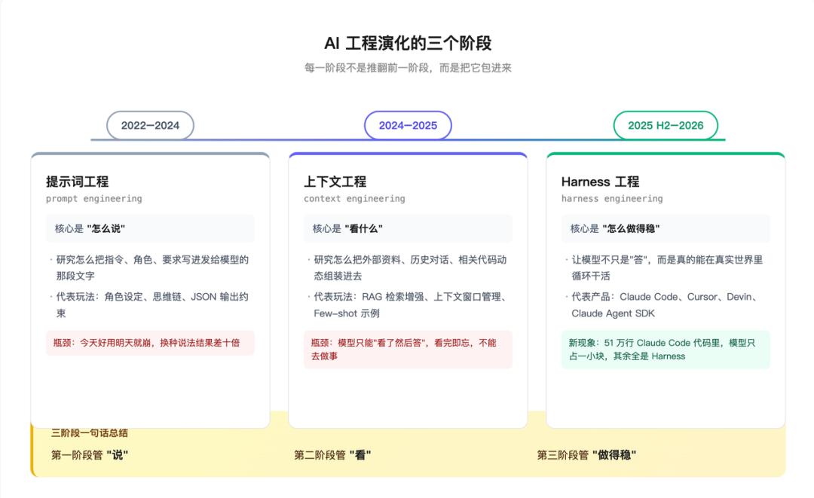
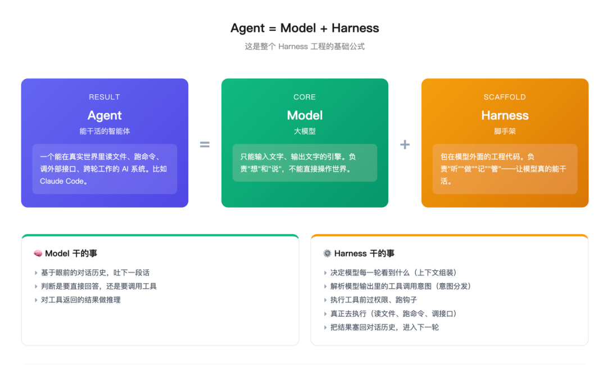
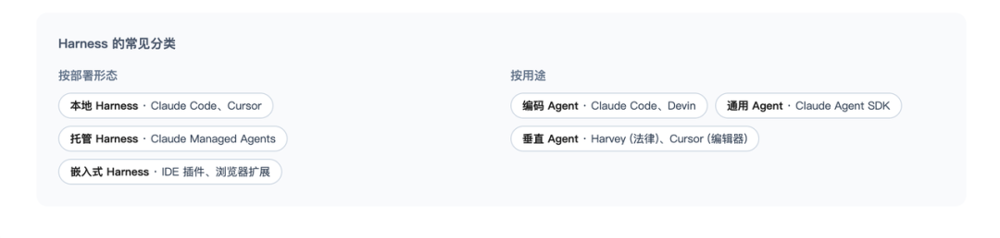
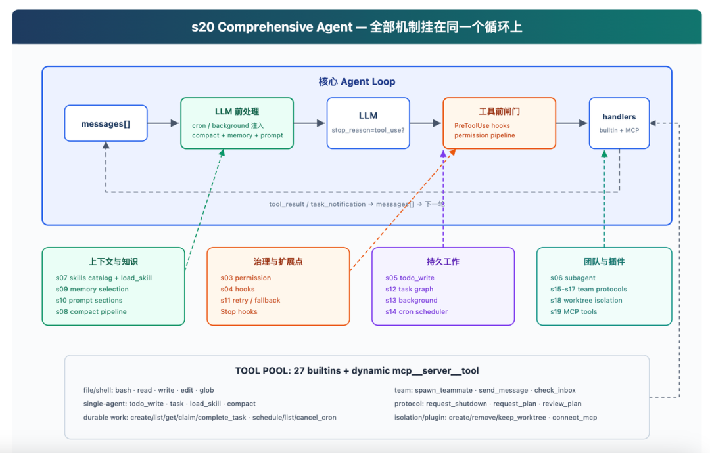
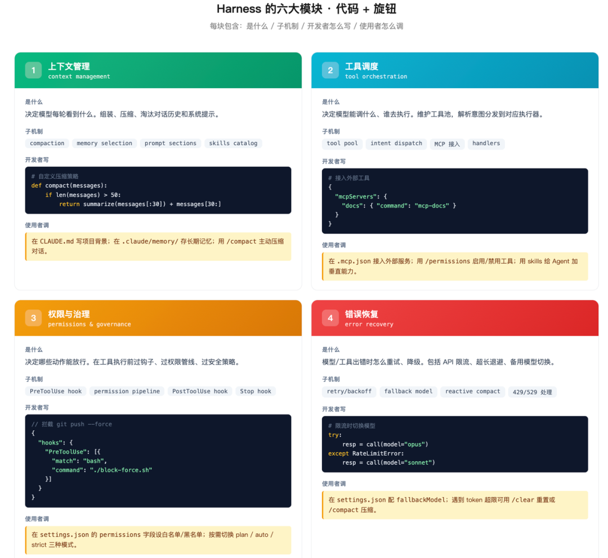
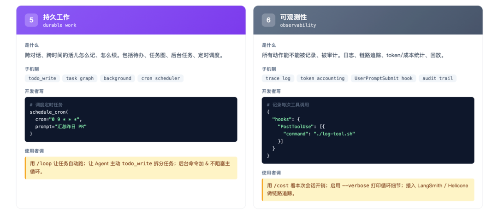
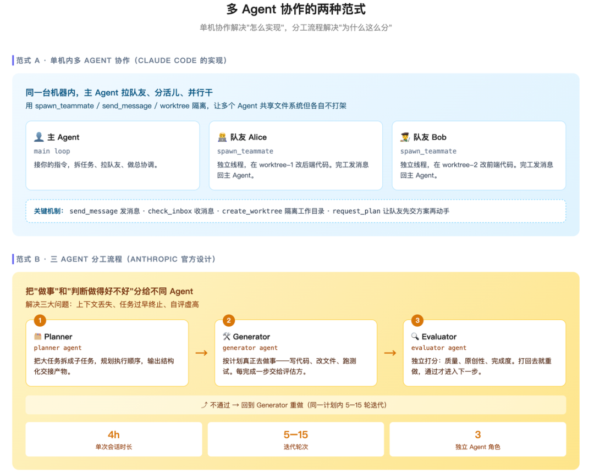

# 别再只盯着大模型了，Harness 才是 AI Agent 的关键

> **作者**：芊羽AIGC
> **来源**：[微信公众号原文](https://mp.weixin.qq.com/s/IWYjPceJ3ypNLvZojDQgNw)
> **发布日期**：2026-05-24

> [!NOTE]
> **一句话总结**：过去三年大家以为"模型变强了"，其实真正拉开差距的，是模型外面那一层 —— `Harness`。它决定了同一个 Claude，在不同团队手里能跑出 78 分还是 42 分。

---

## 目录

- [一、先说件怪事](#一先说件怪事)
- [二、它是怎么来的](#二它是怎么来的)
- [三、Harness 到底是什么](#三harness-到底是什么)
- [四、同样的 Claude，凭啥有人 78% 有人 42%](#四同样的-claude凭啥有人-78-有人-42)
- [五、然后剧情反转了——Anthropic 自己在删 Harness](#五然后剧情反转了anthropic-自己在删-harness)
- [六、那你怎么办——Harness 怎么增、怎么删](#六那你怎么办harness-怎么增怎么删)
- [七、这跟你有什么关系](#七这跟你有什么关系)
- [八、写在最后](#八写在最后)

---

## 一、先说件怪事

2026 年初，一大批人开始反馈 **Claude 变笨了**。

代码写得乱、回答不如以前、问个简单问题都磨蹭半天。讨论声大到 Anthropic 出来解释。

复盘出来，结论让人意外 —— **模型一个字节没改**。权重、参数、训练数据，全是原来那套。

那改了什么？改了一个叫 `Harness` 的东西。

> [!TIP]
> 大部分人是第一次听说这个词。但接下来你会看到，**2026 年 AI 圈最重要的那个词，很可能就是它。**

---

## 二、它是怎么来的

它不是凭空出现的。它是被三年的工程教训一步步逼出来的。

### 2.1、2023：所有人都在琢磨"怎么说"

ChatGPT 刚出来那一年，行业里最热的活儿叫**提示词工程**（prompt engineering），研究怎么把指令、角色、要求写进发给模型的那段文字里，让它输出更准确。

> "你是一位 XX 专家""请一步步思考""请按 JSON 格式输出" —— 这类话术满天飞。背后的逻辑很简单：模型很强，关键看你会不会问。

但这个阶段很快就遇到瓶颈。同一个提示词，今天好用、明天就崩；问题换个说法，结果差十倍。仅靠"怎么问"撑不起一个真正能用的产品。

但要说清楚：提示词工程并没有过时。它只是不够了。后面每一层新东西，内部都还在认真地"怎么说" —— 只不过这件事慢慢从人的手艺，变成了系统自动打理的一个环节。

### 2.2、2024-2025：风向变了，大家开始琢磨"给它看什么"

行业意识到，模型答得好不好，更多取决于它眼前看到了什么，而不是你怎么问。

这一年出现了一批**上下文工程**（context engineering）的玩法，研究怎么把外部资料、历史对话、相关代码片段动态组装进去，让模型每次都看到最相关的信息。

把相关文档检索出来塞进对话（这就是 `RAG`，检索增强生成）、把代码片段挑给它看、把示例贴进提示词。同一个模型，喂得好就答得好，喂得乱就答得差。

但这一层也有上限。它做的还只是准备好材料，递给模型看一眼。而且是单次的 —— 模型看完答完就结束了。它不能上网、不能改文件、不能跑代码、不能记住你昨天说过的话。

> 它只会"看了然后答"，不会"看了然后做"。

### 2.3、2025 下半年–2026：终于开始琢磨"它怎么干活"

行业又问：能不能让模型不只是"答"，而是真的去做事？

**第一波尝试**是 AutoGPT、BabyAGI 这种早期 Agent 项目。给模型一个目标，让它自己想自己干。结果一跑就乱、烧钱不办事 —— 这不全怪他们，那会儿模型本身还撑不起长链条的自主任务，外面那层框架也太糙，两头都没到位。

**第二波尝试**是 LangChain 这类 Agent 框架 —— 给开发者一堆积木让他们自己拼。能跑了，但每家拼出来形状都不一样，又脆又重。

到这一步，得正式请出一个词：**harness（脚手架）**。它指的是模型外面那一整套东西，让一次性的"问答"变成一个能干活的 agent 所需要的全部配件：自己跑的行动循环、调用工具的接口、上下文和记忆的动态管理、权限控制、会话和文件状态、出错了怎么处理。

到这儿前两层的去向就清楚了：提示词工程、上下文工程都没消失，它们被收进了 `harness` 里，成了这套系统内部自动打理的两个模块。**harness 不是第三种取代前两种的东西，而是把前两层装进了一个会循环行动的框架。**

2025 年，Anthropic 推出了 **Claude Code** —— 它在终端里跑，能读你整个项目的代码、改文件、运行命令、跑测试、提交 PR，像个能自己干活的工程师。它不是给你积木让你拼，而是直接给你一辆装好的车，钥匙交到你手上，你只管开。

那它凭什么比别人的拼装车跑得好？答案全在 `harness` 上。

> [!IMPORTANT]
> 有个很说明问题的数据：同样一个 **Opus 4.5** 模型，在 CORE 基准上套 Claude Code 的 harness 能拿 **78 分**，换一套开源框架（Smolagents）只剩 **42 分**。模型一模一样，差距全在外面那层。

过去三年大家以为"模型变强了"，其实真正拉开差距的，是模型外面那一层有没有打磨好。

2025 年下半年，事情又往前走了一步。Claude Code 在 Anthropic 内部早就不只用来写代码了 —— 做深度研究、剪视频、记笔记，几乎所有主要的 agent 流程都在它上面跑。

于是 Anthropic 干脆承认：驱动 Claude Code 的这套引擎，根本不是"编码工具"，而是个通用的 agent 底座。他们把它单独拆出来，把原本的 Claude Code SDK 改名为 **Claude Agent SDK**。

这一拆，定位就清楚了：你不用再自己拼积木，也不必整辆车照搬，而是拿到那台验证过的引擎，装进自己的应用里，再针对自己的任务去定制外面那层 harness。业界给这套打法起了个名字 —— **Harness as a Service**。

### 2.4、一句话概括这三年

| 阶段 | 管什么 | 名字 |
| --- | --- | --- |
| 第一阶段 | 管"**说**" | 提示词工程 |
| 第二阶段 | 管"**看**" | 上下文工程 |
| 第三阶段 | 管"**做**" | Harness 工程 |

每一阶段不是推翻前一阶段，而是把前一阶段包进来。Harness 里依然有提示词、有上下文管理，但它管的是一整套"模型怎么在真实世界里循环干活"的事。



---

## 三、Harness 到底是什么

讲到这里，我们可以正式说 Harness 了。

### 3.1、三个东西的关系：Agent = Model + Harness

先把三个核心概念理清楚：

- **大模型**（比如 Claude Sonnet 4.5）：一个只会"输入文字、输出文字"的引擎。本身不能读文件、不能跑命令、不能记事。
- **Harness**：包在大模型外面的一整套工程代码。它负责把大模型变得能在真实世界里干活 —— 给它配工具、管它的记忆、决定它每次看到什么、检查它能不能放行某个动作。
- **Agent**：能在真实世界里干活的智能体。它 = 大模型 + Harness。

这个等式写出来就是行业里那条最基础的公式：

> [!TIP]
> **`Agent = Model + Harness`**

举个具体的：

- **Claude Code** = Claude 模型 + 一个非常成熟的 Harness（这个 Harness 现在被 Anthropic 独立出来叫 Claude Agent SDK）
- **Cursor** = 某个底层模型 + Cursor 自家的 Harness
- **Devin** = 某个底层模型 + Devin 自家的 Harness

模型大家都能调用 API，真正决定一个 Agent 强不强的，是它的 Harness。



### 3.2、Harness 的分类

行业里目前的 Harness 大致按两个维度分。

**按部署形态分：**

- **本地 Harness**：跑在你机器上，比如 Claude Code、Cursor、Aider。优点是延迟低、数据不出本机；缺点是要你自己维护环境。
- **托管 Harness**：跑在云上，比如 Anthropic Managed Agents、Devin。优点是开箱即用，可以长跑；缺点是数据要交出去。
- **嵌入式 Harness**：嵌进别的产品里，比如 VS Code 里的各种 AI 插件、浏览器扩展。

**按用途分：**

- **编码 Agent**：Claude Code、Cursor、Devin。Harness 围绕"读代码、改代码、跑测试"建。
- **通用 Agent SDK**：Claude Agent SDK、OpenAI Assistants API。给你一个通用底座，你自己接业务。
- **垂直 Agent**：Harvey（法律）、Glean（企业搜索）、Hebbia（金融）。Harness 重度定制到某个行业。



这篇文章后面讲的所有原理，三类都适用。

### 3.3、机制很多，循环一个

shareAI-lab 的开源教学项目 `learn-claude-code` 把 Claude Code 拆成 20 个最小可运行的示例。最后它用一句话总结了整套架构 —— **机制很多，循环一个**。

这句话不是 Anthropic 官方的提法，但它准确戳中了 Claude Code 这类 Agent 内部的设计原则。我们沿用它来理解 Harness。

#### 3.3.1、先讲"循环一个"

你看到的 Claude Code 那么多能力 —— 读文件、跑命令、调工具、记住你说过的话、几个 Agent 协作、定时任务、后台执行 —— 表面上像是无数个独立功能堆出来的。

但骨子里，所有功能都挂在同一个循环上。这循环只有 5 行代码：

```python
while True:
    response = LLM(messages, tools)          # 让模型基于历史说话
    if not has_tool_use(response):           # 模型没要求调工具?结束
        return
    results = execute_tools(response)        # 模型要调工具?执行
    messages.append(results)                 # 结果塞回去,再来一轮
```

翻译成人话：

> 模型说话 → 看它要不要调工具 → 调了 → 结果塞回去 → 模型再说话 → …… 直到模型说"我说完了"为止。

Claude Code、ChatGPT 的 Agent 模式、Cursor，骨子里都是这一个循环。区别只在于循环外面挂了多少东西。

> [!NOTE]
> 这一个循环，就是 Agent 的"**心跳**"。下文出现"循环"和"心跳"，指的都是这同一件事。

#### 3.3.2、走一遍真实过程

光看代码没感觉。我们用一个真实场景从头到尾跑一遍 —— 你跟 Claude Code 说：

> "帮我看一下桌面上有什么文件，然后把所有 PDF 移到 Documents/PDFs 里去。"

**第 0 步：你按下回车之前**

Claude Code 已经在一个 `while True` 循环里跑着。它脑子里有两样东西：

- `messages[]`：从对话开始到现在所有的来回
- 一个**工具池**：内置工具（27 个，包括读写文件、跑命令等）+ 可能动态接入的外部工具

**第 1 步：用户输入预处理（input preprocessing）**

你输入的那句话，先被 `UserPromptSubmit` 钩子处理一遍 —— 做安全审计、记日志、必要时改写。然后追加到 `messages[]` 末尾。

> **钩子（hook）** 是 Harness 在关键时刻插的扩展点，可以让你在不改主流程的前提下加上自己的逻辑（审计、拦截、改写）。

**第 2 步：上下文组装（context assembly）**

进入"LLM 前处理"环节。这一步要按顺序干 4 件事：

1. **定时事件检查（cron polling）**：有没有定时任务到点了？这次对话没设定时任务，跳过。
2. **后台事件检查（background notification）**：有没有后台任务跑完了？没有，跳过。
3. **上下文压缩（compaction）**：当前 `messages[]` 是否过长？没到上限。如果到了，这里会把旧消息压成摘要，省出空间。
4. **系统提示组装（system prompt assembly）**：
   - 拼上"你是 Claude Code，知识截止 2026 年 1 月……"这种身份说明
   - 拼上技能目录（已注册的各种 skill 的简介）
   - 拼上记忆（如果有的话）
   - 拼上已连接的外部服务器列表

这一步整个 Harness 在做的事是：把"模型这一轮需要看到的所有信息"准备好。

**第 3 步：模型推理（model inference）**

把 `messages[]` + 系统提示 + 工具池定义全部打包，发给 Claude 模型本体。

模型在这一步做**意图识别（intent recognition）**：它要判断用户到底想干嘛、自己该直接回答还是该调工具。这一次它判断："用户要我先看桌面、再移动 PDF。我得先调一下 bash 看看。"

模型返回内容里带了一个 `tool_use` 块：调用 bash，命令是 `ls ~/Desktop`。

**第 4 步：意图分发（intent dispatch）**

Harness 解析模型的返回，判断 `stop_reason=tool_use`？→ 是。继续。

**第 5 步：工具前闸门（pre-tool gate）**

进入安检环节。

- `PreToolUse` 钩子触发：日志钩子先记一笔
- **权限管线（permission pipeline）** 检查：`ls ~/Desktop` 是只读命令，安全，放行
- 如果模型给的命令是 `rm -rf ~/Desktop`，权限会拦截，闸门直接返回"拒绝"

**第 6 步：工具执行（tool execution）**

bash 是内置工具，由内置执行器（handler）执行。注意这里有一个分支：`should_run_background?`

- 如果命令很慢（比如 `npm install`），后台机制会启动一个独立线程，主循环立刻拿到一个占位结果："任务已在后台运行，ID=xxx"
- `ls` 很快，不走后台，同步执行完成

**第 7 步：工具后处理（post-tool processing）**

工具跑完了，`PostToolUse` 钩子触发 —— 比如检查输出是不是太大、要不要截断。

**第 8 步：结果回写（result append）**

把执行结果包装成 `tool_result` 块，追加到 `messages[]` 末尾。

**第 9 步：进入下一轮循环**

模型这次看到的 `messages[]` 里多了"用户要看桌面 + 我调了 bash + 桌面有这些文件"。它继续判断："桌面有 3 个 PDF，我得用 mv 命令把它们移走。" 又返回一个 `tool_use`。

第二轮 → 第三轮 → …… 直到模型看到"全部移动完成"，生成一段总结回复，这次没有 `tool_use` 了。循环触发 `Stop` 钩子收尾，结束循环，把回复给你看。

这一整段过程里，大模型和 Harness 分别在做什么？看清楚这个，就理解 Harness 了。

**大模型**从头到尾只做一件事：基于眼前的对话历史，吐下一段话（要么是回答，要么是"我要调这个工具"）。它不读文件、不跑命令、不记事、不审计。它只会"看了然后说"。

**Harness** 在做的事多得多：

- **上下文组装**：决定模型这一轮看到什么
- **意图分发**：解析模型的输出，看它要不要调工具
- **权限管线**：在工具执行前检查、跑钩子
- **工具执行**：真的去执行那个工具（读文件、跑命令、调外部接口）
- **结果回写**：把结果塞回对话历史
- **循环控制**：决定要不要进入下一轮，还是收尾退出

> [!IMPORTANT]
> 模型负责"想"和"说"，Harness 负责"听""做""记""管"。一个 Agent 之所以能干活，是因为这两边在那一个循环里反复配合。

如果一句话不需要工具，循环跑 1 次就结束。如果是"看下桌面然后整理一下 PDF"，可能跑 5–6 次。

#### 3.3.3、那"机制很多"是啥意思

回到那张架构图。



这张图是 `learn-claude-code` 项目里把 Claude Code 完整版的内部架构画出来的。看着复杂，其实就两块。

**上半部分 —— 蓝色大框里那一排，就是循环本身。** 从左到右五个方框，对应循环的五步：

- `messages[]`：对话历史。一切的起点和终点。
- **LLM 前处理**（绿色）：把模型这一轮要看到的东西全部准备好。包括定时事件/后台事件的注入、消息压缩、系统提示组装。
- **LLM**：真的调用模型。看它有没有要求调工具。
- **工具前闸门**（橙色）：模型说要调工具，但能不能调先过安检。钩子看一眼（打日志、审计），权限管线看一眼（"你想 rm -rf？不行！"）。
- **执行器（handlers）**：闸门过了，真的执行。内置工具自己执行，外部工具（通过 MCP 协议接入的）转发出去。

执行完，结果绕回 `messages[]`，进入下一轮。这就是底部那条回路虚线。

**下半部分 —— 四个彩色方框，是挂在循环上的四类"外挂"。** 这是整张图最聪明的设计。它把 Claude Code 所有能力按职责分成四类，每一类用虚线指向"我挂在循环的哪一步"。

- 🟢 **绿色「上下文与知识」** → 挂在【LLM 前处理】。决定模型每一轮看到什么。技能目录、相关记忆、提示组装、长对话压缩，都在这里。
- 🟠 **橙色「治理与扩展点」** → 挂在【工具前闸门】。决定模型能不能做某事。权限、钩子、出错重试、停止条件，都在这里。
- 🟣 **紫色「持久工作」** → 也挂在【工具前闸门】。因为待办、任务图、后台任务、定时调度，本质都是"模型要调一个工具来记事/排活儿"，所以都要先过闸门。
- 🔵 **青色「团队与插件」** → 挂在【执行器】。决定模型能调动什么。子 Agent、队友、隔离工作树、外部工具，都在这里。

最底部那条 `TOOL POOL`，就是执行器真正能执行的工具清单。27 个内置 + 动态接入的外部工具。你一旦执行 `connect_mcp("docs")`，下一轮工具池里就会多出 `mcp__docs__search` —— 是动态的。

> **MCP（Model Context Protocol，模型上下文协议）** 是 Anthropic 提出的一个开放协议，让任何外部服务都能按一个统一格式接进 Agent 的工具池。

> [!TIP]
> 这张图最重要的不是它画了多少功能，而是它告诉你：**每个功能挂在循环的哪一步。** 理解这个结构以后，Harness 就不再是"一堆零散的代码" —— 它是围着一个 5 行循环长出来的器官。

### 3.4、Harness 的六大模块

把上面这张图的所有外挂归个类，就是 Harness 的六大模块。下面每块都给两套用法：开发者怎么写代码，使用者怎么调旋钮。





#### 3.4.1 上下文管理（context management）

- **是什么**：决定模型每轮看到什么。组装、压缩、淘汰对话历史和系统提示。
- **子机制**：compaction（压缩）、memory selection（记忆筛选）、prompt sections（提示分段）、skills catalog（技能目录）
- **开发者怎么写**：自定义压缩函数、注册 skills、写 `CLAUDE.md` 定义项目背景
- **使用者怎么调**：在 `CLAUDE.md` 写项目背景规则；在 `.claude/memory/` 存长期记忆；用 `/compact` 命令主动压缩对话；用 `/clear` 重置对话

#### 3.4.2 工具调度（tool orchestration）

- **是什么**：决定模型能调什么、谁去执行。维护工具池，解析意图分发到对应执行器。
- **子机制**：tool pool（工具池）、intent dispatch（意图分发）、MCP 接入、handlers（执行器）
- **开发者怎么写**：在 `.mcp.json` 接入 MCP 服务器、写自定义 skill、注册自定义 handler
- **使用者怎么调**：用 `/permissions` 启用/禁用工具；用 skills 给 Agent 加垂直能力；通过 `.mcp.json` 一键接入外部服务（比如数据库、文档站）

#### 3.4.3 权限与治理（permissions & governance）

- **是什么**：决定哪些动作能放行。在工具执行前过钩子、过权限管线、过安全策略。
- **子机制**：PreToolUse hook、permission pipeline（权限管线）、PostToolUse hook、Stop hook
- **开发者怎么写**：在 `settings.json` 的 hooks 字段写钩子脚本（Node/Python/Shell 都行）；自定义权限策略
- **使用者怎么调**：在 `settings.json` 的 permissions 字段设白名单/黑名单；切换 plan / auto / strict 三种执行模式；通过 `--allow-tool` 一次性放行

#### 3.4.4 错误恢复（error recovery）

- **是什么**：模型/工具出错时怎么重试、降级。包括 API 限流、超长退避、备用模型切换。
- **子机制**：retry/backoff（指数退避）、fallback model（备用模型）、reactive compact（反应式压缩）、429/529 处理
- **开发者怎么写**：在 SDK 里捕获 `RateLimitError` 切换模型；自定义 retry 策略
- **使用者怎么调**：在 `settings.json` 配 `fallbackModel`；遇 token 超限用 `/clear` 或 `/compact`；超时调高 `--timeout`

#### 3.4.5 持久工作（durable work）

- **是什么**：跨对话、跨时间的活儿怎么记、怎么续。包括待办、任务图、后台任务、定时调度。
- **子机制**：todo_write（待办）、task graph（任务图）、background（后台执行）、cron scheduler（定时调度）
- **开发者怎么写**：调用 `schedule_cron` 注册定时任务；用 task graph API 编排跨会话任务；长命令加 `run_in_background: true`
- **使用者怎么调**：用 `/loop` 命令让任务自动重复跑；让 Agent 主动 `todo_write` 拆分长任务；后台命令加 `&` 不阻塞主循环

#### 3.4.6 可观测性（observability）

- **是什么**：所有动作能不能被记录、被审计。日志、链路追踪、token/成本统计、回放。
- **子机制**：trace log（链路日志）、token accounting（token 计量）、UserPromptSubmit hook（输入日志）、audit trail（审计跟踪）
- **开发者怎么写**：在 `PostToolUse` 钩子里写日志；接入 LangSmith / Helicone 做链路追踪；自定义 metrics 上报
- **使用者怎么调**：用 `/cost` 看本次会话开销；启用 `--verbose` 打印循环细节；查 `~/.claude/logs/` 复盘历史调用

> [!NOTE]
> 这六块加起来，就是把"只会接话的模型"变成"能在你电脑上干活的同事"的全部机制。而它们共同的骨架，永远是那 5 行 `while True`。

### 3.5、多 Agent 协作：一个 Harness 内的两种范式

讲完单 Agent 的 Harness，还得讲一种越来越主流的设计：多 Agent 协作。一个 Harness 里跑多个 Agent，行业里有两种典型范式。

#### 3.5.1、范式 A：单机内多 Agent 协作（Claude Code 的实现）

主 Agent 接你的指令，可以拉队友一起干。具体机制：

- `spawn_teammate`：主 Agent 决定要拉一个队友，调一个工具就能起来一个新的子 Agent。新队友有自己独立的 `messages[]` 和 `while True`，但和主 Agent 共享文件系统。
- `send_message` / `check_inbox`：队友之间通过消息总线沟通。A 干完一段活儿，发条消息给 B；B 在自己的循环里 `check_inbox`，看到消息就接着干。
- **worktree 隔离**：每个队友占一个独立的 git worktree（独立目录 + 独立分支），A 改后端、B 改前端，互不打架。
- `request_plan` / `review_plan`：可以要求队友先交方案，主 Agent 看过批准了再让对方动手。

> 这一套适合**横向并行** —— 一个大需求拆成几条线，几个队友同时推。

#### 3.5.2、范式 B：分工流程的三 Agent 设计（Anthropic 官方）

Anthropic 自己在 2026 年 4 月发布了一个"长任务三 Agent 范式"，把"做事"和"判断做得好不好"分给不同的 Agent。

- **Planner Agent（规划）**：把大任务拆成子任务，规划执行顺序，输出结构化交接产物。
- **Generator Agent（执行）**：按计划真正去做事 —— 写代码、改文件、跑测试。
- **Evaluator Agent（评估）**：独立打分（质量、原创性、完成度），不通过就打回去重做。

这一套解决三个长期痛点：

- **上下文丢失**：通过结构化交接产物 + context reset，让长任务能跨阶段接力。
- **任务过早终止**：单次会话最长 4 小时、5–15 轮迭代，把"快速试错"换成"慢工细活"。
- **自评虚高**：让模型自己评自己，几乎一定虚高；把评估单独拎给一个 Agent，立刻客观。

> 这一套适合**纵向迭代** —— 一个长任务反复打磨，直到评估方点头。

#### 3.5.3、两种范式什么时候用

| 场景 | 用哪种 |
| --- | --- |
| 需求能拆成多条独立子任务 | **范式 A**（横向并行） |
| 单个任务复杂、需要反复打磨 | **范式 B**（纵向迭代） |
| 既要拆又要打磨 | **A + B 嵌套**（主 Agent 用 A 拉队友，每个队友内部用 B 的三角色循环） |



---

## 四、同样的 Claude，凭啥有人 78% 有人 42%

地基打牢了，看数据。行业里一个公开的事实是：**同样的 Claude 模型，不同团队用，性能能差一倍。** 三个案例。

### 4.1、案例一：Vercel 把工具砍掉 80%，成功率反而涨到 100%

Vercel 是做云部署的那家公司。他们做了一个 Agent 来自动化部署任务。

一开始想法很朴素 —— 工具越多 Agent 越聪明。所以装了一大堆：读文件、写文件、搜代码、跑命令、查文档、调 API……

跑出来发现一个怪现象：模型常常挑错工具。明明能直接写文件，它非要先搜一遍；明明能一步搞定，它拆成五步。为什么？

回到刚才那张图，每一轮模型说话之前，Harness 都要把"模型可以调的工具列表"喂进去。工具越多，这列表越长。模型每次得从一长串里挑一个用 —— 挑错的概率自然上升。

Vercel 做了一件反直觉的事 —— **把工具池从一大堆砍到只剩最核心的几个。**

> [!TIP]
> **结果：**
> - ✅ 成功率从 80% 涨到 **100%**
> - ✅ token 用量**砍一半**
> - ✅ 响应时间从 12 分钟掉到 **2 分钟**

对模型来说，工具越少反而越聪明。**"少"是一种能力。**

### 4.2、案例二：LangChain 模型没换，光改上下文就跳了一档

LangChain 是最早做 Agent 框架的公司之一。他们想在 Terminal Bench 2.0 上拿高分 —— 这是个公开评测，专门测 Agent 能不能在终端里完成真实的编程任务。

第一版跑出来排第 30 名，得分 52.8%。

他们没去换模型 —— 业界用的都是同一批模型，换了也没用。他们去研究"模型为什么会出错"。

发现绝大多数错误的根源是**上下文管理**。回到那张图，绿色"LLM 前处理"框 —— 每一轮模型说话之前，Harness 要决定塞什么进它眼前。塞太多它处理不过来，塞太少它信息不够。

第一版的策略太粗。该看到的没看到，不该看到的塞了一堆。模型在噪音里挑信号，自然挑错。他们重新设计了这套策略 —— 怎么组装、怎么压缩、怎么淘汰。

> [!TIP]
> **结果：**
> - ✅ 得分从 52.8% 跳到 **66.5%**
> - ✅ 排名从第 30 挤进 **前 5**
>
> 模型没动一根头发。

### 4.3、案例三：Harvey 重做"找资料"那一块，准确率直接翻倍

Harvey 是给律师用的 AI。律师评测发现它回答法律问题准确率不够高。

他们排查了很久，结论挺反直觉 —— 模型本身没问题。同样的问题，如果你手动整理好资料再问，模型答得很好。

问题出在 Harness 里"找资料 + 塞资料"那一块（行业里叫 **RAG 流水线**）。法律数据库巨大，每次模型要回答一个问题，Harness 得从里面挑几条相关的法条或案例塞给模型。挑错了或挑不全，模型就只能猜 —— 再聪明的模型也救不回来。

他们重做了这一块。**结果：律师评估的准确率直接翻倍。**

### 4.4、落到你身上

> [!IMPORTANT]
> 这三家公司没换模型，没多花 token 钱。他们换的是**车**。
>
> 如果你也用过 Claude 觉得"也就那样" —— 大概率不是模型选错了，而是你压根没有 Harness，或者那个 Harness 太烂。

---

## 五、然后剧情反转了——Anthropic 自己在删 Harness

到这里你应该已经接受了"Harness 很重要"这件事。现在给你一个反转。

你打开任何一个 AI 公众号，最近半年都在教你"怎么建 Harness"。十二大模块、六层架构、完整指南。

然后你打开 Anthropic 自己的工程博客，他们在说一句完全相反的话 —— **把你那些 Harness 删掉。**

> [!WARNING]
> 引爆的判断是这句：
> **"我们当初为 Claude 3 建的脚手架，正在变成 Claude 4 的牢笼。"**

为什么？

回到前面那个定义 —— Harness 本质是给模型**补短板**。你建一个工具，是因为模型自己干不了那件事；你写一段压缩逻辑，是因为模型看不下那么长。

但模型一直在升级。它的短板在变少。

你三个月前为"模型当时干不了 X"写的那段补丁，三个月后模型自己能干 X 了。但补丁还在那里跑 —— 它不仅没用，还在替模型干它本来能干得更好的事。

讲一个真实例子，你就明白了。

回到那张图，模型每一轮能"看"的文字是有上限的，专业术语叫**上下文窗口（context window）**。Claude Sonnet 4.5 有个毛病 —— 聊到一半，眼看自己快"看不下"了，会提前慌张结束任务。Anthropic 自己给这毛病起了个名叫"**上下文焦虑（context anxiety）**"。

他们给 Harness 打了个补丁：每次接近上限时，主动帮模型清掉一部分历史、重置对话状态。

半年后 **Opus 4.5** 出来。这毛病自己没了 —— 新模型对长对话不焦虑了。

但那个补丁还在 Harness 里跑。新模型本来能跑得很顺，结果被旧补丁强行打断、清记忆、重置。**补丁反过来变成了拖累。**

> [!CAUTION]
> 这就是为什么 2026 年初一批用户突然觉得"Claude 变笨了" —— 他们感觉到的不是模型变笨，是 Harness 里那一堆早该删掉的补丁在拖后腿。

所以 Anthropic 在做的事是：**删**。落下来一句话 ——

> [!IMPORTANT]
> **Harness 工程的真正高阶能力，不是"建"，是"判断什么时候该删"。**

---

## 六、那你怎么办——Harness 怎么增、怎么删

光看 Anthropic 在删，自己不会动也没用。

这一段先说一件最重要的事：**Harness 不是"AI 黑盒"，是你能直接动手改的代码。** 每一段权限、每一条规则、每一个工具，都是写在配置文件或代码里的。能加，能改，能删。

下面分别讲怎么增、怎么删，以及怎么不删错。

### 6.1、怎么"增"一段 Harness（4 步）

假设你在用 Claude Code，发现它经常做一件"危险事" —— 比如时不时执行 `git push --force`，你想拦下来。

**第 1 步：定位问题挂在循环的哪一步**

回到那张图。你的问题是"工具执行前要拦截"，对应的是**工具前闸门**那一步。所以这是一个钩子（hook）问题，不是上下文问题，也不是工具池问题。

**第 2 步：选择最小改动**

能用配置解决，就不要写代码。Claude Code 提供了 `~/.claude/settings.json`，里面可以配 `PreToolUse` 钩子。一段 JSON 就能搞定，不用动主流程。

**第 3 步：写一段拦截逻辑**

在 `settings.json` 里加：

```json
{
  "hooks": {
    "PreToolUse": [
      {
        "match": "bash",
        "command": "node ~/.claude/hooks/block-force-push.js"
      }
    ]
  }
}
```

然后写一个 30 行的 `block-force-push.js`：读取要执行的命令，匹配到 `git push --force` 或 `-f` 就返回拒绝。

**第 4 步：观测一段时间**

跑一周，看日志里：

- 拦截触发了几次？拦对了吗？
- 有没有误拦？（比如把正常的 `git push origin force-branch` 误判）
- 有没有让模型卡死？（被拒后它能不能换个方式继续）

观测正常，留下；不正常，调一下匹配规则。

> [!TIP]
> **核心原则：** 从循环找位置 → 用最小改动 → 装观测 → 看数据。不要一上来就写一大套框架。

### 6.2、怎么"删"一段 Harness（4 步）

删比增难，因为你不知道删了会不会塌。但有套路。

**第 1 步：列出"嫌疑名单"**

打开你的 Harness 配置和代码，把以下几类挑出来：

- 三个月以上没人动过的钩子
- 注释里写着"临时补丁""绕过 XX 问题"的逻辑
- 当年为某个旧版本模型写的特殊处理
- 工具池里上个月统计调用次数为 0 的工具

这些就是嫌疑名单。

**第 2 步：一次只删一项**

挑一个嫌疑最大的（比如那个为 Sonnet 4.5 上下文焦虑写的补丁），只删它一个。别一次性大扫除 —— 出问题你不知道是哪个引起的。

**第 3 步：跑一遍评测对比**

删之前跑一遍你常用的任务（修 bug、写测试、改文档等），把成功率、token、耗时记下来。删之后再跑一遍，对比。

- 三项都没变差 → 删对了，提交。
- 有一项变差了 → 看看是哪种任务挂了，决定是回滚还是改写。
- 全都变好了（也常见）→ 这段补丁早就是负资产了，删得太对。

**第 4 步：固化下来**

把"为什么删""删之前/之后的数据"写进 commit message。下次模型再升级，你回头看这段历史就有判断依据。

> [!IMPORTANT]
> **最重要的一条：装观测。** 你不敢删，本质是因为你看不见删了之后会发生什么。一旦每次跑完都有数据，删除就从"赌博"变成"实验"。

### 6.3、三层境界

| 层级 | 能力 | 说明 |
| --- | --- | --- |
| **第一层** | 会增 | 知道六大模块是什么，能往循环上挂东西。绝大多数人卡在这一层。 |
| **第二层** | 会调 | 知道每个模块怎么调能让性能跳一档。Vercel 砍工具、LangChain 改上下文、Harvey 重做 RAG，都是第二层。 |
| **第三层** | 会删 | 能判断哪段 Harness 已经过期，敢删，敢承担删错的风险。Anthropic 自己在这一层。 |

> Harness 工程能力强的人，不是写代码最多的人，是每次模型升级后**删代码最果断**的人。

---

## 七、这跟你有什么关系

不只是程序员的事。三种人各一句。

> [!NOTE]
> 💡 **如果你是程序员**：你下一个稀缺技能，不是写提示词，不是写代码，是判断这段 Harness 该留还是该删。前者有教程，后者只能靠判断力。判断力没人能教，只能在每一次"该不该删"的时刻自己练出来。

> [!NOTE]
> 👔 **如果你是团队 leader**：你买 Claude 花的钱，效果上限不在 token 数量，而在 Harness 工程能力。同样的预算，能力差的团队跑出 42%，强的团队跑出 78%。差的那 36 个百分点不在账单上，在你看不见的那一层代码里。

> [!NOTE]
> 🙋 **如果你是普通用户**：下次再觉得"Claude 变笨了"，先别骂模型。问一句 —— 是不是它背后那辆车换了？或者，那辆车上一堆早该拆掉的旧配件还在拖着它。

### 再往前推一步

把 Harness 这件事抽出来，它揭示的规律不只在 AI 里成立。

> **任何工具的真正能力，等于工具本身 + 包在它外面那层"用法系统"。**

钢琴的能力不只是琴，是琴 + 弹琴的人那套训练 + 调音 + 演奏曲目。AI 的能力不只是模型，是模型 + Harness。一个人的能力也不只是他懂多少，是他懂的东西 + 他给自己建的那套工作系统：笔记、工具链、习惯、复盘。

每次主角升级 —— 模型变强了、你懂得多了 —— 外面那套系统就要重新审视一遍。该删的删，该简的简。不删，外面那套就会变成牢笼。

**这件事在 AI 上叫 Harness 工程。在人身上，叫成长。**

---

## 八、写在最后

你以为你在选模型，其实模型早就选好了。你真正在选的，是谁给它配了更好的那辆车。

而最贵的那辆车，不是装满了配件的车。

**是知道什么时候该把配件拆下来的车。**
