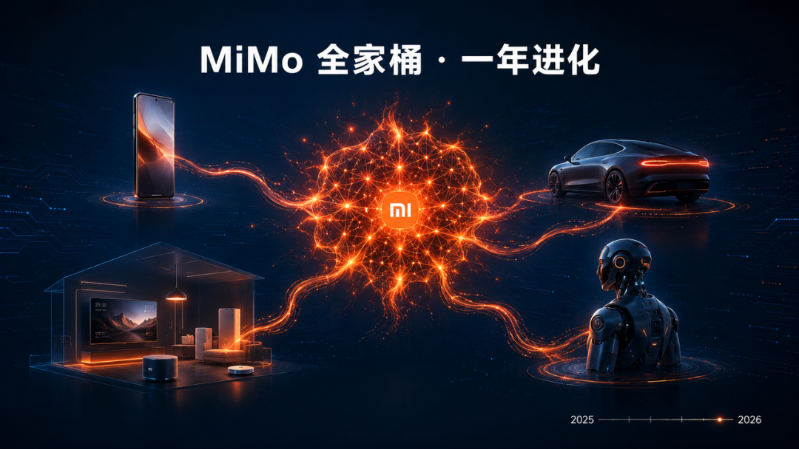
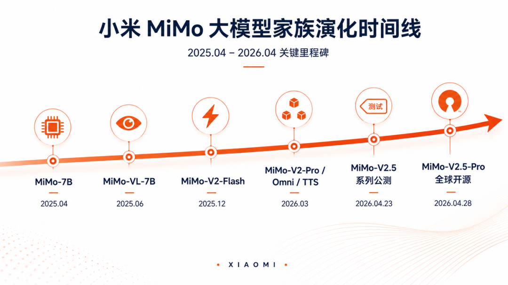
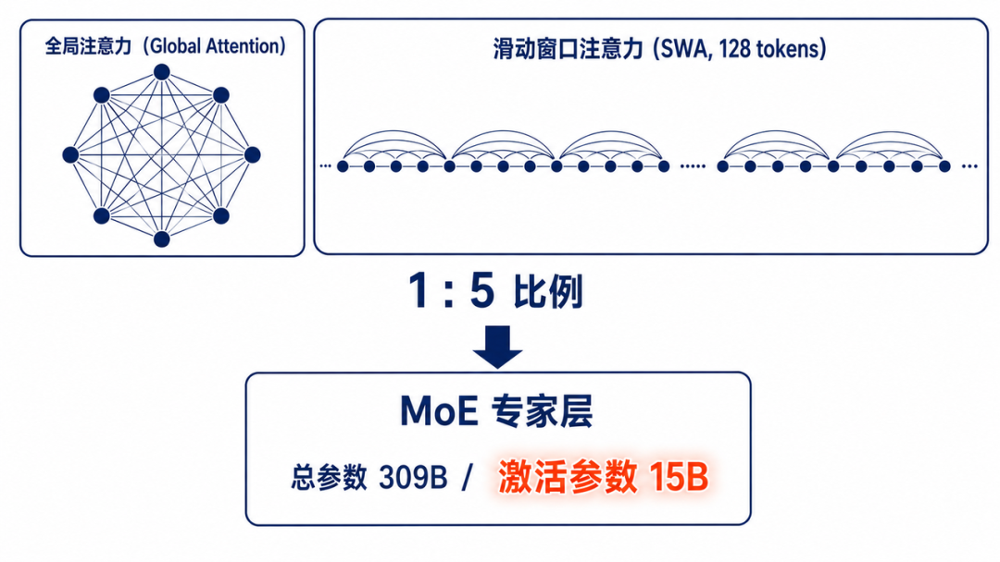
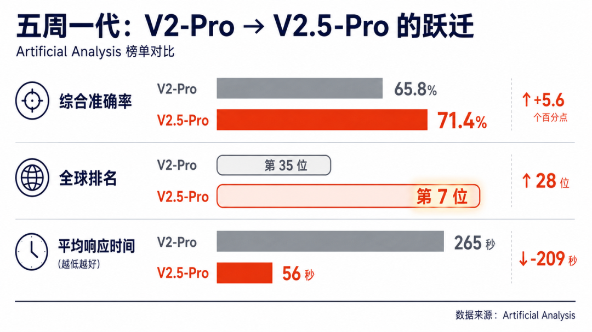
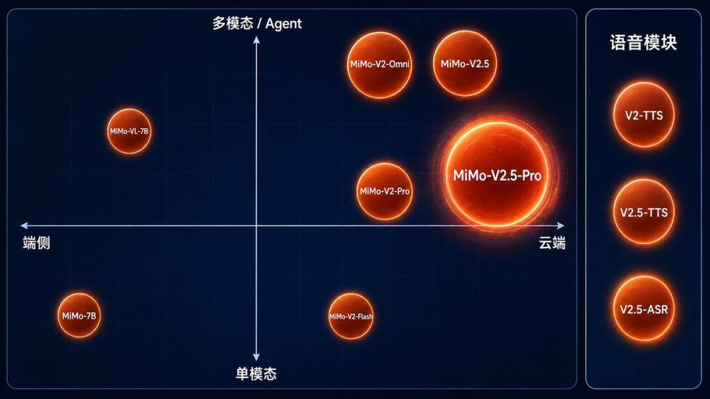
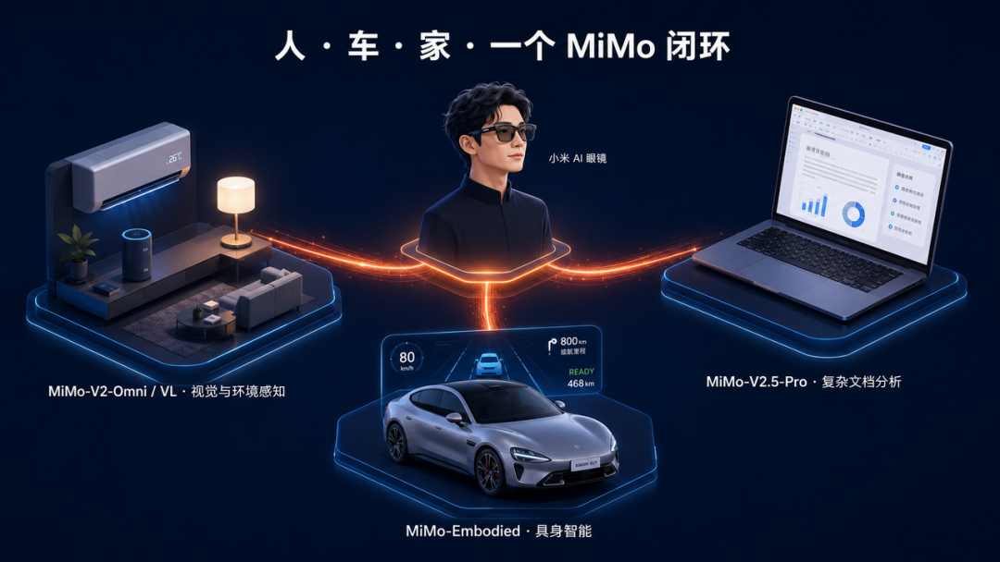

# MiMo 全家桶深度测评：一年时间，小米怎么把大模型从"性价比"打成"全球前五"？

> **作者**：芊羽AIGC
> **来源**：[微信公众号原文](https://mp.weixin.qq.com/s/ZNd28FrFR_vZwBKI_u6zRQ)
> **发布日期**：2026-05-06

---

## 前言

从 MiMo-7B 到 V2.5-Pro，一份覆盖 10 款模型、横跨端云、面向 Agent 时代的完整测评

如果把 2025 年 4 月小米开源 MiMo-7B 那一天当作起点，到 2026 年 4 月 28 日 MiMo-V2.5-Pro 全球开源为止，整整一年。

一年里，小米从一个"刚迈入大模型赛道的硬件公司"，被推到了 Artificial Analysis 全球开源综合智能榜单的第七位、Agent 指数开源第一，并在 Text Arena 国际盲测中拿下全球第五、LabRank 第四。

这一年也是整个大模型行业的"分水岭"。百万 token 上下文成为新标配，参数堆料让位于 Token 效率比拼，AI Agent 从概念走向规模化商用。

MiMo 系列恰好是这一波趋势里最具样本意义的国产开源代表——它不是参数最大的，也不是名气最响的，但它把"够用 + 便宜 + 能干活"这三个看似平淡的词，做成了一条完整的工程护城河。

这份测评会覆盖 MiMo 家族目前所有公开成员：MiMo-7B、MiMo-VL-7B、MiMo-V2-Flash、MiMo-V2-Pro、MiMo-V2-Omni、MiMo-V2-TTS，以及 2026 年 4 月 23 日开启公测、4 月 28 日全球开源的 MiMo-V2.5、V2.5-Pro、V2.5-TTS、V2.5-ASR。

每一款都会从架构、性能、成本、适用场景四个维度展开，最后给出一张完整的横向对比表。

## 一、MiMo 家族全景图：一张完整作战地图

### 1.1 时间线与版本谱系

MiMo 的演化路径非常清晰，几乎是一条教科书式的"端 → 多模态 → 云端 → 全模态 Agent"纵深布局。

2025 年 4 月，MiMo-7B 作为端侧推理先锋首发，主打移动设备低能耗推理，能耗仅为同类产品的 1/5，并集成进 HyperOS 3.0 成为手机的"思维中枢"。两个月后，MiMo-VL-7B 发布，把多模态视觉语言能力补齐，在 40 项多模态任务中 35 项超越 Qwen2.5-VL-7B。

真正的拐点在 2025 年 12 月 16 日，MiMo-V2-Flash 上线——总参数 309B、激活参数 15B 的 MoE 模型，以 Claude Sonnet 4.5 的 2.5% 推理成本、2 倍生成速度、SWE-Bench Verified 73.4% 的成绩打开了行业的想象力。

三个月后，2026 年 3 月 19 日凌晨，小米一口气发布 MiMo-V2-Pro、V2-Omni、V2-TTS 三款新模型。再过五周，2026 年 4 月 23 日，MiMo-V2.5 系列开启公测，4 月 28 日 V2.5-Pro 正式开源。

平均每两个月一次大版本，节奏快到让 Hugging Face 上的开源模型榜单都来不及更新。

### 1.2 矩阵分工：四象限里看清每个模型的边界

MiMo 全家桶的产品逻辑，可以用"任务类型 × 部署位置"的四象限来切：端侧通用推理由 MiMo-7B 承担，端侧多模态由 MiMo-VL 承担，云端高效率推理由 V2-Flash → V2.5 接棒，云端旗舰长程 Agent 则是 V2-Pro → V2.5-Pro 的主战场。语音侧的 V2-TTS 与 V2.5-TTS/ASR 是横跨整条产品线的"语音模块"。

把这套矩阵串起来看，小米想做的不是"最强单点模型"，而是"端云协同的 Agent 操作系统"——这正是后续讨论生态布局时的关键背景。

## 二、端侧奠基，MiMo-7B 与 MiMo-VL-7B

### 2.1 MiMo-7B：端侧推理的"小钢炮"

MiMo-7B 在 2025 年 4 月发布时，就在数学推理和代码生成上超越了 OpenAI o1-mini 和阿里 QwQ-32B-Preview。

这件事在当时被低估了——一款 7B 参数的端侧模型，在数学和代码这两个最考验"硬推理"的赛道上跑赢了 32B 参数级的开源旗舰，意味着小米从一开始走的就是"用工程优化抵消参数差距"的路线。

它的核心价值在于能耗仅为竞品的 1/5，被深度集成进 HyperOS 3.0，成为小米手机本地化 AI 推理的引擎。从用户体感上讲，离线翻译、摘要、屏幕内容理解这些"端上即时反馈"的能力，几乎都靠它完成。

### 2.2 MiMo-VL-7B：多模态的眼睛

2025 年 6 月发布的 MiMo-VL-7B 是另一块拼图。它在 GUI 交互和复杂推理上刷新了开源记录，在 40 项多模态任务中 35 项超越同尺寸的 Qwen2.5-VL-7B。对于产品形态上需要"看懂屏幕、看懂照片、看懂文档"的端侧 Agent 而言，VL-7B 提供的是基础感知层。

这两款 7B 模型不是这次测评的主角，但它们解决的问题决定了后续 V2 系列的产品定义：端侧解决感知和即时响应，云端解决长程推理和复杂规划。

## 三、效率先锋：MiMo-V2-Flash

3.1 Hybrid Attention + 多层 MTP：把"大模型"做小

MiMo-V2-Flash 的核心架构创新有两个。

第一个是 Hybrid Attention，采用 1:5 的 Global Attention 与 Sliding Window Attention 混合结构——前者负责长距离依赖，后者把窗口控制在 128 tokens，90% 以上的注意力计算被优化掉。第二个是多层 MTP（Multi-Token Prediction），让模型并行预测多个后续 token 而不是一个一个吐字。

这两项加在一起，让 309B 总参数、15B 激活的 MoE 模型实现了 150 tokens/s 的推理速度，比同类闭源模型快 2 倍。

### 3.2 MOPD：训练成本砍到 1/50 的真护城河

比架构更值得说的是训练方法。多教师在线策略蒸馏（MOPD） 先训出各领域的专家教师模型，再让学生模型基于自身策略分布采样，利用多教师的稠密 token 级奖励信号优化。

MOPD 训练只需不到传统 SFT+RL 流程 1/50 的计算资源，即可匹配教师模型的峰值表现。

1/50 的训练计算成本——这才是后续 V2-Pro、V2.5-Pro 能在三个月、五周这种节奏里连续迭代的根本原因。

### 3.3 性能定位与短板

V2-Flash 在 SWE-Bench Verified 上达到 73.4%，是当时所有开源模型中的第一，逼近 GPT-5-High。但它在 ARENA-HARD 创意写作、人类最后一场考试这类纯通用推理评测中略逊色于 DeepSeek-V3.2——它是工程师型选手，不是文学家。

它的真正价值不在"最强"，而在"最便宜的够用"——推理成本仅为 Claude Sonnet 4.5 的 2.5%，这个数字让大量原本"做不起"的 Agent 应用变得可行。

## 四、旗舰推理基座：MiMo-V2-Pro

### 4.1 万亿参数 MoE + 混合注意力 + 1M 上下文

2026 年 3 月 19 日凌晨发布的 MiMo-V2-Pro，是小米第一次真正进入"旗舰"赛道。总参数超过 1T，激活参数 42B，采用创新的混合注意力架构，原生支持 1M 超长上下文长度。在全球权威大模型综合智能排行榜 Artificial Analysis 上，MiMo-V2-Pro 位列全球第八、国内第二。

它不是 V2-Flash 的简单放大版，而是面向"高强度真实 Agent 工作流"重新设计的——重点在于把 Coding 智能向 Claw 智能（通用 Agent 能力） 做泛化。

### 4.2 Agent 能力：把"聊天"做成"干活"

在 OpenClaw、Claude Code 等智能体框架中，MiMo-V2-Pro 能够在无人工干预下完成复杂工作流编排、长程规划与精准工具调用。

在 OpenClaw 标准评测榜单 PinchBench、ClawEval 上效果处于全球顶尖。整体使用体感官方表述为"已超越 Claude Sonnet 4.6，逼近 Opus 4.6，但 API 定价仅为其 1/5"。

需要客观说明的是，V2-Pro 发布时小米只公布了 SWE-Bench Verified 的成绩（一项被业界认为存在数据污染嫌疑的测试集），而回避了更抗污染的 SWE-Bench Pro。这一点直到 V2.5-Pro 才被补齐。

### 4.3 适用场景

V2-Pro 的最佳战场是长难任务：完整的代码工程、跨多个工具的复杂业务流、需要数小时连续推理的研究型任务。它不是用来做客服对话的，而是用来"代替一个初级工程师工作半天"的。

## 五、全模态基座：MiMo-V2-Omni

### 5.1 原生统一架构，不是后接的多模态

MiMo-V2-Omni 在 3 月 19 日同期发布，定位是面向 Agent 时代的全模态基座。它的关键不在于"支持多模态"，而在于"原生统一处理"——大多数多模态模型是各模态分别处理后再拼接，而 V2-Omni 把图像、视频、音频、文本作为同一学习框架中的一等公民统一表示。

它在公开测评前以"Healer Alpha"代号匿名上架 OpenRouter，未做宣传就在 OpenClaw 测评榜单 PinchBench 上拿下均分第一。

### 5.2 三大模态全面表现

| 评测维度 | 评测集 | 得分 | 对标 |
| --- | --- | --- | --- |
| 语音推理 | BigBench Audio | 94.0 | 超越所有竞品 |
| 音频理解 | MMAU-Pro | 69.4 | 登顶音频排行榜 |
| 视频未来预测 | FutureOmni | 66.7 | 视频类别第一 |
| 图像理解 | 多学科视觉推理 | 超 Claude Opus 4.6 | 逼近 Gemini 3 Pro |
| 长音频理解 | 10 小时连续音频 | 综合超 Gemini 3 Pro | — |

V2-Omni 支持 256K 上下文，API 定价为输入 \$0.4/M tokens、输出 \$2/M tokens。

### 5.3 适用场景

它最适合的是"既要看又要听还要动手"的 Agent 任务——比如自动化短视频制作、长会议纪要 + 决策分析、电商选品比价砍价下单、复杂网页 GUI 操作。这是单模态模型完全够不到的场景。

## 六、语音合成：MiMo-V2-TTS

MiMo-V2-TTS 基于自研 Audio Tokenizer 和多码本语音-文本联合建模架构，经过上亿小时语音数据的大规模预训练与多维度强化学习，实现了高度可控的多粒度语音风格控制。

它最有意思的能力是同一句话内完成语气转折和情感递变——这是绝大多数 TTS 模型做不到的。它还能在唱歌时准确表达音高和节奏，少样本声音克隆（3 句样本）就能适配口音、语气甚至方言。

它的角色不是独立模型，而是"给 Agent 注入灵魂"——配合 V2-Omni 的耳朵、V2-Pro 的大脑，构成完整的多模态交互闭环。

## 七、旗舰再进化：MiMo-V2.5-Pro

### 7.1 五周一代：节奏快到让人怀疑人生

V2-Pro 发布于 2026 年 3 月 19 日，V2.5-Pro 公测于 2026 年 4 月 23 日，正式开源于 4 月 28 日。五周一代，这个迭代速度本身就是 MOPD 训练方法的最佳广告。

关于参数规模：百度百科将 V2.5-Pro 标注为"309B 总参 / 15B 激活"，与小米官方在 V2-Pro 上公布的"1T 总参 / 42B 激活"存在矛盾。结合官方"V2.5-Pro 是 V2-Pro 进化版"的定位以及五周迭代节奏，更可信的判断是 V2.5-Pro 沿用 V2-Pro 的万亿参数 MoE 架构并做了 Token 效率优化——发稿前建议以小米官方技术报告为准。

### 7.2 关键基准成绩

V2.5-Pro 这一代最大的态度转变，是把 SWE-Bench Pro 这种抗污染测试集放到了宣传榜首位。

| 评测项 | MiMo-V2.5-Pro | 对标模型成绩 | 结论 |
| --- | --- | --- | --- |
| SWE-Bench Pro | 57.2% | Claude Opus 4.6: 57.3% / GPT-5.4: 57.7% | 基本持平 |
| MiMo Coding Bench | 73.7 | Claude Opus 4.6: 71.5 | 反超 |
| ClawEval (pass^3) | 63.8 | — | 开源 Agent 第一梯队 |
| τ3-bench | 72.9 | GPT-5.4: 持平 | 持平顶级 |
| Humanity's Last Exam | 48.0 | GPT-5.4: 58.7% | 落后约 10 分 |
| Video-MME | 87.7 | Gemini 3 Pro: 88.4 | 逼近 |

相比上一代 V2-Pro，Artificial Analysis 准确率从 65.8% 提升至 71.4%，排名从第 35 位跃升至第 7 位，平均响应时间从 265 秒缩短至 56 秒。

### 7.3 三个长程 Agent 实战 Demo

小米官方放出的三个 demo 极具说服力：

Demo 1｜从零实现完整 SysY 编译器（北大编译原理课程项目）：用 Rust 从零实现，4.3 小时、调用工具 672 次完成开发，在隐藏测试集上取得满分 233/233。首次编译即通过 137/233 个测试，59% 冷启动通过率。第 512 轮重构令 lv9/riscv 回退两个测试点时，模型自行诊断、恢复、继续推进。

Demo 2｜视频编辑器 Web 应用：仅凭"构建一个视频编辑器 Web 应用"的简单指令，交付一款具备多轨道时间线、片段裁剪、交叉淡化、音频混合及导出功能的可运行 Web 应用，构建代码 8192 行，1868 次工具调用，11.5 小时自主工作。

Demo 3｜模拟电路 FVF-LDO 设计优化：接入 ngspice 仿真闭环（TSMC 180nm CMOS 工艺），1 小时闭环迭代后六个目标指标全部达标，其中四个比初始尝试改进了一个数量级。

这些 demo 的共同点是长程、多工具、可交付——它们想证明的不是"模型聪明"，而是"模型能把活干完"。

### 7.4 必须客观指出的短板

V2.5-Pro 的 SWE-Bench Pro 57.2% 距离当前最高分 Claude Mythos Preview 的 77.8% 还有约 20 个百分点的差距。在 Humanity's Last Exam 上 48.0% 也明显落后于 GPT-5.4 的 58.7%。在"高阶知识密度 + 跨学科抽象推理"上，它和最顶级模型还有一段距离。

更重要的是，编译器、视频编辑器、模拟电路这三个 demo 缺乏完全可复现的公开标准——成功率多少？换一批任务还稳不稳？1868 次工具调用里有多少次是无效调用、重复调用？这些细节如果不公开，demo 的说服力会打折。

## 八、全模态 Agent 进化，MiMo-V2.5

### 8.1 一个模型解决"看听读 + 行动"

V2.5 是为 Agent 场景而生的原生全模态大模型，能同时看、听、读，并把理解转化为行动。它不是 V2-Omni 的简单继承，而是把多模态感知和 Agent 工具调用从训练之初就联合对齐。

它的两个关键升级：在 Claw-Eval 等权威 Agent 评测中超过 V2-Pro 水平，胜任日常简单任务，API 成本降低约 50%；在 VideoMME、CharXiv、MMMU-Pro 等评测中跨模态推理、视频理解、图表分析等能力提升，逼近甚至超越业界顶级闭源模型。

### 8.2 Token 效率：被低估的真护城河

在达到相同 Agent 基准榜单 ClawEval 分数的情况下：

- V2.5-Pro 相比 Kimi K2.6 节省 42% Token

- V2.5 相比 Muse Spark 节省 50% Token

这意味着 API 标价之外还有一层"实际花费折扣"。对于一个 Agent 任务动辄几十万 token 的真实业务，这个差距是商业模型成立与否的关键变量。

### 8.3 V2.5 与 V2.5-Pro 怎么搭配用

V2.5-Pro 专为长难 Agent 任务打造，V2.5 覆盖绝大多数通用 Agent 场景；V2.5 支持原生全模态 Agent 能力，涵盖图像、音频与视频；V2.5 具备更高的平均推理速度，更适合时延敏感任务。

简单粗暴地说：用 V2.5 处理 90% 的日常任务，用 V2.5-Pro 处理 10% 的硬骨头。

## 九、语音双雄进化：MiMo-V2.5-TTS 与 V2.5-ASR

V2.5-TTS 在 V2-TTS 的基础上进一步强化了情感连续性和多语种、多方言支持。而 V2.5-ASR 是这一代新增的语音识别专项模型，对车机、家居、AI 眼镜等远场、噪声、方言场景做了重点优化。

这两款模型的真正意义在于把小米"人车家全生态"的语音入口闭环——从识别（ASR）到推理（V2.5）到合成（TTS），全部由 MiMo 自研模型承担，不再依赖第三方语音引擎。对无障碍场景（视障实时环境描述、听障手语-语音双向转换）也做了专项适配。

## 十、全家桶横向对比表

| 模型 | 发布时间 | 总参 / 激活 | 上下文 | 核心定位 | 关键基准 / 亮点 |
| --- | --- | --- | --- | --- | --- |
| MiMo-7B | 2025.04 | 7B（密集） | 32K | 端侧通用推理 | 数学/代码超越 o1-mini、QwQ-32B-Preview；能耗仅为竞品 1/5 |
| MiMo-VL-7B | 2025.06 | 7B（密集） | 32K | 端侧多模态 | 40 项多模态任务 35 项超 Qwen2.5-VL-7B |
| MiMo-V2-Flash | 2025.12 | 309B / 15B（MoE） | 256K | 云端高效推理 | SWE-Bench Verified 73.4%（开源第一）；成本仅 Sonnet 4.5 的 2.5% |
| MiMo-V2-Pro | 2026.03 | 1T+ / 42B（MoE） | 1M | 云端旗舰长程 Agent | Artificial Analysis 全球第八、国内第二 |
| MiMo-V2-Omni | 2026.03 | 未公开 | 256K | 全模态 Agent 基座 | PinchBench 第一；BigBench Audio 94.0 |
| MiMo-V2-TTS | 2026.03 | — | — | 语音合成 | 同句内情感递变；3 句样本声音克隆 |
| MiMo-V2.5 | 2026.04 | 未公开 | 1M | 通用全模态 Agent | ClawEval general 62.3；成本为 Pro 一半 |
| MiMo-V2.5-Pro | 2026.04 | 万亿 MoE（参考 V2-Pro） | 1M | 旗舰长程 Agent | SWE-Bench Pro 57.2；Video-MME 87.7；Artificial Analysis 第七 |
| MiMo-V2.5-TTS | 2026.04 | — | — | 语音合成升级 | 多语种多方言增强 |
| MiMo-V2.5-ASR | 2026.04 | — | — | 语音识别 | 远场、噪声、方言专项优化 |

## 十一、经济模型与商业可行性

11.1 Token Plan 焕新：4 月 23 日新计费规则

V2.5 系列同步对 Token Plan 做了几项实质优化：

- Credits 速率：V2.5 为 1x（1 Token = 1 Credit）、V2.5-Pro 为 2x（1 Token = 2 Credits）

- 取消 1M 上下文的 4x 倍率——用户用满 1M 上下文不再被额外惩罚

- 北京时间每天 00:00–08:00，所有模型 Credits 消耗速率再打 8 折

- 新增"连续包月"和"包年"订阅，老用户开通自动续费享次月 7 折，包年享全年 88 折

- 所有已购 Token Plan 用户截至 4 月 22 日 22:00 前的 Credits 全量重置

### 11.2 没有 5 小时窗口限制

绝大多数 Coding Plan 都有"每 5 小时 N 次请求"的硬限制，灵感来了额度没了是常态。MiMo Token Plan 用统一 Credits 体系，6000 万 Credits 想一次花完就一次花完，不存在窗口期。这对独立开发者和高强度 vibe coding 用户而言是个被低估的卖点。

### 11.3 与同档套餐横向对比

| 套餐 | 价格 | 额度 / 月 | 限制 | 一句话评价 |
| --- | --- | --- | --- | --- |
| MiMo Token Plan Pro | ¥329 | 7 亿 Credits | 无 5h 窗口 | 性价比第一梯队，无窗口限制 |
| Kimi Code Allegretto | ¥199 | 多模态支持，倍率一般 | 5h 窗口 | 团队综合使用推荐 |
| GLM Coding Plan Pro | ¥149 | 代码能力国内最强 | 5h 窗口，429 错误较多 | 团队开发推荐 |
| MiniMax Coding Plan Plus | ¥49 | 含 TTS / 图像生成 | 5h 窗口 | 性价比首选，但仅文本 |

如果你的 AI 功能目前是成本敏感型的，且每月 API 费用已经显著影响盈利模型，那 V2.5 是一个非常值得认真评估的替代选项。

## 十二、开源策略与生态布局

### 12.1 MIT 协议

V2-Flash 与 4 月 28 日开源的 V2.5-Pro 全部采用最宽松的 MIT 协议，模型权重和推理代码均可自由商业使用甚至闭源再分发。这比 Apache 2.0 还宽松一档，对企业法务而言意义重大。

### 12.2 生态接入清单

MiMo-V2 系列已登陆 Xiaomi miclaw、MiMo Studio、金山办公（WPS 灵犀）、小米浏览器，并通过 OpenClaw、OpenCode、KiloCode、Blackbox、Cline 接入。V2.5 系列还完成了对阿里平头哥、亚马逊云科技、AMD 等多个芯片厂商及主流推理框架的适配。

WPS 灵犀接入 V2-Pro 后，原生支持 Word、Excel、PPT、PDF 四大主流格式，覆盖超 95% 的日常文档类型，这是国产大模型在办公场景的最深度集成之一。

## 十三、端云协同：人车家全生态的真正闭环

把 MiMo 全家桶放回小米的"人车家全生态"语境里，就能看清这盘棋：MiMo-7B 在手机本地做即时响应，MiMo-VL 提供视觉感知，MiMo-Embodied 打通自动驾驶与具身智能（已应用在小米扫地机器人、工厂 AGV、SU7 高阶智驾），MiMo-V2.5 在云端做复杂推理和多模态 Agent，MiMo-V2.5-TTS/ASR 提供语音入口。

一个真实链路可以是这样的：你戴着小米 AI 眼镜，V2-Omni 实时描述环境；进入车内，MiMo-Embodied 接管驾驶决策；快到家时，V2.5 联动家居自动触发"回家模式"；在家用 WPS 处理工作时，V2.5-Pro 做复杂文档分析。

整条链路由 MiMo 矩阵无缝衔接，延迟可控、成本极低——这是单一模型厂商完全做不到的事，也是小米"硬件 + 大模型"模式相对纯软件公司的差异化护城河。

## 十四、不擅长的事，客观短板

任何测评不指出短板都是软文。MiMo 全家桶目前的客观短板有四个：

第一，通用高阶推理仍非第一梯队，HLE、ARENA-HARD 等开放式评测落后顶级闭源模型。

第二，中文长文学创作、哲学思辨类发散性任务不是它的强项。

第三，多模态视频生成（区别于视频理解）暂未跟进，这块被 Veo 3、Sora 占据。

第四，海外开发者社区接受度仍在爬坡，英文技术博客和 GitHub 讨论度相对国内低。

另外一个值得警惕的点：长程 Agent demo 的可复现性。SysY 编译器 233/233、视频编辑器 8192 行代码这些数据非常亮眼，但 prompt、工具配置、上下文注入方式等细节没有完全公开，这是开源大模型评测中常见的"showcase vs. baseline"陷阱。

## 十五、给不同角色的实操结论

如果你是独立开发者或中小团队，建议立刻在边缘服务上做灰度测试：把日常代码补全、文档处理、批量 API 调用迁到 V2.5，把硬骨头任务用 V2.5-Pro 兜底，原有的 Claude/GPT 链路保留为对照组三周，再做最终决策。

如果你是企业技术决策者，重点评估三件事：MIT 协议下的法务可行性、私有化部署的支持力度（已适配阿里平头哥、AWS、AMD）、长期成本曲线（Token Plan 包年 88 折 + 夜间 8 折 + 取消 1M 倍率）。

如果你是产品经理，可以重新审视哪些 AI 功能因为之前 API 太贵被砍掉了——V2.5 的成本结构可能让它们重新具备商业可行性。

如果你是研究者，MOPD 多教师在线策略蒸馏、Hybrid Attention 1:5 比例设计、多层 MTP 这三项技术值得深读对应的技术报告。

结语：从性价比到全球前五的真实距离

一年前，没人会把"小米"和"全球开源大模型第一梯队"放在一句话里。一年后，MiMo-V2.5-Pro 在 Artificial Analysis 综合智能榜单上排名全球第七、Agent 指数开源第一、Text Arena 国际盲测全球第五。

这不是参数堆出来的，是 MOPD 把训练成本砍到 1/50、Hybrid Attention 把推理成本砍到对手的 2.5%、MIT 协议把生态门槛砍到零——三刀下去砍出来的。

这场比赛的计分方式已经变了。性能不必再贵，开源不必再弱，国产不必再追——这是 MiMo 这一年留给行业的最重要叙事。

但同时也要清醒：在最难的高阶通用推理上，它距离 Claude Mythos Preview、GPT-5.4 仍有 10–20 个百分点的距离；在 demo 可复现性上，它需要给社区更硬的证据。

下一个五周，会发生什么？按现在的迭代节奏，V2.6 大概率已经在路上了。
