# Tim Cook 最后一届 WWDC，苹果把 AI 作业交上来了

> **作者**：芊羽AIGC
> **来源**：[微信公众号原文](https://mp.weixin.qq.com/s/yxFHFgC62_VTaLt7LCOvrw)
> **发布日期**：2026-06-08

---

2026 年 6 月 9 日凌晨一点钟，苹果开了 2026 年的开发者大会

这场发布会的重点很清楚，苹果没有把精力放在硬件上，主线集中在系统、AI、儿童安全、开发者工具和 Apple Intelligence 的全面升级。
它还有一条暗线：这是 Tim Cook 作为苹果 CEO 的最后一次 WWDC。Cook 在结尾说，担任 CEO 期间，WWDC 一直是他最重要的时刻之一。放在苹果即将交接的背景里看，这场发布会像一次收尾。Cook 留下的苹果，硬件、芯片、生态都足够强；下一任接手时，AI 会成为新的主战场。

## 一、系统体验：iPhone、iPad、Mac 都在变快

发布会一开始讲的是系统底层优化。
苹果说，今年他们优化了很多系统组件，包括网络切换、显示渲染、Mission Control、空间切换等一系列基础体验。听起来不刺激，但这些东西决定设备每天用起来顺不顺。

具体数字有几组：
iPhone 和 iPad 的 App 启动速度最高提升 30%。苹果的解释是，系统会在你打开 App 前预加载关键数据，所以 App 会更快准备好。这个优化也适用于第三方 App。

新拍的照片出现在照片图库里的速度最高提升 70%。以前你拍完照片，图库里可能要等一下才刷新出来。现在这个等待时间会缩短很多。

iPad 浏览文件、把文件传到外接硬盘，速度最高提升 5 倍。苹果把它和 Mac 上 Finder 的体验放在一起讲，意思很明显：iPad 的文件管理还在往“更像电脑”靠近。

CPU 调度器也做了升级。CPU 调度器负责决定不同任务什么时候执行、怎么分配资源。苹果说，新系统进一步优化了高负载场景下的效率，而且把新的 CPU 调度能力带到了更老的机型上，一直到 iPhone 11。

这也引出一个关键信息：iOS 27 支持 iPhone 11 及之后机型，并且支持所有能运行 iOS 26 的 iPhone。 苹果称这是覆盖用户最多的一次 iOS 发布。

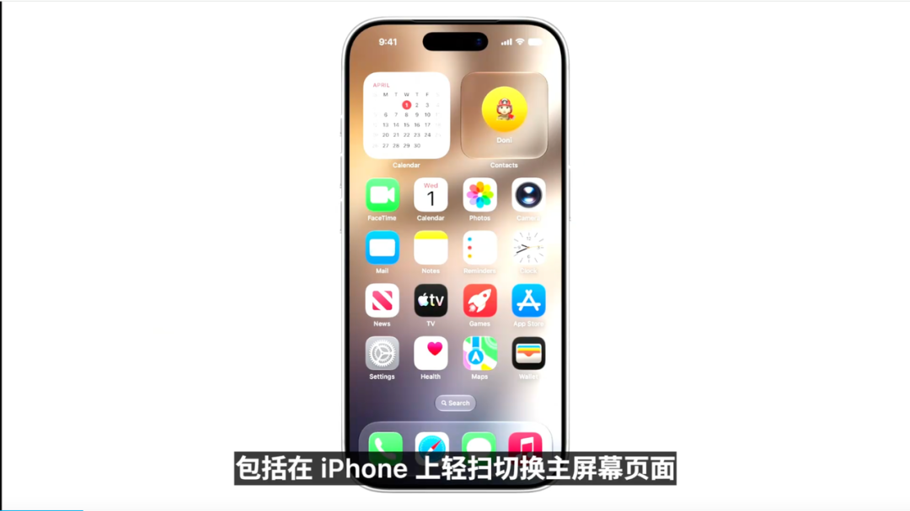

## 二、网络与消息：少一点手动切 Wi-Fi，多一点发送进度提示

苹果还专门讲了网络切换。
很多人都遇到过这种情况：路过咖啡店，手机死死连着那个信号很强但不好用的 Wi-Fi；下飞机后，手机还挂在航空公司网络上，上网反而不顺。以前你可能要进控制中心，手动关 Wi-Fi，强行切回蜂窝网络。

iOS 27 会让 iPhone 更聪明地判断什么时候继续连 Wi-Fi，什么时候切到蜂窝网络。
消息发送也有变化。低带宽环境下，发送大照片或视频不会拖慢整个对话。每条消息会出现新的发送进度提示，让你知道哪条消息还在发送、卡到哪一步了。

这个功能不大，但很实用。尤其是发照片、视频、文件的时候，用户终于能看清楚到底是哪一条没发出去。

## 三、搜索：Spotlight、照片、邮件的底层索引重做了

苹果接着讲了搜索。
这次 iOS、iPadOS 和 macOS 都重建了搜索基础设施，影响的核心功能包括 Spotlight、照片和邮件。

苹果说，系统会在设备上建立一个更丰富的内容目录，用来理解你有什么内容、这些内容在哪里。新的索引架构会更稳定、更高效，也会覆盖更多旧内容和新内容。

更新后，系统会重新索引设备里的内容。之后新内容进来，也会更快被索引。
邮件搜索也有升级。Mail 会有新的排序系统，让更相关的邮件更容易出现在 Top Hits 里。哪怕那封邮件是几个月前发来的，也更容易被排到前面。

这部分和后面的 Siri AI 关系很大。Siri 要理解你的个人上下文，前提是它能找到你设备里的邮件、照片、文件、联系人、日历和信息。搜索做不好，个人 AI 助手就很难真的好用。

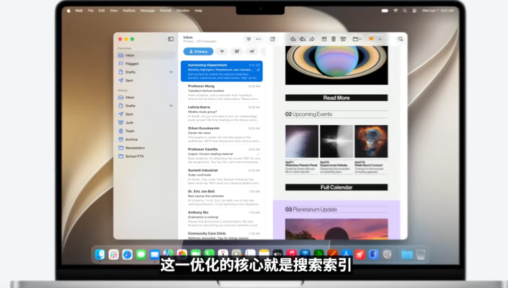

四、日常 App 小功能：共享相册、健康、AirPods、Vision Pro、地图

苹果随后快速过了一组日常功能。
照片里的共享相册升级了。共享相册现在可以包含一次旅行里的所有照片和视频，而且 Android 或 Windows 用户也可以加入并贡献他们拍的内容。共享相册还支持全分辨率分享。

健康 App 的经期追踪加入了围绝经期和绝经期支持。系统可以在周期模式出现相关迹象时提醒用户，也会提供教育信息，帮助用户理解身体变化，并更好地和医生沟通。

AirPods 增加了自定义 EQ。用户可以自己调节 AirPods 的声音表现，让音色更符合个人偏好。

Vision Pro 相关功能也有更新。用户可以把拍过的全景照片变成有深度和真实感的特殊场景，也可以把这些全景照片作为自己的沉浸式环境。

地图里的 Flyover 也升级了。苹果说会结合航拍图像和视觉智能模型，让城市细节更丰富，从建筑细节到单棵树的形状都会更清晰。

## 五、儿童安全：儿童账号、内容限制、联系人、时间管理全部重做

接下来苹果用了比较长的篇幅讲儿童安全。
苹果先强调了两个原则：每个孩子都不同，父母最适合决定什么适合自己的家庭；儿童安全功能要基于临床专家、儿童发展专家和在线安全专家的研究。

这次儿童安全更新的第一步，是儿童账号。

创建儿童账号后，系统会立即启用一组按年龄定制的设置，包括只允许访问适龄网站、适龄媒体、App Store 年龄限制等。如果孩子现在已经有账号，家长也可以把现有账号转换成儿童账号。

苹果把家长最关心的问题分成几类：孩子能看到什么内容、能和谁联系、什么时候能用 App、父母如何引导孩子的数字生活。

内容方面，家长可以让孩子从更有限的内容访问开始，再随着孩子成长逐步开放。
联系人方面，家长可以要求孩子在连接新联系人前获得批准。苹果也提到，对于孩子接收或发送的图片、视频，系统会继续防护裸露或暴力内容。

时间管理方面，系统会按年龄给出不同类别 App 的时间建议。比如社交媒体，苹果引用专家建议，认为 13 岁以下孩子不适合使用社交媒体；青少年什么时候开始使用，应该由父母结合孩子情况判断。

苹果还加入了日程化管理。家长可以按不同时间段设置孩子能用哪些 App。比如上学时间只开放学习相关 App，周末可以额外给一点娱乐时间。

Screen Time 也重新设计。家长可以一眼看到孩子最近怎么使用设备，也可以快速调整访问权限。

开发者侧也有配套能力。苹果提供 API 和资源，帮助 App 保护儿童远离裸露、暴力内容，也能让父母批准 App 内的新联系人。开发者还可以使用 Declared Age Range API，在保护隐私的前提下，根据孩子的年龄范围调整 App 体验。

苹果还会推出一个新网站，集中介绍所有儿童安全功能，并回答家长常见问题。

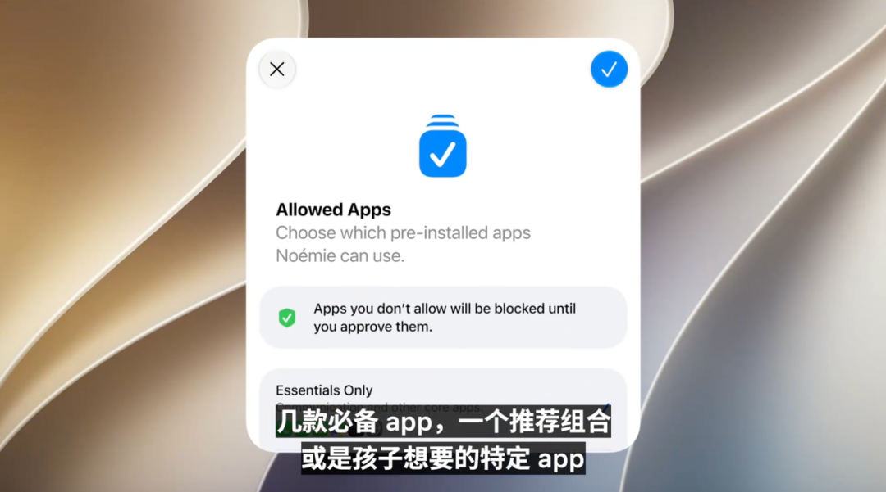

六、Apple Intelligence 架构：和 Google 合作，端侧与私有云一起跑

发布会后半段进入 AI 主线。
苹果先讲了 Apple Intelligence 的新架构。核心是 Apple Foundation Models。今年苹果和 Google 深度合作，利用 Gemini 系列模型背后的技术，一起打造下一代 Apple Foundation Models。

这些模型会适配两种运行方式：一部分在设备端运行，一部分在 Private Cloud Compute 上运行。
苹果强调，这些模型具备更强的理解、推理和多模态能力，包括图像理解、图像生成、视觉内容问答等。

苹果还提到，在更强的 Apple Silicon 设备上，会有第二个更强的端侧模型。这个模型可以理解和生成语音，同时理解文本和图像。它会带来更高准确率的系统听写、更好的自然语言理解，以及更有表现力的 Siri 声音。

新架构里还有一个 system orchestrator，可以协调不同能力：个人上下文理解、世界知识、App 工具调用、屏幕感知。简单说，用户提出一个请求后，系统会判断该用本地模型、私有云，还是调用更强的模型能力来完成。

隐私仍然是苹果重点强调的部分。苹果说，Apple Intelligence 会使用端侧处理和 Private Cloud Compute，用户数据不会被苹果或其他人存储、访问，只用于执行当前请求，并允许外部专家持续验证。

## 七、Siri AI：新版 Siri 变成系统级 AI 助手

新版 Siri 这次正式叫 Siri AI。
Siri AI 可以像过去一样通过 “Hey Siri” 唤起，也可以通过侧边按钮等原有方式使用。它现在具备个人上下文、图像理解、世界知识访问能力。

发布会演示了几个场景。
第一个是查演唱会。用户问旧金山某场演出什么时候开，Siri 可以查询当前世界知识，告诉用户日期。用户继续问怎么买票，Siri 回答需要抽签。用户再说“抽签开放时提醒我报名”，Siri 就创建提醒事项。

第二个是屏幕感知。用户看着一张海岸照片问“这是哪里”，Siri 能识别画面地点。用户又提到朋友最近搬到附近，但没保存地址。Siri 可以从个人信息里找到朋友发来的地址，然后规划路线，还能加入中途停靠点。

第三个是照片操作。用户说“给我看上周末旅行的照片”，Siri 会搜索照片图库。用户再说“只把有某几个人的照片加入家庭共享相册”，Siri 可以筛选照片并完成添加，不需要用户手动进入照片 App 一张张选。

在更强设备上，Siri 声音也升级了。它会更有表现力，用户还能调节 Siri 声音的表达强度和语速。

系统听写也大幅升级。苹果说新的系统听写准确率更高，对拼写、标点、大小写的捕捉更精确。由于它直接集成在键盘里，用户可以在信息、日记等各种 App 中使用。这个能力也会扩展到 CarPlay 和 AirPods。

八、Siri 的对话界面：iPhone、Mac、iPad、Apple Watch、Vision Pro 都有不同入口

Siri AI 还有新的对话体验。
在 iPhone 上，用户可以从 Dynamic Island 区域下拉进入搜索/提问入口，也可以继续说 “Hey Siri” 或按侧边按钮。用户可以问复杂问题，得到更详细的答案，也可以继续追问。

发布会演示了世界杯周末赛程。用户问开幕周末有哪些比赛，Siri 给出赛程。用户继续让 Siri 规划一场观赛派对，要求加入巴西和摩洛哥的经典菜。之后用户又让 Siri 从女儿之前提到的甜点里找灵感，Siri 搜索手机里的信息，把相关消息拉进对话，并最终整理出菜单，还可以把菜单发到群聊里。

在 Mac 上，Siri AI 更像一个可拖动、可调整大小的对话窗口。用户可以从 Spotlight 里直接发起对话，也可以在系统上下文菜单里选中图片、文件或文本，然后让 Siri 分析。

发布会演示了一个搭建 makerspace 的例子。用户选中几份报价文件，让 Siri 比较并推荐方案。Siri 分析文件后生成对比表。用户继续问哪家能解决儿子提到的电气问题，Siri 搜索信息和邮件，给出建议。之后用户让 Siri 起草邮件，询问承包商能否提前交付，Siri 会提取承包商姓名、邮箱和选择理由，生成邮件草稿。

Siri AI 也会有独立 App。这个 App 可以查看对话历史，也可以开启新对话。对话历史会通过 iCloud 私密同步，所以你可以在 iPhone 上开始聊，在 iPad 上继续，在 Mac 上收尾。

Apple Watch 上也能使用 Siri AI。Vision Pro 上会有一个 3D Siri 形象，可以放在空间里。用户甚至不用说 “Hey Siri”，只要看向 Siri 然后开始说话。

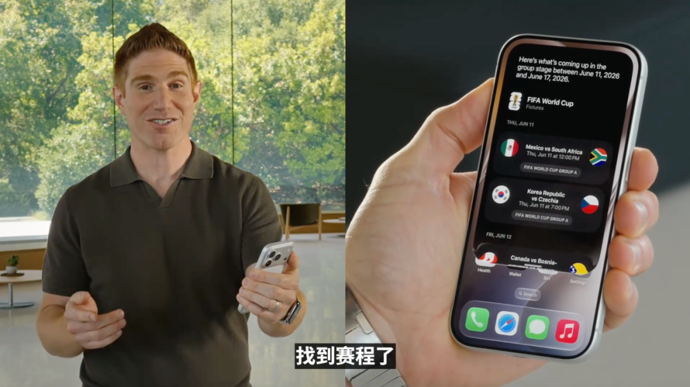

九、视觉智能：相机、Mac 屏幕、iPad 截图、Vision Pro 都能问 Siri

视觉智能是 Siri AI 的重要组成部分。
在 iPhone 上，视觉智能被集成进相机 App。相机里会有新的 Siri 模式。用户对准眼前的东西，点击快门按钮，就能让 Siri 看见你看见的东西，并给出回答。用户还可以下拉查看更丰富的细节，并继续追问。

苹果举了几个用法：
对准一盘食物，获取营养信息。
和朋友骑车后，对准账单，选择自己点的项目，用 Apple Cash 分账。

在 Mac 上，视觉智能可以通过专用快捷键调用。用户选择屏幕上的内容，然后直接输入问题，让 Siri 给出答案。比如看着一个日程表，Siri 可以建议一次性把多个事件加入日历。

在 iPad 上，视觉智能被集成到截图体验里。用户可以对屏幕内容提问，也可以让 Siri 基于截图采取行动。

在 Vision Pro 上，用户可以看着某个现实物体问问题。发布会演示里，Siri 可以结合世界知识和个人上下文，判断一个背包能不能作为航班随身行李，或者某个物品能不能放进背包里。

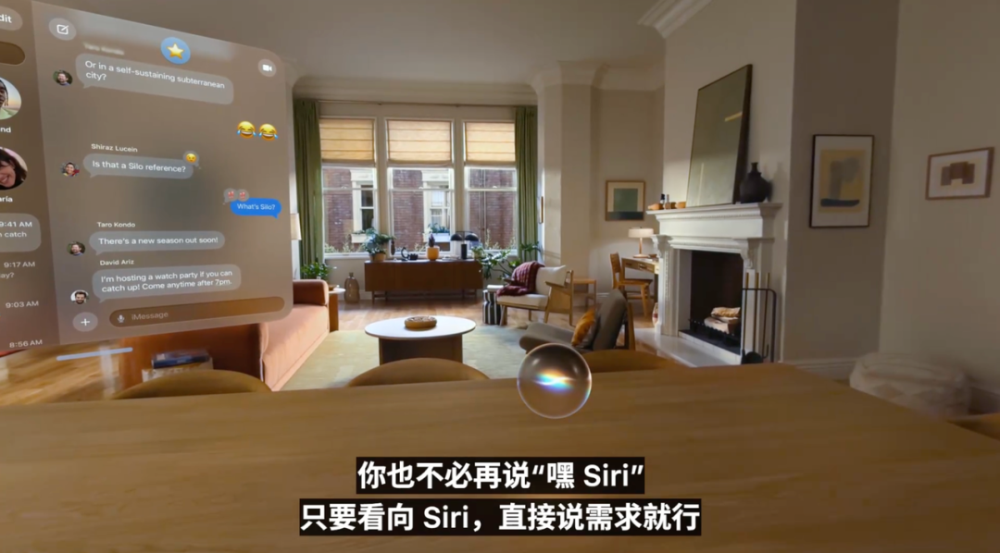

## 十、写作工具：随处写、改、润色，还能模仿你和某个人说话的风格

Siri AI 也升级了写作工具。
用户可以在几乎任何能输入文字的地方使用 “Write with Siri”。只要用自然语言描述需求，Siri 就能从零生成草稿。

在 Mail 和 Messages 里，Siri 还能根据你平时和某个同事、朋友的沟通方式调整语气。比如你平时给经理发邮件总是短句、项目符号，Siri 生成的邮件也会贴近这种风格。

用户也可以选中自己写好的内容，让 Siri 判断语气如何，并给出修改建议。
自动校对也会系统级上线。用户在系统内各种 App 打字时，Apple Intelligence 会自动帮你校对，不需要额外执行一步。苹果说这个能力也适用于大多数第三方 App。

## 十一、Safari：自动整理标签页、监控网页、还能生成个人扩展

Safari 的 AI 更新也很多。
第一个是标签页自动整理。Safari 会用 Apple Intelligence 分析每个网页，识别页面之间的相似性，然后自动把相关标签归成主题。继续浏览时，新打开的相关标签也会被加入对应主题。用户当天结束后，可以关闭整个主题，也可以保存为之后继续处理的任务。

第二个是 Notify Me。很多人会因为等报名开放、等商品补货、等网页更新而一直留着标签页。现在用户可以用自然语言告诉 Safari 自己在等什么，然后关闭标签。Safari 会在后台监控页面变化，一旦检测到符合条件的变化，就发通知提醒用户。

第三个是 Describing Extension。用户可以用自然语言描述自己想要网页多一个什么功能，Safari 可以生成一个定制扩展来调整网页。发布会举的例子是，在菜谱网页工具栏里加一个按钮，用来保存并给试过的菜谱打分。

苹果也强调，Safari 的 AI 不会把敏感浏览数据分享给苹果或其他人。

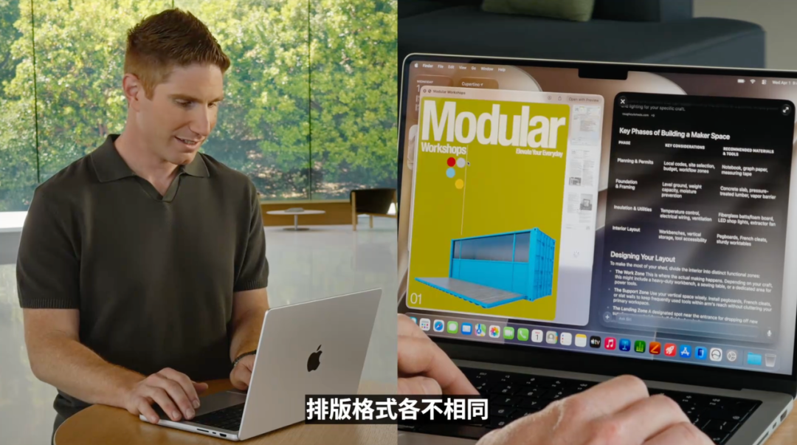

十二、Passwords、Messages、Mail、Calendar、Phone：AI 开始处理碎片任务

Passwords App 会自动升级弱密码或泄露密码。以前系统能提醒你密码有风险，但你要自己去每个网站改。现在符合条件的网站可以一键自动更新强密码。后台由 Passwords、Safari 和 Apple Intelligence 代理式完成登录、进入网站、修改密码等流程。

Messages 会理解聊天上下文，给出一键建议。比如别人让你发照片，Messages 可以帮助你搜索合适照片。你只要输入“搜索照片”，它会识别关键词、地点和人物，从图库里找出匹配内容。

Mail 会基于邮件上下文提供更有用的操作建议，并且可以调用第三方 App。
Calendar 可以用自然语言创建日程。比如你边输入一句话，Calendar 会识别联系人、地点和标题，自动填进日程。修改日程也更方便，比如把每周团队午餐改成隔周一次，Calendar 会自动调整重复频率。

Phone App 加入 Call Context。给商家打电话时，系统会主动从其他 App 找相关信息。比如你打电话给航空公司改航班，Phone App 可以从 Mail 里找到确认码，通话一开始就显示给你。苹果强调，这个功能基于你打给谁来判断，不分析通话内容，并且完全在设备端运行。

## 十三、Home：通知合并、摄像头视频总结、4K 录像

Home App 也加入 Apple Intelligence。
第一个是配件通知合并。家里的设备可能连续发很多通知，Home 会理解它们是否属于同一件事，然后合并成一个持续更新的活动通知。

第二个是摄像头视频总结。兼容摄像头录下的片段，Home 可以分析并生成描述，概括视频里发生了什么。

第三个是跨摄像头搜索和串联。因为系统理解视频内容，所以可以从多个摄像头中找相关片段，并把它们连起来，帮助你看到完整过程。比如你想知道后院发生了什么，Home 可以从多个镜头里找出相关视频。

用户搜索摄像头片段时，Home 会把重要片段提前展示；也可以搜索“包裹送达”这样的具体事件。
支持的摄像头还能查看 4K 分辨率录像。

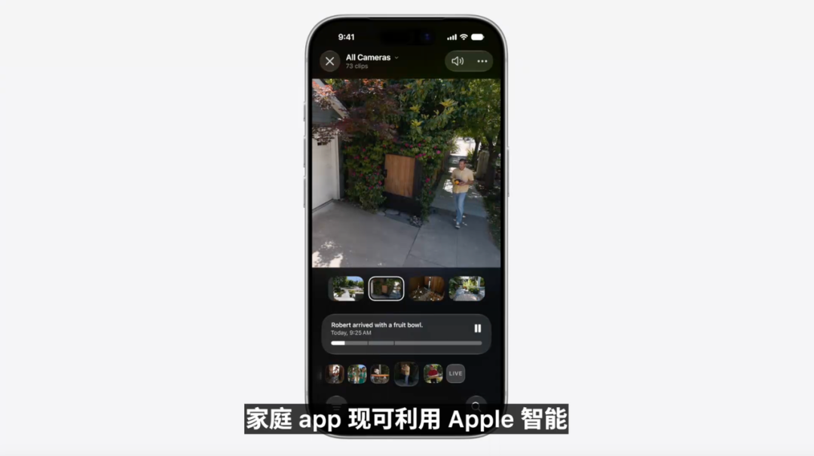

## 十四、Shortcuts：用一句话生成自动化

Shortcuts 这次升级很关键。
以前 Shortcuts 很强，但创建流程复杂。你要知道有哪些动作、怎么串起来、触发条件怎么设。现在用户可以直接描述目标，Shortcuts 会自动组装步骤。
发布会例子是：每次我离开公司时，给 Pedro 发消息，说我正在回家，并附上预计到达时间。

Shortcuts 会自动创建一个自动化：当你离开工作地址时触发，用 Maps 计算回家 ETA，再用 Messages 发给 Pedro。

如果你想改，可以继续用自然语言描述。比如再加一句“同时自动播放我最喜欢的播客”，Shortcuts 会把这个动作补进去。
这个功能对普通用户很有意义。以前 Shortcuts 像高级玩家工具，现在它更接近“你说需求，系统搭流程”。

## 十五、Image Playground：图片生成质量升级，可用自然语言改图

Image Playground 也重做了。
苹果说新版 Image Playground 使用更强的图像模型，可以生成更高质量图片，支持几乎任何风格，包括写实风格。模型运行在 Private Cloud Compute 上。

用户可以用自然语言描述想要的画面，也可以把照片转成不同风格。比如用照片图库中的多人照片生成一张新图，或者把照片改成某种风格。

改图也更直观。用户可以用手圈选图像中的某个物体，比如蛋糕，然后移动、调整大小，或者直接描述修改需求。比如选中蛋糕后说“加上蜡烛”，系统会生成修改结果。

Image Playground 还支持不同尺寸。比如给小企业网站生成横图，或者给传单生成竖图。

它也会出现在更多系统场景里，包括 Messages、背景、联系人海报、锁屏壁纸。系统还会基于你的照片、常去地点和活动给出个性化建议。

开发者也能通过 Image Playground API 使用这些能力。

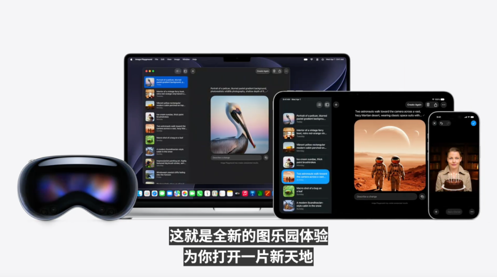

## 十六、照片编辑：消除、扩图、空间重构三件套

照片 App 这次有三个 Apple Intelligence 编辑功能。
第一个是 Clean Up 升级。用户可以移除画面里的干扰物，系统会用更高质量、更真实的方式填补背景。复杂场景下效果会更好。

第二个是 Extend。用户如果觉得主体周围空间不够，或者想换一个画幅比例，可以用 Extend 扩展图片边缘，给主体更多呼吸空间。它也可以帮助校正倾斜地平线，同时尽量不裁掉重要内容。

第三个是 Spatial Reframing。这个功能最有新意。它结合 Apple Vision Pro 带来的空间模型理解，让用户在照片拍完后调整构图角度。

发布会演示里，用户打开照片，点编辑，在右下角进入新的工具选项，找到使用 Apple Intelligence 图像模型和 Private Cloud Compute 的功能，然后选择 Reframe。

进入 Reframe 后，用户可以直接拖动画面。画面的透视会随之变化，像重新移动了拍摄机位。用户拖动时，原始图片边缘会出现模糊区域，之后由生成模型补齐。用户还可以双指缩放，调整构图，最后点击完成。

苹果强调，这个功能只会在透视变化后产生空缺的地方生成新内容，尽量保持照片原始场景一致。

这些照片编辑功能可以作用于照片图库中几乎任何照片，包括老照片，以及其他相机拍摄的照片。

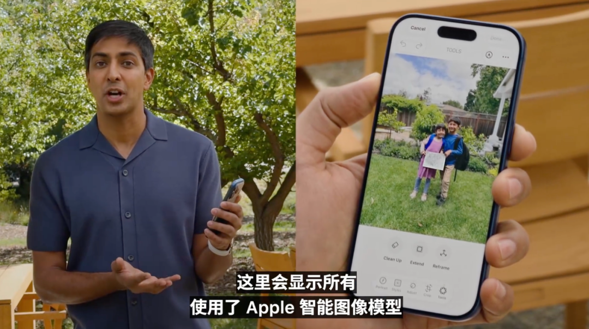

## 十七、可用性与限制：Siri AI 先英语，部分地区暂不上线

苹果明确说，Siri AI 会先支持英语，然后快速扩展更多语言。
新一代 Apple Intelligence 功能会随最新系统免费提供。图像生成因为依赖强大的服务端模型，会有每日使用限制；更高访问量会包含在多数 iCloud+ 订阅计划里。兼容家庭摄像头的 Apple Intelligence 支持也会包含在相关 iCloud+ 计划中。

设备方面，这次更新支持当前支持 Apple Intelligence 的同一批产品型号。更强的端侧模型及其带来的功能，比如更有表现力的声音、更高级听写等，会面向更强的 iPhone、iPad 和 Mac 系统。

开发者可以从发布当天开始试用新版 Siri。面向用户的 Siri AI beta 会在 2026 年晚些时候推出。

地区限制也说得很清楚：Siri AI 在 iOS 和 iPadOS 上不会首批登陆欧盟。苹果说会寻找一条既保护隐私和安全、又能满足监管要求的路径。中国等地区的新功能也会在监管问题解决前暂缓。

十八、开发者工具：App Intents、Foundation Models、Core AI、Xcode AI 编程

开发者部分也很重要。
苹果说，开发者可以把 Apple Intelligence 带进自己的 App，使用已有技术，比如 App Intents，让用户通过 Siri 获取信息、完成任务。

例子之一是消息类 App。如果 App 把内容索引进 Spotlight，用户就可以让 Siri 帮忙从 App 对话里找信息。日历类 App 如果结构化了 App Intents，用户就可以让 Siri 创建日程。

Foundation Models framework 也升级了，现在可以使用图像作为输入。开发者还可以用自定义 skills 扩展模型能力。

发布会还提到一个例子：Daydream 这样的 App 可以让用户选一张活动照片，端侧模型识别穿搭里的每一件单品，然后结合 App 自己的时尚能力，推荐适合用户风格的搭配。

除了 Apple Foundation Models，苹果还发布了新的 Core AI framework。开发者可以把其他模型带到本地 App 里运行，利用 Apple Silicon 的能力，在苹果所有平台上使用。

Xcode 也加入更强的 AI 编程能力。Coding assistant 可以本地化整个 App，也可以和模拟设备交互。开发者还能用自定义 skills 扩展它的能力。

Xcode 里可以选择外部模型，包含 Anthropic Claude、OpenAI Codex、Gemini 三类模型。你可以选择你想用的模型，但可用地区、价格和账号体系仍需等官方后续说明。

另外，苹果还发布了新的 Device Hub，把模拟设备和真实设备放到一个统一界面里。开发者可以模拟多点触控，比如 pinch 缩放；也可以一键切换 App 外观，做动态测试。

更多工具、语言和框架细节会在 Platforms State of the Union 和后续技术 sessions 里展开。

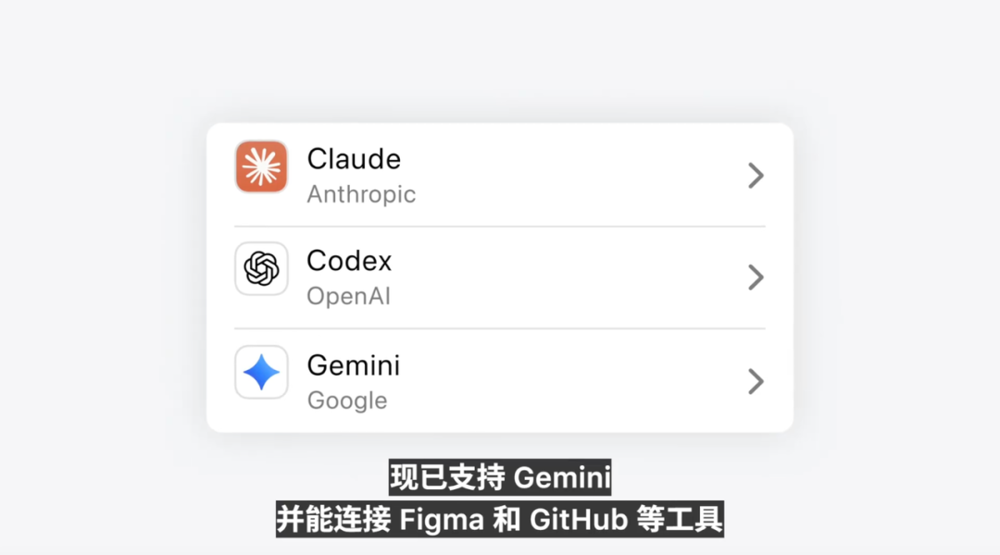

## 十九、发布时间：开发者 beta、公开 beta、正式版

发布会结尾，Tim Cook 总结了这次更新。
新的 OS 版本会在发布会当天提供开发者 beta。公开 beta 会在下个月推出。正式版会在 2026 年秋季面向用户发布。

尤其是 Siri AI，苹果明确说用户版 beta 会在今年晚些时候推出，并且有语言和地区限制。

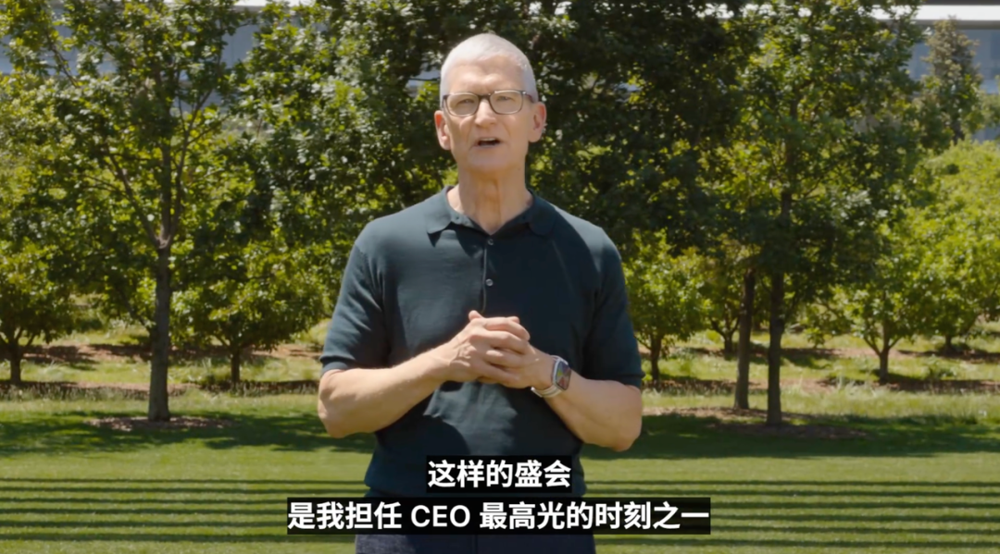

## 写在最后

这场 WWDC 对 AI 产品经理最有价值的地方，不在于苹果展示了多少模型能力，而在于它把 AI 放进了完整产品链路里。

第一，AI 助手的价值来自上下文。Siri AI 能用邮件、照片、信息、日历、屏幕内容、相机画面。没有上下文，AI 只能泛泛回答；有了上下文，AI 才能帮用户完成真实任务。

第二，AI 产品要从“回答问题”走向“完成动作”。Siri 查演唱会后能创建提醒，找照片后能加入共享相册，比较报价后能写邮件。Shortcuts 也可以把一句话变成自动化流程。真正有用的 AI，必须能调工具、走流程、给结果。

第三，AI 功能要嵌进用户原来的工作流。Safari 管标签页，Passwords 改密码，Calendar 建日程，Phone 找确认码，Home 总结摄像头视频。用户不需要为了 AI 换一个入口，AI 要出现在用户本来就在用的地方。

第四，模型选择会变成产品能力的一部分。苹果自己有端侧模型和 Private Cloud Compute，也和 Google 合作，又在 Xcode 里接入 Claude、Codex、Gemini。AI 产品经理以后要理解模型能力、成本、延迟、隐私、地区限制和降级策略。

第五，开发者生态会决定 AI 产品的天花板。App Intents、Foundation Models、Core AI、Image Playground API、Xcode AI coding，这些都在把开发者拉进 Apple Intelligence 体系。苹果想要的不是单个 AI 功能爆火，而是让整个生态开始围绕 AI 重写。

回头看这场 WWDC，苹果其实是在把过去两年的账单摊开，一项一项补。
Siri 终于升级了。
Apple Intelligence 进入更多系统场景了。
iOS 27 更快了。
搜索基础设施重做了。
儿童安全补了一大块。
Safari、Passwords、Messages、Calendar、Phone、Home、Shortcuts 都开始接入 AI。
Image Playground 和照片编辑重新打磨了。
Xcode 也把 Claude、Codex、Gemini 这类模型拉进苹果官方开发工具里。

Tim Cook 在这场发布会上没有抢走主角位置，但他的影子一直在。这个人把苹果带进了万亿美元时代，也把苹果变成了世界上最会做稳定体验的公司。到了他最后一次 WWDC，苹果最需要证明的能力，偏偏是过去几年它最慢的一块：AI。

Cook 留给 John Ternus 的苹果依然强大。硬件强，生态强，用户忠诚度强，芯片能力强，隐私品牌也强。
但 AI 正在改变入口，改变搜索，改变 App，改变用户和设备说话的方式。苹果这次交出了答卷。分数还要等用户真正用上 Siri AI、iOS 27 和 Xcode 的 AI 编程工具之后才知道。
